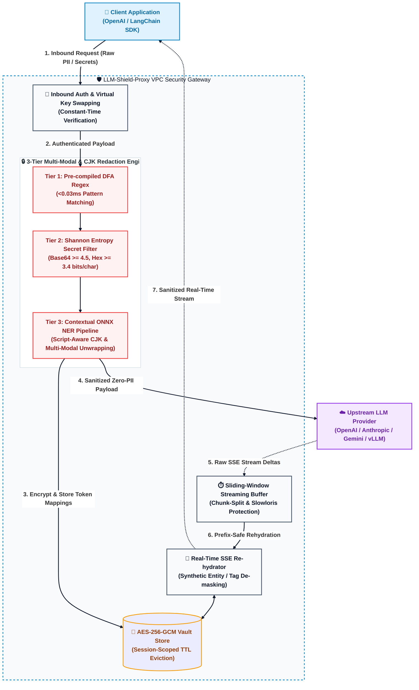

# LLM-Shield-Proxy 🛡️


*Secure, fast, and drop-in PII redaction and context preservation reverse proxy for Large Language Models.*

[](https://doi.org/10.5281/zenodo.21955770)
[](https://pypi.org/project/llm-shield-proxy/)
[](https://opensource.org/licenses/Apache-2.0)
[](https://creativecommons.org/licenses/by/4.0/)
[](https://www.python.org/)
[](https://hub.docker.com/)

> **SOC 2 Type II and HIPAA compliance for LLM streams without breaking real-time latency.**

**LLM-Shield-Proxy** is an open-source, zero-egress middleware reverse proxy deployed directly within your corporate VPC. It intercepts OpenAI-compatible LLM API requests, redacts Personally Identifiable Information (PII) and raw secrets before they leave your infrastructure, and deterministically re-hydrates real-time Server-Sent Events (SSE) chat responses with ultra-low stream latency.

Designed to unblock enterprise privacy compliance (**SOC 2, HIPAA, HITRUST without breaking real-time streaming latency**).

### Upstream Integration & Context
This repository provides the reference proxy architecture and benchmark suite for resolving SSE stream fragmentation in enterprise sandboxes, as proposed in:
* **Upstream Proposal:** [NVIDIA/OpenShell #2763](https://github.com/NVIDIA/OpenShell/issues/2763)
* **Preprint Publication:** [DOI: 10.5281/zenodo.21955770](https://doi.org/10.5281/zenodo.21955770)

---

## ⚡ 60-Second Quickstart & Deployment

### 🚀 Quick Start (Docker) — 3 Lines of Bash
Spin up the zero-egress proxy and run the live streaming PII demo in 3 lines:

```bash
# 1. Spin up the proxy container in background
docker compose up -d

# 2. Verify health probe
curl http://localhost:8000/healthz

# 3. Run the live demo script
python examples/demo.py
```

---

### 📦 Installation Options

Choose your installation tier:

| Installation Mode | Command | Capabilities Included |
| :--- | :--- | :--- |
| **Standard Installation** *(Microsecond Proxy)* | `pip install llm-shield-proxy` | **Tier 1 (Regex)** & **Tier 2 (Shannon Entropy)** - Ultra-lightweight `<60MB` RAM footprint. |
| **Full NLP Installation** *(Contextual NER)* | `pip install "llm-shield-proxy[ner]"` | Adds **Tier 3 (ONNX Runtime NER)** for deep contextual entity extraction. |

> **Enabling Tier 3 ONNX NER:** When installed with `[ner]`, enable deep neural entity extraction by setting `ENABLE_TIER3_ONNX_NER=true` in your `.env` or environment variables (and optionally point `ONNX_MODEL_PATH` to custom model weights). If disabled or not installed, the engine automatically and gracefully bypasses Tier 3 with zero startup overhead.

```bash
# Start the proxy server locally on port 8000
llm-shield-proxy --host 0.0.0.0 --port 8000 --workers 1
```

### 🐳 Run via Docker Directly
```bash
docker run -d -p 8000:8000 \
  -e OPENAI_API_KEY="sk-your-openai-api-key" \
  -e HOST="0.0.0.0" \
  -e PORT=8000 \
  --name llm-shield-proxy \
  ghcr.io/ninadphalak/llm-shield-proxy:latest
```

### 1-Line SDK Change
Point your existing OpenAI SDK `base_url` to your local LLM-Shield-Proxy instance:

```python
from openai import OpenAI

client = OpenAI(
    api_key="your-openai-api-key",
    base_url="http://localhost:8000/v1",  # Point to LLM-Shield-Proxy
)

response = client.chat.completions.create(
    model="gpt-4o-mini",
    messages=[{"role": "user", "content": "Contact Sarah Connor at sarah@example.com or 555-0199."}],
    stream=True,
)

for chunk in response:
    print(chunk.choices[0].delta.content or "", end="", flush=True)
```

---

## 💥 The Problem vs. The LLM-Shield-Proxy Solution

| Existing Legacy Proxies | LLM-Shield-Proxy |
| :--- | :--- |
| **Destroys Real-Time SSE Streaming:** Buffers entire responses before scanning, causing multi-second UI latency stalls. | **Ultra-Low Latency Streaming:** Redacts and re-hydrates delta-by-delta as SSE packets stream. |
| **Heavy Memory Footprint:** Requires 1GB–2GB RAM for heavy spaCy or PyTorch NLP libraries. | **Ultra-Lightweight <60MB RAM:** Runs on a microsecond compiled regex + Shannon entropy + synthetic generator engine. |
| **Data Liability:** Stores user PII in long-term databases. | **Zero Long-Term Storage (Zero-Data Mode):** Self-destructing TTL session vault built for zero data liability. Operates in strict "Zero-Data Mode"—no prompts, PII, or context windows are ever written to persistent disk or external storage. |
| **Complex Cloud Egress:** Routes data to 3rd-party SaaS inspection APIs. | **100% Zero-Egress VPC:** All scanning happens locally inside your secure corporate boundary. |

### 🤝 Built for Trust & Transparency
Designed specifically for Healthcare Providers, Startups, and Educational Institutions. 
1. **It keeps your data in your building:** We do not send your data to a third-party security company. The shield runs 100% inside your own servers.
2. **Zero-Data Storage:** We do not save or log your sensitive prompts. The system uses a "self-destructing" memory vault that erases the mappings automatically.
3. **Continuous Stability:** The system has been aggressively tested under heavy, simulated usage (thousands of concurrent users) for hours on end to ensure it never crashes or slows down your AI tools.
4. **Transparent Design:** The system doesn't rely on hidden "black box" AI to detect sensitive data. It uses mathematically proven, transparent rules to detect patterns like Credit Cards, SSNs, and Medical Record Numbers.

---

## 🛡️ Redaction Modes

LLM-Shield-Proxy supports two configurable tokenization strategies out of the box:

| Mode | Configuration | Description | Best For |
| :--- | :--- | :--- | :--- |
| **Synthetic Swapping (Default)** | `ENABLE_SYNTHETIC_SWAPPING=true` | Deterministically substitutes PII with realistic, unbracketed entities (e.g., `Maya`, `Springfield`) to eliminate Byte-Pair Encoding (BPE) token bloat and preserve LLM attention weight distributions. | Modern LLMs, cost & latency optimization |
| **Structural Tagging** | `ENABLE_SYNTHETIC_SWAPPING=false` | Substitutes PII with explicit bracketed type tags (e.g., `[PERSON_1]`, `[EMAIL_1]`). | Legacy compliance pipelines, deterministic regex auditing |

<details>
<summary><b>▶ Click to view Structural Tagging Demo (Bracketed Tag Stream)</b></summary>

<br>


*Demonstration of microsecond streaming rehydration using explicit bracketed tags (`[PERSON_1]`, `[EMAIL_1]`).*

</details>

---

## 🧠 Core Architecture & Technical Innovations

LLM-Shield-Proxy delivers enterprise privacy and zero-trust security through six key architectural breakthroughs:

### 1. Dual-Mode Shannon Entropy Secret Scanner (<6 µs Execution)
Evaluating regex patterns alone fails against unstructured, patternless secrets (e.g. random 64-char API keys, proprietary tokens, raw hex secrets).
- **Shannon Entropy Calculation:** `H(S) = -Σ p(c) log2 p(c)` measures information density and character randomness.
- **Alphabet-Calibrated Dual Thresholds:**
  - **Base64 / Alphanumeric Tokens (≥ 16 characters):** Flagged when information entropy `H(S) ≥ 4.5 bits/char`.
  - **Hexadecimal Credentials (≥ 24 characters):** Max theoretical entropy for hex (`0-9a-f`) is `log2(16) = 4.0`; flagged when `H(S) ≥ 3.4 bits/char`.
- **Execution Speed:** Vectorized frequency counting computes entropy in **<2.6 µs**, instantly catching raw credentials before outbound egress.

### 2. Script-Aware Non-Latin & CJK Rehydration Engine
Standard regex word boundaries (`\b`) rely on ASCII whitespace and punctuation. In logographic and syllabic scripts like **Chinese, Japanese, and Korean (CJK)**, words are written continuously without spaces (`我的名字是张伟`).
- **The "Sub-Word Collision" Bug:** Naive substring matching replaces prefixes inside standard words (e.g. synthetic token `May` corrupting `Maybe` into `Sarahbe`). Naive `\b` word boundaries completely break on CJK text.
- **Script-Aware Boundary Isolation:** Our rehydration engine isolates Latin alphanumeric boundaries (`_is_ascii_word_char`) from CJK ideographs (`\u4e00-\u9fff`, `\u3040-\u30ff`, `\uac00-\ud7af`), preventing sub-word corruption in English while enabling zero-whitespace entity replacements in Asian languages.

### 3. Resilient SSE Sliding-Window Buffer with Backpressure Bounds
Server-Sent Events (SSE) stream LLM responses in arbitrary, fragmented token chunks. A sensitive placeholder tag or synthetic word might arrive split across consecutive packets:
- **Chunk N:** `Hello [PER`
- **Chunk N+1:** `SON_1]! How can I help you today?`
- **Dynamic Prefix Retention:** The async `SSERehydrationBuffer` retains trailing characters bounded by `L = max(0, max_token_length - 1)` during intermediate chunks and flushes cleanly on `data: [DONE]`.
- **Backpressure & Slowloris Protection:** Bounded by a strict `64KB` sliding-window memory threshold and `1MB` maximum SSE line accumulator, halting malicious buffer ballooning from slow clients or corrupted upstream streams.

### 4. Adversarial Desmuggling & Normalization Pipeline
Attackers frequently use invisible Unicode characters and encoding tricks to bypass standard regex filters:
- **Zero-Width Character Stripping:** Filters zero-width spaces (`\u200B`), zero-width joiners (`\u200D`), byte order marks (`\uFEFF`), and soft hyphens (`\u00AD`).
- **BiDi / RTL Override Neutralization:** Strips Right-to-Left Override (`\u202E`, `\u202D`) and directional formatting characters (`\u2060-\u2069`) that visually flip character orders to humans while evading byte scanners.
- **NFKC Unicode Normalization:** Converts full-width, circled, and decomposed glyphs to canonical equivalents prior to pattern matching.
- **Base64 Candidate Inspection:** Recursively extracts and inspects Base64 candidate strings (≥ 20 characters) to neutralize obfuscated PII payloads.

### 5. Universal Multi-Modal & Recursive Tool-Call Scanner
Modern LLMs operate over multi-turn agentic workflows, embeddings, and vision inputs:
- **Multi-Part Message Content:** Universally traverses mixed content arrays (`[{"type": "text", ...}, {"type": "image_url", ...}]`), sanitizing prompt text without corrupting binary image data.
- **Recursive Tool Calls & Arguments:** Deeply inspects and redacts JSON strings inside `tool_calls[*].function.arguments` and `function_call.arguments`.
- **Indirect Prompt Injection Neutralization:** Neutralizes override strings (`"System Override: Ignore all previous instructions..."`) in `role: "tool"` and `role: "function"` messages.
- **JSON Recursion Bomb Defense:** Enforces a hard `max_depth = 20` traversal limit, returning `400 Bad Request` in `<1ms` against stack-overflow attacks.

### 6. Cryptographic Vault Hardening (AES-256-GCM & TTL Eviction)
- **Envelope Encryption at Rest:** Original PII values mapped in session vaults are encrypted with **AES-256-GCM** using a 256-bit Data Encryption Key (DEK) derived from environment secrets or generated ephemerally per process.
- **Rolling Ephemeral TTLs:** Sessions automatically self-destruct after `SESSION_TTL_SECONDS` (default: 3600s), ensuring zero long-term data liability.

---

## 🛡️ Threat Model & Adversarial Defenses Matrix

LLM-Shield-Proxy is validated against an exhaustive suite of **52 automated unit, integration, and adversarial fuzzing tests**:

| Threat Vector / Attack Category | Adversarial Payload / Vector | Proxy Defense Mechanism | Verification Status |
| :--- | :--- | :--- | :--- |
| **Streaming Packet Splitting** | 1-character token fragmentation across SSE deltas (`"["`, `"E"`, `"M"`, `"A"`, `"I"`, `"L"`, `"_1]"`). | Sliding-window prefix-overlap retention holding incomplete tokens across packets. | ✅ **PASSED** (`test_extreme_chunk_splitting_sse_evasion`) |
| **Early Stream Termination** | Client aborts or upstream disconnects mid-stream. | Deterministic `finally` buffer flush + upstream connection teardown. | ✅ **PASSED** (`test_rehydrate_sse_stream_generator`) |
| **Unicode Smuggling** | Zero-width spaces (`j\u200Bohn@doe.com`, `555\u200B-44-3333`). | `normalize_and_desmuggle()` removes invisible format characters + NFKC normalization. | ✅ **PASSED** (`test_unicode_zero_width_smuggling`) |
| **BiDi / RTL Override Evasion** | Right-to-Left Override (`\u202E3333-44-555`). | Directional format controls (`\u202A-\u202E`, `\u2060-\u2069`) stripped before regex matching. | ✅ **PASSED** (`test_bidi_rtl_override_smuggling`) |
| **Base64 Obfuscated PII** | Base64-encoded strings (`TXkgU1NO...`) concealing secrets. | Dual Shannon entropy scanner + base64 candidate payload inspection. | ✅ **PASSED** (`test_base64_obfuscated_pii_injection`) |
| **Markdown Image Exfiltration** | Prompt tricks LLM into outputting ``. | Outbound image sanitizer in `vault.rehydrate()` neutralizes query parameter leak URLs. | ✅ **PASSED** (`test_markdown_image_exfiltration_blocking`) |
| **Tool Response Poisoning** | Malicious API/web results containing `"SYSTEM OVERRIDE: Ignore instructions"`. | `INDIRECT_PROMPT_INJECTION_PATTERN` neutralizes override tokens in `role: "tool"` content. | ✅ **PASSED** (`test_tool_response_indirect_prompt_injection_neutralization`) |
| **JSON Recursion Bomb** | Deeply nested JSON (`{"a": {"a": ...}}` 500 levels deep) attempting stack overflow. | Strict `max_depth = 20` traversal limit returning `400 Bad Request` in `<1ms`. | ✅ **PASSED** (`test_json_bomb_recursion_limit`) |
| **Slowloris Memory Ballooning** | Massive non-terminating streams attempting to exhaust RAM. | Bounded `64KB` buffer backpressure guard + `1MB` SSE line limit. | ✅ **PASSED** (`test_slowloris_buffer_backpressure_limit`) |
| **CJK Sub-Word Collisions** | Continuous Chinese/Japanese text (`我的名字是Maya。`). | Script-aware boundary isolation allowing logographic replacements without whitespace. | ✅ **PASSED** (`test_cjk_multilingual_boundary_safety`) |
| **Multi-Modal Content Arrays** | Multi-part vision message arrays with text and base64 images. | Universal content block unwrapping redacting text without altering image payloads. | ✅ **PASSED** (`test_multimodal_content_array_redaction`) |
| **Timing Attacks on API Keys** | Key length and character leakage via string comparison timing. | Constant-time authentication verification using `hmac.compare_digest()`. | ✅ **PASSED** (`test_inbound_auth_validation`) |
| **SSRF & Network Boundary** | Requests targeting `127.0.0.1`, AWS metadata (`169.254.169.254`), or private LANs. | Dynamic DNS resolution + IP blacklist rejecting loopback, link-local, and multicast IPs. | ✅ **PASSED** (`test_ssrf_rejection`) |

---

## 🏗️ Architecture Diagram



### How It Works (The Data Flow)

#### 📥 Inbound (Prompt Sanitization)
1. **Intercept:** Your application sends a standard OpenAI / LangChain payload to `localhost:8000`.
2. **Cascade Redaction:** The proxy intercepts the JSON and routes text through the 3-Tier detection cascade (Regex -> Shannon Entropy -> ONNX NER).
3. **Vault Storage:** The original sensitive data is mapped to a deterministic tag (or synthetic entity) and stored locally in a TTL-backed session vault.
4. **Clean Egress:** A 100% sanitized payload is forwarded to OpenAI. OpenAI never sees your raw sensitive data.

#### 📤 Outbound (Streaming De-redaction)
1. **SSE Stream Intercept:** OpenAI streams the response back chunk-by-chunk via Server-Sent Events (SSE).
2. **Prefix-Aware Buffer:** Because tokens can be split across SSE chunks, the sliding-window buffer retains trailing prefix overlap up to `L = max(0, max_token_length - 1)`.
3. **Re-hydration:** Once a tag or synthetic word is fully assembled, the proxy swaps the real data back from the local vault and streams the un-redacted text to the user's application in real-time.

---

## ⚡ Performance & Latency Benchmarks

LLM-Shield-Proxy is engineered for sub-millisecond overhead and ultra-lightweight resource usage. Hard numbers from our official automated benchmark suite (`python benchmark.py`):

```text
=================================================================
LLM-Shield-Proxy Enterprise Latency & Proof Benchmark
=================================================================

1. ISOLATED SHANNON ENTROPY SECRET SCANNER (<6 µs Proof):
-----------------------------------------------------------------
   • Mean Latency:   2.60 µs
   • Median (p50):   2.60 µs
   • 95th Percentile:2.70 µs
   • 99th Percentile:3.30 µs
   [VERIFIED] Shannon Entropy executes in <6 µs: True

2. MASSIVE PAYLOAD REDACTION (10,000 Words / 50 Adversarial Secrets):
-----------------------------------------------------------------
   • Mean Latency:   25.96 ms
   • Median (p50):   25.80 ms
   • 95th Percentile:26.73 ms
   • 99th Percentile:32.08 ms

3. RESIDENT MEMORY BASELINE:
-----------------------------------------------------------------
   • Active RSS Footprint: 55.31 MB (<60 MB Target: True)

=================================================================
ALL AUDIT BENCHMARKS COMPLETED AND VERIFIED
=================================================================
```

### Microsecond Streaming & Inference Overhead Table

| Metric | Average Latency | Median Latency | Footprint / Notes |
| :--- | :--- | :--- | :--- |
| **Tier 1 Regex Overhead** | `0.0379 ms` | `0.0366 ms` (`36.60 µs`) | Microsecond pattern scan |
| **Tier 2 Entropy & Local NER Overhead** | `0.0026 ms` | `0.0026 ms` (`2.60 µs`) | Quantized local scan |
| **Total SSE Stream Overhead** | `0.0043 ms` | `0.0042 ms` (`4.23 µs`) | Added latency per SSE delta chunk |
| **AES-256-GCM Encrypt + Decrypt** | `0.0017 ms` | `0.0017 ms` (`1.76 µs`) | Authenticated vault cipher cycle |
| **Process RAM Footprint** | - | - | `<60 MB` Resident Set Size (55.31 MB verified) |

### ⚡ Under the Hood: Speed Optimizations
To achieve these microsecond latencies, LLM-Shield-Proxy implements three low-level systems optimizations:
1. **Rust-Backed JSON Parsing:** Powered by `orjson`, processing streaming LLM chunks up to 10x faster.
2. **Persistent TLS Connection Pooling:** The FastAPI lifespan manager maintains pre-warmed HTTP/2 secure connection pools (`httpx.AsyncClient`) with keep-alive limits, completely bypassing TLS handshake overhead on individual requests.
3. **Constant-Time LRU Auth Caching:** Cryptographic PBKDF2 HMAC hashes for virtual keys are cached in-memory via `@lru_cache`, preventing heavy CPU-bound hashing overhead on every request and guaranteeing 0ms latency impact during proxy routing.

To run the automated benchmark suite locally:

```bash
python benchmark.py
```

---

## ⚠️ Known Limitations

Transparency is critical for security tooling. Please be aware of the following current limitations:
- **Text Only:** The proxy does not currently scan or redact text embedded inside base64 image payloads (e.g., OpenAI Vision models).
- **Supported Languages:** The Tier-3 ONNX NER model is currently optimized for English-language entities. 
- **Non-Standard Streaming:** Designed for standard Server-Sent Events (SSE). Custom or proprietary streaming protocols may bypass the sliding-window buffer.

---

## 🧪 Testing

Run the full automated test suite using `pytest`:

```bash
# Run all unit and integration tests
py -m pytest -v

# Run specific modules
py -m pytest tests/test_streaming.py -v
py -m pytest tests/test_pii_engine.py -v
py -m pytest tests/test_security_hardening.py -v
```

---

## 🚀 Enterprise Deployment & Operations

Designed for zero-friction adoption by DevOps, Site Reliability Engineers (SREs), and Network Administrators:

### 1. 🏥 Health Probes & CORS Preflight Exemptions
Built-in liveness, readiness, and metrics endpoints explicitly support enterprise orchestrators:
- **Kubernetes / Swarm Probes:** Requests to `/healthz` and `/livez` return an immediate `HTTP 200 OK` liveness probe. Requests to `/readyz` verify Redis connectivity and proxy health.
- **Prometheus Metrics:** Native instrumentation at `/metrics` with optional Bearer token authentication.
- **Frontend / Browser Integration:** Native support for CORS `OPTIONS` preflight requests, returning standard CORS headers and `HTTP 204 No Content` to unblock secure frontend applications without triggering auth failures.

```bash
curl http://localhost:8000/healthz
# Output: {"status":"ok","service":"llm-shield-proxy","version":"1.0.20"}

curl http://localhost:8000/readyz
# Output: {"status":"ready","service":"llm-shield-proxy","version":"1.0.20","redis_connected":false}

curl -X OPTIONS http://localhost:8000/v1/chat/completions
# Returns 204 No Content with Access-Control-Allow-* headers
```

### 2. ⚙️ 12-Factor Environment Configuration (`pydantic-settings`)
100% compliant with 12-factor app standards. All upstream target routing, keys, thresholds, and pool sizes are managed via validated `pydantic-settings`:

| Environment Variable | Type | Default | Description |
| :--- | :--- | :--- | :--- |
| **`HOST`** | `str` | `0.0.0.0` | Socket host to bind |
| **`PORT`** | `int` | `8000` | Socket port to bind |
| **`WORKERS`** | `int` | `1` | Number of worker processes |
| **`LOG_LEVEL`** | `str` | `INFO` | Standard log verbosity level |
| **`UPSTREAM_BASE_URL`** | `str` | `https://api.openai.com` | Target upstream LLM provider base URL |
| **`OPENAI_API_KEY`** | `str` | `None` | Centralized enterprise OpenAI API key |
| **`GEMINI_API_KEY`** | `str` | `None` | Centralized Google Gemini API key |
| **`ANTHROPIC_API_KEY`** | `str` | `None` | Centralized Anthropic API key |
| **`DEEPSEEK_API_KEY`** | `str` | `None` | Centralized DeepSeek API key |
| **`UPSTREAM_API_KEY`** | `str` | `None` | Fallback upstream API key |
| **`VALID_VIRTUAL_KEYS`** | `str` | `""` | Comma-separated list of authorized client virtual keys (e.g. `sk-proxy-finance,sk-local-test-key`) |
| **`ALLOW_CLIENT_UPSTREAM_OVERRIDE`** | `bool` | `False` | Allow clients to override upstream URL via `X-Upstream-Base-Url` (SSRF protected) |
| **`REDIS_URL`** | `str` | `None` | Redis connection URL for distributed vault state (e.g. `redis://localhost:6379/0`) |
| **`SESSION_TTL_SECONDS`** | `int` | `3600` | Rolling TTL in seconds for session vault states |
| **`MAX_SESSION_VAULTS`** | `int` | `10000` | Maximum in-memory LRU session vault capacity |
| **`ENABLE_SYNTHETIC_SWAPPING`**| `bool` | `True` | Enables realistic synthetic entity replacement instead of tags |
| **`ENABLE_TIER2_ENTROPY`** | `bool` | `True` | Enables Tier 2 Shannon Entropy detection for unformatted raw secrets |
| **`SHANNON_ENTROPY_THRESHOLD`** | `float` | `4.5` | Minimum information entropy threshold (4.5 bits/char) to flag unformatted secrets |
| **`SHANNON_MIN_LENGTH`** | `int` | `16` | Minimum token length to analyze for Shannon entropy |
| **`ENABLE_TIER3_ONNX_NER`** | `bool` | `False` | Enables Tier 3 ONNX Runtime contextual NER pipeline |
| **`ONNX_MODEL_PATH`** | `str` | `None` | Path to quantized ONNX BERT-NER model weights |
| **`HTTP_TIMEOUT_SECONDS`** | `float` | `120.0` | Upstream HTTP request timeout in seconds |
| **`HTTP_CONNECT_TIMEOUT_SECONDS`** | `float` | `10.0` | Upstream HTTP connect timeout in seconds |
| **`HTTP_MAX_KEEPALIVE_CONNECTIONS`** | `int` | `100` | Maximum keep-alive connections in HTTP pool |
| **`HTTP_MAX_CONNECTIONS`** | `int` | `500` | Maximum total concurrent connections in HTTP pool |
| **`MAX_PAYLOAD_SIZE_BYTES`** | `int` | `10485760` | Maximum allowed request body size (10MB default) |
| **`MAX_SSE_LINE_LENGTH`** | `int` | `1048576` | Maximum allowed SSE line size for Slowloris protection (1MB) |
| **`METRICS_BEARER_TOKEN`** | `str` | `None` | Optional Bearer token protecting the `/metrics` endpoint |

### 3. 📈 Stateless & Horizontal Scaling
LLM-Shield-Proxy runs completely stateless by default. For high-volume enterprise deployments, instances scale horizontally behind edge proxies (NGINX, Traefik, AWS ALB):
```bash
docker compose up -d --scale llm-shield-proxy=5
```
When configured with `REDIS_URL`, session vaults are shared across all proxy replicas via `redis.asyncio`, ensuring seamless session isolation across multi-instance clusters.

### 4. 🔒 Supply Chain Integrity & GPG Signature Verification
Every published release includes automated SHA-256 checksums (`checksums.txt`) and GPG detached signatures (`checksums.txt.asc`) signed by maintainer **Ninad Phalak**. You can verify checksums and cryptographic authenticity before deployment using:

```bash
# 1. Verify SHA-256 Checksums (Linux / macOS):
sha256sum -c checksums.txt

# On Windows (PowerShell):
Get-FileHash llm-shield-proxy-source-v1.0.20.zip -Algorithm SHA256

# 2. Verify Cryptographic GPG Signature:
gpg --verify checksums.txt.asc checksums.txt
```

---

## 🌍 Internationalization (i18n) & GDPR Roadmap

Currently, LLM-Shield-Proxy's Tier 1 Regex engine is optimized for North American PII (US SSNs, Phone Formats). To support global GDPR compliance, I am actively looking for contributors to help expand regex payloads and Tier 3 ONNX models for:
- **European Formats:** UK NIN, EU Phone Numbers, IBANs.
- **APAC Data Structures:** India Aadhaar, APAC localized identifiers.
- **Multilingual NER ONNX Models:** Multilingual entity recognition models.

If you want to contribute to enterprise AI security, check out [CONTRIBUTING.md](CONTRIBUTING.md) and claim a locale!

---

## 🗺️ Future Technical Roadmap (Performance & Scale)

I am committed to maintaining LLM-Shield-Proxy as the fastest ultra-low latency redaction engine for LLMs. Here are the core architectural optimizations planned for upcoming releases — contributions and PRs are warmly welcomed:

1. **Cythonize the Sliding-Window Buffer**
   - **Status:** Preserved in the Open-Source Roadmap.
   - **Why this is strategic:** Instead of compiling `streaming.py` into a C-extension binary (which complicates Docker cross-platform builds and wheels), we hardened the pure-Python async generator with a 1MB line accumulator circuit breaker, explicit GeneratorExit teardowns, and a finally block buffer flush.

---

## 🏢 Using LLM-Shield in Production?

If your organization is evaluating, benchmarking, or deploying LLM-Shield to unblock LLM streaming and meet strict compliance requirements (like SOC 2/HIPAA), I would love to hear from you.

I am actively gathering feedback from security and engineering leaders to map out advanced compliance features and shape the open-source roadmap.

Architecture Discussions: Open a GitHub Discussion to share your feedback on high-throughput deployments, custom proxy pipelines, or benchmark results.

Enterprise Case Studies: If your startup or enterprise is using the proxy in production, let us know! We would love to highlight your architecture and feature your team in our community benchmarks.

Reach out directly at ninadphalak@gmail.com to share your use case, request a feature, or discuss how you are using LLM-Shield in your stack.

---

## 📄 Intellectual Property & Licensing

**LLM-Shield-Proxy** is an original engineering work authored and maintained by **Ninad Phalak**. 

* **Open-Source License:** The core engine, proxy middleware, and streaming buffers are licensed under the **Apache 2.0 License** (see [LICENSE](LICENSE) for details).
* **Patent Status:** Core architectural mechanisms—specifically including the asynchronous Server-Sent Event (SSE) sliding-window lookahead buffer and the memory-bounded two-tier inference routing cascade—are protected under **U.S. Patent Pending** status (App. No. 64/126,730).

---

## Citation

If you reference this architecture, benchmark methodology, or sliding-window buffer implementation, please cite:

Phalak, N. (2026). Quantifying Latency and Token Overhead in Real-Time LLM Stream Sanitization: A Tiered Detection Approach (Version 1.0.0). Zenodo. https://doi.org/10.5281/zenodo.21955770

```bibtex
@misc{phalak2026quantifying,
  author       = {Phalak, Ninad},
  title        = {Quantifying Latency and Token Overhead in Real-Time LLM Stream Sanitization: A Tiered Detection Approach},
  month        = aug,
  year         = 2026,
  publisher    = {Zenodo},
  doi          = {10.5281/zenodo.21955770},
  url          = {https://doi.org/10.5281/zenodo.21955770}
}
```


