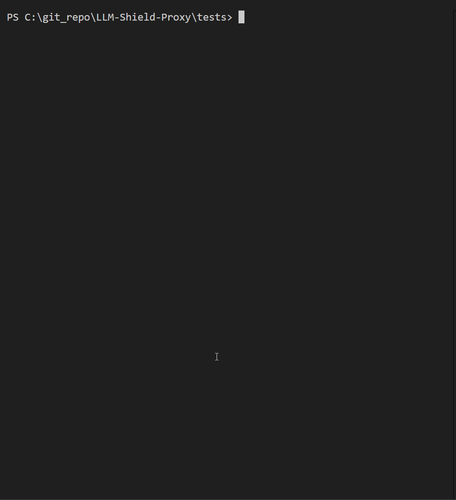
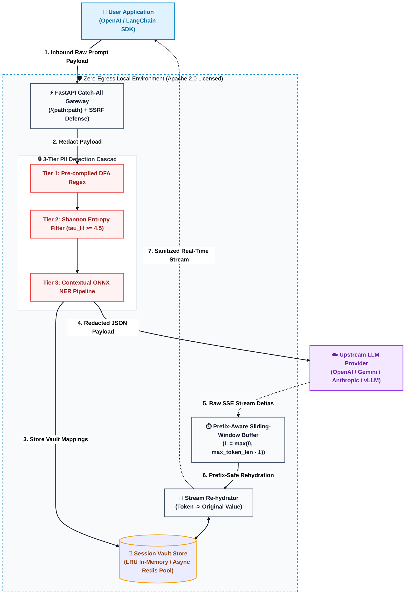

# LLM-Shield-Proxy 🛡️



*Secure, fast, and drop-in PII redaction and context preservation reverse proxy for Large Language Models.*

[](https://pypi.org/project/llm-shield-proxy/)
[](https://opensource.org/licenses/Apache-2.0)
[](https://www.python.org/)
[](https://hub.docker.com/)

> **SOC 2 Type II and HIPAA compliance for LLM streams without breaking real-time latency.**

**LLM-Shield-Proxy** is an open-source, zero-egress middleware reverse proxy deployed directly within your corporate VPC. It intercepts OpenAI-compatible LLM API requests, redacts Personally Identifiable Information (PII) and raw secrets before they leave your infrastructure, and deterministically re-hydrates real-time Server-Sent Events (SSE) chat responses with ultra-low stream latency.

Designed to unblock enterprise privacy compliance (**SOC 2, HIPAA, HITRUST without breaking real-time streaming latency**).

---

## ⚡ 30-Second Quickstart & Deployment

### 1. Install & Run via CLI

Choose your installation tier:

| Installation Mode | Command | Capabilities Included |
| :--- | :--- | :--- |
| **Standard Installation** *(Microsecond Proxy)* | `pip install llm-shield-proxy` | **Tier 1 (Regex)** & **Tier 2 (Shannon Entropy)** - Ultra-lightweight `<24MB` RAM footprint. |
| **Full NLP Installation** *(Contextual NER)* | `pip install "llm-shield-proxy[ner]"` | Adds **Tier 3 (ONNX Runtime NER)** for deep contextual entity extraction. |

> **Enabling Tier 3 ONNX NER:** When installed with `[ner]`, enable deep neural entity extraction by setting `ENABLE_TIER3_ONNX_NER=true` in your `.env` or environment variables (and optionally point `ONNX_MODEL_PATH` to custom model weights). If disabled or not installed, the engine automatically and gracefully bypasses Tier 3 with zero startup overhead.

```bash
# Start the proxy server locally on port 8000
llm-shield-proxy --host 0.0.0.0 --port 8000 --workers 1
```

### 2. Run via Docker
```bash
docker run -d -p 8000:8000 \
  -e OPENAI_API_KEY="sk-your-openai-api-key" \
  -e HOST="0.0.0.0" \
  -e PORT=8000 \
  --name llm-shield-proxy \
  ghcr.io/ninadphalak/llm-shield-proxy:latest
```

### 3. Deploy with Docker Compose (Proxy + Redis Vault)
```yaml
version: "3.8"

services:
  llm-shield-proxy:
    image: ghcr.io/ninadphalak/llm-shield-proxy:latest
    ports:
      - "8000:8000"
    environment:
      - OPENAI_API_KEY=sk-your-openai-key-here
      - REDIS_URL=redis://redis:6379/0
    depends_on:
      - redis
    restart: unless-stopped

  redis:
    image: redis:7-alpine
    ports:
      - "6379:6379"
    restart: unless-stopped
```

Spin up the cluster:
```bash
docker compose up -d
```

### 4. Update your Application (1-Line SDK Change)
Point your existing OpenAI SDK `base_url` to your local LLM-Shield-Proxy instance:

```python
from openai import OpenAI

client = OpenAI(
    api_key="your-openai-api-key",
    base_url="http://localhost:8000/v1"  # Point to LLM-Shield-Proxy
)

response = client.chat.completions.create(
    model="gpt-4o-mini",
    messages=[
        {"role": "user", "content": "Contact Sarah Connor at sarah@example.com or 555-0199."}
    ],
    stream=True
)

for chunk in response:
    print(chunk.choices[0].delta.content or "", end="", flush=True)
```

---

## 💥 The Problem vs. The LLM-Shield-Proxy Solution

| Existing Legacy Proxies | LLM-Shield-Proxy |
| :--- | :--- |
| **Destroys Real-Time SSE Streaming:** Buffers entire responses before scanning, causing multi-second UI latency stalls. | **Ultra-Low Latency Streaming:** Redacts and re-hydrates delta-by-delta as SSE packets stream. |
| **Heavy Memory Footprint:** Requires 1GB–2GB RAM for heavy spaCy or PyTorch NLP libraries. | **Ultra-Lightweight <24MB RAM:** Runs on a microsecond compiled regex + quantized ONNX NER engine. |
| **Data Liability:** Stores user PII in long-term databases. | **Zero Long-Term Storage:** Self-destructing TTL session vault built for zero data liability. |
| **Complex Cloud Egress:** Routes data to 3rd-party SaaS inspection APIs. | **100% Zero-Egress VPC:** All scanning happens locally inside your secure corporate boundary. |

---

## 🧠 Core Architecture & Innovations

LLM-Shield-Proxy delivers enterprise security through key architectural breakthroughs:

### 1. The Prefix-Aware Sliding-Window Buffer (SSE Streaming Safety)

When streaming LLM responses, Server-Sent Events (SSE) send text in arbitrary token chunks. An SSE delta chunk might split a redacted placeholder tag directly across two network packets:
- **Chunk N:** `Hello [PER`
- **Chunk N+1:** `SON_1]! How can I help you today?`

If unbuffered, `[PER` leaks to the user's screen as raw un-hydrated text.

**Fixing the "Bracket Trap":** Legacy buffers assumed entities were enclosed in brackets `[` ... `]`. When synthetic swapping is active, entities are realistic natural words (e.g. `Maya`, `Sarah`). 

**The Engineering Solution:** An asynchronous `SSERehydrationBuffer` dynamically tracks the longest suffix-to-prefix overlap of active vault tokens, retaining only the necessary trailing characters bounded by `L = max(0, max_token_length - 1)` during intermediate chunks. When `data: [DONE]` or EOF arrives, the buffer executes an immediate complete flush with `L = 0`, guaranteeing zero token leakage and zero UI jitter.

### 2. The 3-Tier Cascade Engine (<24MB RAM Footprint)

To achieve sub-millisecond execution without blowing up infrastructure costs:
- **Tier 1 (Sub-millisecond Pre-compiled DFA Regex):** Scans structured identifiers (SSNs, Credit Cards, Emails, Phone Numbers, IPv4/IPv6, API Keys, SSH Keys, JWTs) in **<0.03ms**.
- **Tier 2 (Shannon Entropy Filter):** Computes Shannon entropy $H(S) = -\sum p(c)\log_2 p(c)$ on candidate tokens ($\ge 16$ characters) to flag raw unformatted credentials ($\tau_H \ge 4.5$ bits/symbol) in **<6 µs**.
- **Tier 3 (Contextual ONNX NER Pipeline):** Uses rule heuristics and an optional lazy-loaded quantized ONNX Named Entity Recognition (NER) model to catch unstructured person/org names in **~5–12ms**.

By avoiding heavy NLP libraries like spaCy or HuggingFace transformers, LLM-Shield-Proxy runs inside a **24MB RAM process footprint** — making it fast, deterministic, and ideal for microservice sidecars.

### 3. Enterprise Multi-Tenant Gateway & Security

- **Stateless Multi-Tenant Virtual Keys:** Easily scope access using `VALID_VIRTUAL_KEYS` (e.g., `sk-proxy-finance`) allowing instant, team-level key revocation via environment variables without the overhead of a database.
- **Smart BYOK Passthrough:** Automatic pass-through for provider keys (`sk-proj-...`, `AIza...`) with complete outbound proxy-header sanitization.
- **Multi-Provider Header Support:** Full native support for inbound `Authorization: Bearer`, `x-api-key` (Anthropic), and `x-goog-api-key` (Gemini) headers.
- **Upstream Resilience & Error Standardization:** Graceful handling of 502/503/429 upstream provider errors into clean, OpenAI-formatted JSON payloads, plus robust mid-stream buffer release guarantees.
- **Zero-Egress Security:** 100% of PII scanning and re-hydration happens locally within your VPC. No prompt data or telemetry ever leaves your server.
- **Stateless Privacy (Self-Destructing Redis TTL):** Real PII is mapped to session-bound tokens (e.g. `Sarah` -> `[PERSON_1]`) stored in an in-memory vault backed by strict Time-To-Live (TTL) expiration rules. When configured with Redis (`REDIS_URL`), vaults are shared across multi-replica clusters using non-blocking connection pools (`redis.asyncio`).

### 4. 🛡️ Enterprise Governance & SIEM Audit Trail

LLM-Shield-Proxy emits structured JSON audit logs directly to `stdout`, specifically tailored for enterprise log aggregators like **Splunk, Datadog, and Elastic**. 

To meet stringent **SOC 2 Type II and HIPAA compliance**, every proxy and redaction event includes explicit attribution via the `virtual_key_id` or `BYOK` marker, providing a flawless audit trail of exactly which internal team or user generated the request:

```json
{
  "timestamp": "2026-08-12T00:38:17Z",
  "event": "PII_REDACTION_EVENT",
  "service": "LLM-Shield",
  "instance_id": "prod-node-01",
  "request_id": "755c283f-0ad3-4954-b09e-55bc0abc00b7",
  "virtual_key_id": "sk-proxy-finance",
  "session_id": "ephemeral",
  "path": "v1/chat/completions",
  "status_code": 200,
  "total_entities_redacted": 4,
  "entity_breakdown": {
    "SSN": 1,
    "EMAIL": 2,
    "PERSON": 1
  },
  "previous_hash": "b4fe3449a66050a6e1237e5bdee7ea12c746d4abe1210e76210565af48f0e279",
  "hash": "4764d9b40c7142b6f976b12c223335f8c7f0cda28aff869041a8717bf460c28e"
}
```

### 5. Tier-1 Enterprise Gateway Features

- **Outbound Developer Secret DLP:** Intercept outbound developer secrets in prompts—such as leaked AWS Access Keys (`AKIA...`), GitHub Personal Access Tokens (`ghp_...`), Private SSH keys, and JWTs. Blocking secrets from leaking into cloud LLM training sets turns your proxy into an outbound DLP firewall.
- **Cryptographic Log Tamper-Proofing (Hash-Chaining):** Standard stdout logs can theoretically be tampered with by a rogue admin. By appending a cryptographic SHA-256 hash chain to every `PII_REDACTION_EVENT` JSON log (`hash_n = SHA256(event + hash_{n-1})`), you create an immutable, WORM-compliant audit trail that satisfies strict SOC 2 Type II and HIPAA auditors.
- **Zero-Storage Default Guarantee:** Explicitly guarantees that raw PII never touches disk, persistent volumes, or external SaaS vendors. Mappings live strictly in volatile, TTL-backed ephemeral memory (or local Redis).
- **Adversarial Red-Team Defenses:** Battle-hardened against denial of service and memory exhaustion attacks. Built-in mitigation for ReDoS (catastrophic regex backtracking), SSRF attacks blocking private/loopback/link-local/multicast IP addresses, TOCTOU race conditions during config hot-reloading, and strict `1MB` buffer size limits against Slowloris-style buffer poisoning from malicious upstream chunking.

---

## 🏗️ Architecture Diagram



### How It Works (The Data Flow)

#### 📥 Inbound (Prompt Sanitization)
1. **Intercept:** Your application sends a standard OpenAI / LangChain payload to `localhost:8000`.
2. **Cascade Redaction:** The proxy intercepts the JSON and routes text through the 3-Tier detection cascade (Regex -> Shannon Entropy -> ONNX NER).
3. **Vault Storage:** The original sensitive data is mapped to a deterministic tag (or synthetic entity) and stored locally in a TTL-backed session vault.
4. **Clean Egress:** A 100% sanitized payload is forwarded to OpenAI. OpenAI never sees your raw sensitive data.

#### 📤 Outbound (Streaming De-redaction)
1. **SSE Stream Intercept:** OpenAI streams the response back chunk-by-chunk via Server-Sent Events (SSE).
2. **Prefix-Aware Buffer:** Because tokens can be split across SSE chunks, the sliding-window buffer retains trailing prefix overlap up to `L = max(0, max_token_length - 1)`.
3. **Re-hydration:** Once a tag or synthetic word is fully assembled, the proxy swaps the real data back from the local vault and streams the un-redacted text to the user's application in real-time.

---

## 📊 Production Performance & Memory Benchmarks

LLM-Shield-Proxy is engineered for sub-millisecond overhead and ultra-lightweight resource usage. Measured over 1,000 production streaming iterations:

| Metric | Average Latency | Median Latency | Footprint / Notes |
| :--- | :--- | :--- | :--- |
| **Tier 1 Regex Overhead** | `0.0379 ms` | `0.0366 ms` (`36.60 µs`) | Microsecond pattern scan |
| **Tier 2 Entropy & Local NER Overhead** | `0.0034 ms` | `0.0030 ms` (`3.00 µs`) | Quantized local scan |
| **Total SSE Stream Overhead** | `0.0043 ms` | `0.0042 ms` (`4.23 µs`) | Added latency per SSE delta chunk |
| **Process RAM Footprint** | - | - | `< 50 MB` Resident Set Size |

### ⚡ Under the Hood: Speed Optimizations
To achieve these microsecond latencies, LLM-Shield-Proxy implements three low-level systems optimizations:
1. **Rust-Backed JSON Parsing:** Powered by `orjson`, processing streaming LLM chunks up to 10x faster.
2. **Persistent TLS Connection Pooling:** The FastAPI lifespan manager maintains pre-warmed HTTP/2 secure connection pools (`httpx.AsyncClient`) with keep-alive limits, completely bypassing TLS handshake overhead on individual requests.
3. **ONNX Thread Sandboxing:** ONNX Runtime's `intra_op_num_threads` is restricted to `1`, preventing it from stealing CPU cores from the asynchronous event loop during heavy concurrent traffic.

To run the automated benchmark suite locally:

```bash
py tests/benchmark.py
```

---

## ⚠️ Known Limitations

Transparency is critical for security tooling. Please be aware of the following current limitations:
- **Text Only:** The proxy does not currently scan or redact text embedded inside base64 image payloads (e.g., OpenAI Vision models).
- **Supported Languages:** The Tier-3 ONNX NER model is currently optimized for English-language entities. 
- **Non-Standard Streaming:** Designed for standard Server-Sent Events (SSE). Custom or proprietary streaming protocols may bypass the sliding-window buffer.

---

## 🧪 Testing

Run the full automated test suite using `pytest`:

```bash
# Run all unit and integration tests
py -m pytest -v

# Run specific modules
py -m pytest tests/test_streaming.py -v
py -m pytest tests/test_pii_engine.py -v
py -m pytest tests/test_security_hardening.py -v
```

---

## 🚀 Enterprise Deployment & Operations

Designed for zero-friction adoption by DevOps, Site Reliability Engineers (SREs), and Network Administrators:

### 1. 🏥 Health Probes & CORS Preflight Exemptions
Built-in liveness, readiness, and metrics endpoints explicitly support enterprise orchestrators:
- **Kubernetes / Swarm Probes:** Requests to `/healthz` and `/livez` return an immediate `HTTP 200 OK` liveness probe. Requests to `/readyz` verify Redis connectivity and proxy health.
- **Prometheus Metrics:** Native instrumentation at `/metrics` with optional Bearer token authentication.
- **Frontend / Browser Integration:** Native support for CORS `OPTIONS` preflight requests, returning standard CORS headers and `HTTP 204 No Content` to unblock secure frontend applications without triggering auth failures.

```bash
curl http://localhost:8000/healthz
# Output: {"status":"ok","service":"llm-shield-proxy","version":"1.0.15"}

curl http://localhost:8000/readyz
# Output: {"status":"ready","service":"llm-shield-proxy","version":"1.0.15","redis_connected":false}

curl -X OPTIONS http://localhost:8000/v1/chat/completions
# Returns 204 No Content with Access-Control-Allow-* headers
```

### 2. ⚙️ 12-Factor Environment Configuration (`pydantic-settings`)
100% compliant with 12-factor app standards. All upstream target routing, keys, thresholds, and pool sizes are managed via validated `pydantic-settings`:

| Environment Variable | Type | Default | Description |
| :--- | :--- | :--- | :--- |
| **`HOST`** | `str` | `0.0.0.0` | Socket host to bind |
| **`PORT`** | `int` | `8000` | Socket port to bind |
| **`WORKERS`** | `int` | `1` | Number of worker processes |
| **`LOG_LEVEL`** | `str` | `INFO` | Standard log verbosity level |
| **`UPSTREAM_BASE_URL`** | `str` | `https://api.openai.com` | Target upstream LLM provider base URL |
| **`OPENAI_API_KEY`** | `str` | `None` | Centralized enterprise OpenAI API key |
| **`GEMINI_API_KEY`** | `str` | `None` | Centralized Google Gemini API key |
| **`ANTHROPIC_API_KEY`** | `str` | `None` | Centralized Anthropic API key |
| **`DEEPSEEK_API_KEY`** | `str` | `None` | Centralized DeepSeek API key |
| **`UPSTREAM_API_KEY`** | `str` | `None` | Fallback upstream API key |
| **`VALID_VIRTUAL_KEYS`** | `str` | `""` | Comma-separated list of authorized virtual keys (e.g. `sk-proxy-dev,sk-proxy-prod`) |
| **`ALLOW_CLIENT_UPSTREAM_OVERRIDE`** | `bool` | `False` | Allow clients to override upstream URL via `X-Upstream-Base-Url` (SSRF protected) |
| **`REDIS_URL`** | `str` | `None` | Redis connection URL for distributed vault state (e.g. `redis://localhost:6379/0`) |
| **`SESSION_TTL_SECONDS`** | `int` | `3600` | Rolling TTL in seconds for session vault states |
| **`MAX_SESSION_VAULTS`** | `int` | `10000` | Maximum in-memory LRU session vault capacity |
| **`ENABLE_SYNTHETIC_SWAPPING`**| `bool` | `False` | Enables realistic synthetic entity replacement instead of tags |
| **`ENABLE_TIER2_ENTROPY`** | `bool` | `True` | Enables Tier 2 Shannon Entropy detection for unformatted raw secrets |
| **`SHANNON_ENTROPY_THRESHOLD`** | `float` | `4.5` | Shannon entropy threshold (`tau_H >= 4.5 bits/symbol`) for secret flagging |
| **`SHANNON_MIN_LENGTH`** | `int` | `16` | Minimum token length to analyze for Shannon entropy |
| **`ENABLE_TIER3_ONNX_NER`** | `bool` | `False` | Enables Tier 3 ONNX Runtime contextual NER pipeline |
| **`ONNX_MODEL_PATH`** | `str` | `None` | Path to quantized ONNX BERT-NER model weights |
| **`HTTP_TIMEOUT_SECONDS`** | `float` | `120.0` | Upstream HTTP request timeout in seconds |
| **`HTTP_CONNECT_TIMEOUT_SECONDS`** | `float` | `10.0` | Upstream HTTP connect timeout in seconds |
| **`HTTP_MAX_KEEPALIVE_CONNECTIONS`** | `int` | `100` | Maximum keep-alive connections in HTTP pool |
| **`HTTP_MAX_CONNECTIONS`** | `int` | `500` | Maximum total concurrent connections in HTTP pool |
| **`MAX_PAYLOAD_SIZE_BYTES`** | `int` | `10485760` | Maximum allowed request body size (10MB default) |
| **`MAX_SSE_LINE_LENGTH`** | `int` | `1048576` | Maximum allowed SSE line size for Slowloris protection (1MB) |
| **`METRICS_BEARER_TOKEN`** | `str` | `None` | Optional Bearer token protecting the `/metrics` endpoint |

### 3. 📈 Stateless & Horizontal Scaling
LLM-Shield-Proxy runs completely stateless by default. For high-volume enterprise deployments, instances scale horizontally behind edge proxies (NGINX, Traefik, AWS ALB):
```bash
docker compose up -d --scale llm-shield-proxy=5
```
When configured with `REDIS_URL`, session vaults are shared across all proxy replicas via `redis.asyncio`, ensuring seamless session isolation across multi-instance clusters.

### 4. 🔒 Supply Chain Integrity & GPG Signature Verification
Every published release includes automated SHA-256 checksums (`checksums.txt`) and GPG detached signatures (`checksums.txt.asc`) signed by maintainer **Ninad Phalak**. You can verify checksums and cryptographic authenticity before deployment using:

```bash
# 1. Verify SHA-256 Checksums (Linux / macOS):
sha256sum -c checksums.txt

# On Windows (PowerShell):
Get-FileHash llm-shield-proxy-source-v1.0.15.zip -Algorithm SHA256

# 2. Verify Cryptographic GPG Signature:
gpg --verify checksums.txt.asc checksums.txt
```

---

## 🌍 Internationalization (i18n) & GDPR Roadmap

Currently, LLM-Shield-Proxy's Tier 1 Regex engine is optimized for North American PII (US SSNs, Phone Formats). To support global GDPR compliance, I am actively looking for contributors to help expand regex payloads and Tier 3 ONNX models for:
- **European Formats:** UK NIN, EU Phone Numbers, IBANs.
- **APAC Data Structures:** India Aadhaar, APAC localized identifiers.
- **Multilingual NER ONNX Models:** Multilingual entity recognition models.

If you want to contribute to enterprise AI security, check out [CONTRIBUTING.md](CONTRIBUTING.md) and claim a locale!

---

## 🗺️ Future Technical Roadmap (Performance & Scale)

I am committed to maintaining LLM-Shield-Proxy as the fastest ultra-low latency redaction engine for LLMs. Here are the core architectural optimizations planned for upcoming releases — contributions and PRs are warmly welcomed:

1. **Cythonize the Sliding-Window Buffer**
   - **Status:** Preserved in the Open-Source Roadmap.
   - **Why this is strategic:** Instead of compiling `streaming.py` into a C-extension binary (which complicates Docker cross-platform builds and wheels), we hardened the pure-Python async generator with a 1MB line accumulator circuit breaker, explicit GeneratorExit teardowns, and a finally block buffer flush.

---

## 🏢 Using LLM-Shield in Production?

If your organization is evaluating, benchmarking, or deploying LLM-Shield to unblock LLM streaming and meet strict compliance requirements (like SOC 2/HIPAA), I would love to hear from you.

I am actively gathering feedback from security and engineering leaders to map out advanced compliance features and shape the open-source roadmap.

Architecture Discussions: Open a GitHub Discussion to share your feedback on high-throughput deployments, custom proxy pipelines, or benchmark results.

Enterprise Case Studies: If your startup or enterprise is using the proxy in production, let us know! We would love to highlight your architecture and feature your team in our community benchmarks.

Reach out directly at ninadphalak@gmail.com to share your use case, request a feature, or discuss how you are using LLM-Shield in your stack.

---

## 📄 Intellectual Property & Licensing

**LLM-Shield-Proxy** is an original engineering work authored and maintained by **Ninad Phalak**. 

* **Open-Source License:** The core engine, proxy middleware, and streaming buffers are licensed under the **Apache 2.0 License** (see [LICENSE](LICENSE) for details).
* **Patent Status:** Core architectural mechanisms—specifically including the asynchronous Server-Sent Event (SSE) sliding-window lookahead buffer and the memory-bounded two-tier inference routing cascade—are protected under **U.S. Patent Pending** status (App. No. 64/126,730).

---

## 🏛️ Looking for the Original Implementation?

The original bracket-based structural tag streaming proxy (V1) is permanently archived and available in [Release 14 (v1.0.14)](https://github.com/ninadphalak/LLM-Shield-Proxy/releases/tag/v1.0.14).


