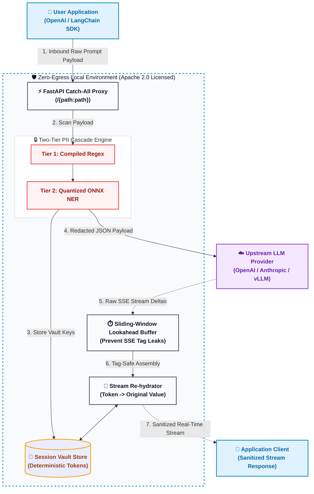

# LLM-Shield-Proxy - Enterprise Privacy Redaction Engine

[](https://pypi.org/project/llm-shield-proxy/)
[](https://opensource.org/licenses/Apache-2.0)
[](https://www.python.org/)

**LLM-Shield-Proxy** is an open-source, zero-egress middleware proxy that intercepts OpenAI-compatible LLM API requests, redacts Personally Identifiable Information (PII) before it leaves your local infrastructure, and deterministically re-hydrates real-time SSE streaming responses without breaking stream latency.

Designed for enterprise privacy compliance (**SOC 2 / HIPAA**).

Author & Core Maintainer: **Ninad Phalak** (`ninad.phalak@gmail.com`)

---

## 🏗️ Architecture & Data Flow



### How It Works (The Data Flow)

**Inbound (Prompt Sanitization)**
1. **Intercept:** Your application sends a standard OpenAI/LangChain payload to `localhost:8000`.
2. **Cascade Redaction:** The proxy intercepts the JSON and routes text through a high-speed compiled Regex engine (for SSNs, emails), falling back to a local ONNX model for unstructured names.
3. **Vault Storage:** The original PII is mapped to a deterministic tag (e.g., `[PERSON_1]`) and stored locally in a TTL-backed session vault.
4. **Clean Egress:** A 100% sanitized payload is forwarded to OpenAI. OpenAI never sees your real data.

**Outbound (Streaming De-redaction)**
5. **SSE Stream Intercept:** OpenAI streams the response back chunk-by-chunk via Server-Sent Events (SSE). 
6. **Lookahead Buffer:** Because tags can be split across chunks (e.g., `[PER` and `SON_1]`), the proxy's sliding-window buffer holds back unclosed brackets to prevent data leaks.
7. **Re-hydration:** Once a tag is fully caught, the proxy swaps the real data back in from the local vault and streams the final, un-redacted text to the user's screen in real-time.

---

## ⚡ Core Features

- **Zero Latency Streaming:** Sliding-window tag-safety buffer intercepts SSE streams delta-by-delta without buffering full requests or responses.
- **Zero Cloud / Zero Egress:** 100% local processing. No external API calls for PII detection.
- **Two-Tier PII Cascade Engine:**
  - **Tier 1 (Sub-millisecond Regex):** SSNs, Credit Cards, Email Addresses, Phone Numbers, IPv4/IPv6, API Keys.
  - **Tier 2 (NER Engine):** Person Names and unstructured entities.
- **Deterministic Re-Hydration Vault:** Swaps PII with session-bound tokens (e.g., `Sarah` -> `[PERSON_1]`). Maps back deterministically when the LLM streams responses. Supports request-scoped and session-scoped (`X-Session-ID`) vaults.
- **SOC 2 Structured Audit Logging:** Emits JSON structured audit logs for compliance monitoring.
- **Opt-In Telemetry:** Strictly opt-in (`TELEMETRY_ENABLED=false` by default) telemetry worker collecting aggregated volumetric metrics with an explicit zero-PII guarantee.

---

## 🛠️ Quickstart

### Installation

Install the package from PyPI:

```bash
pip install llm-shield-proxy
```

#### 1. Start the Proxy

Run the proxy locally via Docker or Uvicorn. No external database required for the open-source core.

```bash
uvicorn app.main:app --host 0.0.0.0 --port 8000
```
or via Docker Compose:
```bash
docker-compose up -d
```

#### 2. Update your Application (1-Line Change)

Point your existing OpenAI SDK `base_url` to your local LLM-Shield-Proxy instance.

```python
from openai import OpenAI

client = OpenAI(
    api_key="your-openai-api-key",
    base_url="http://localhost:8000/v1" # Point to LLM-Shield-Proxy
)

response = client.chat.completions.create(
    model="gpt-4o-mini",
    messages=[
        {"role": "user", "content": "Contact Sarah Connor at sarah@example.com"}
    ],
    stream=True
)

for chunk in response:
    print(chunk.choices[0].delta.content or "", end="")
```

---

## 🧪 Testing

Run the full automated test suite:

```bash
py -m pytest tests/
```

---

## 🏢 Using LLM-Shield-Proxy in Production?

We are actively working with enterprise security teams to map out advanced compliance features. If your startup or organization is using LLM-Shield-Proxy to unblock LLM streaming or pass SOC 2/HIPAA audits, I would love to hear from you.

Email the core maintainer at ninad.phalak@gmail.com to share your feedback, request a feature, or feature your team as a case study.
