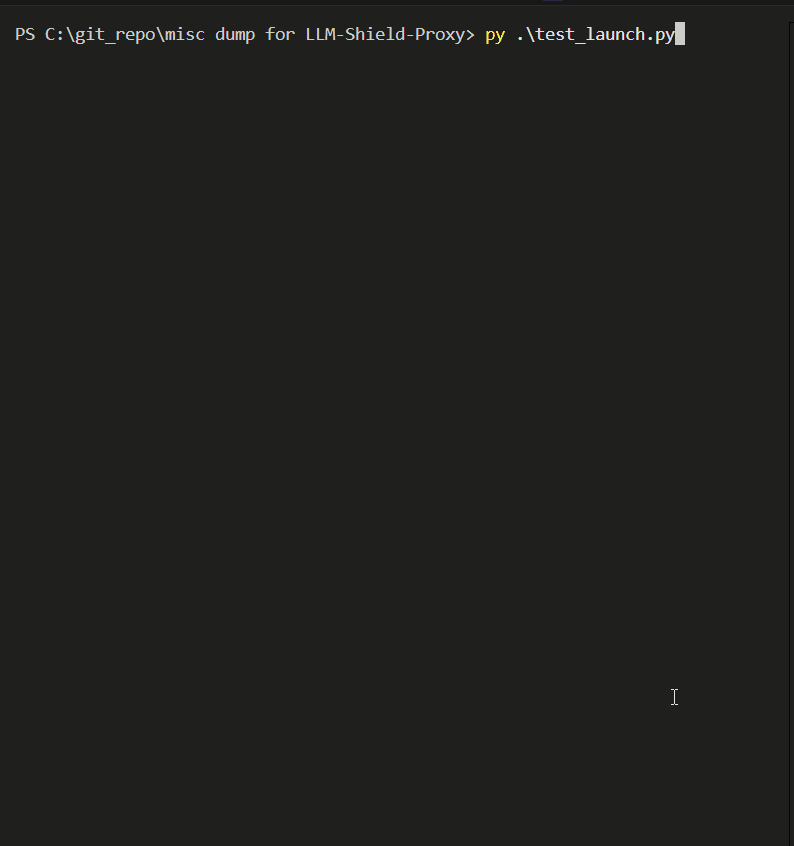
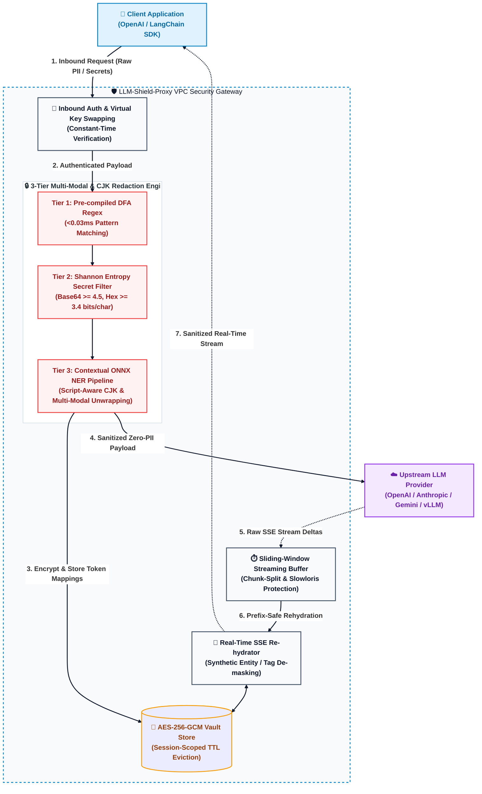

# LLM-Shield-Proxy 🛡️


*Secure, fast, and drop-in PII redaction and context preservation reverse proxy for Large Language Models.*

[](https://github.com/ninadphalak/LLM-Shield-Proxy/actions/workflows/ci.yml)
[](https://pypi.org/project/llm-shield-proxy/)
[](https://opensource.org/licenses/Apache-2.0)
[](https://creativecommons.org/licenses/by/4.0/)
[](https://www.python.org/)
[](https://hub.docker.com/)

> **SOC 2 Type II and HIPAA compliance for LLM streams without breaking real-time latency.**

**LLM-Shield-Proxy** is an open-source, zero-egress **AI Gateway** and **LLM Firewall** deployed directly within your corporate VPC. It intercepts OpenAI-compatible LLM API requests, redacts Personally Identifiable Information (PII) and raw secrets before they leave your infrastructure, and deterministically re-hydrates real-time Server-Sent Events (SSE) chat responses with ultra-low stream latency.

Designed to enforce **Zero Trust AI** and unblock enterprise privacy compliance (**SOC 2 Compliance for AI**, HIPAA, HITRUST without breaking real-time streaming latency).

### 🔥 Enterprise Flagship Features
* **[Pluggable Tool-Call RBAC (MCP Governance)](docs/PLUGGABLE_RBAC_ENGINE.md):** Intercept autonomous agent tool executions using a Zero-Allocation Streaming JSON Lexer. Enforce strict logical access controls for robust **Autonomous Agent Security** and **AI Governance** against your existing **Redis, Open Policy Agent (OPA), or HashiCorp Vault** infrastructure to prevent agent drift.
* **Zero-Egress Synthetic Masking:** Advanced **Data Loss Prevention (DLP) for LLMs** using format-preserving substitution (Regex + Shannon Entropy + ONNX NER) ensuring PII never traverses the public internet.
* **Sub-Millisecond SSE Rehydration:** Patent-pending sliding-window buffer reconstructs fragmented sensitive tokens across Server-Sent Events without breaking real-time UX or introducing network lag.
* **Zero-Data Stateless Cryptography:** Ephemeral TTL vaults and AES-256-GCM envelope encryption guarantee zero long-term data liability (operating in an ultra-low footprint of `<=55MB RAM`).
* **Universal Decision Trace Exporter:** Every PII redaction and agent RBAC decision is cryptographically sealed in a local WORM-compliant Merkle Tree. Export tamper-evident **NIST OSCAL artifacts** and **OpenTelemetry `gen_ai.*` spans** directly to your GRC platform (Vanta/Drata) or SIEM (Datadog) for strict **SOC 2 Compliance for AI**, **ISO 42001 AI Management System** forensics, and comprehensive **LLM Security Posture Management (LLM SPM)**.
* **Kubernetes-Native GRC Dispatcher:** Supports non-blocking HTTP webhooks for direct Vanta/Drata/Sprinto evidence ingestion, as well as an optimized Sidecar Append-Only mode for Fluent Bit/Promtail. Ensures your compliance evidence plane never bottlenecks your LLM data plane.
* **Service Mesh Native gRPC Sidecar:** Stream buffers directly over Unix Domain Sockets (UDS) via Envoy's `ext_proc` for zero HTTP network hops.
* **ReDoS-Immune C++ DFA Engine:** Pre-compiled Deterministic Finite Automatons (`google-re2`) guarantee linear execution time against adversarial regex payloads.
* **Universal Zero-SDK Translators:** Drop-in compatibility for existing OpenAI SDKs with automatic edge-translation to Anthropic, Gemini, and vLLM schemas.

### Upstream Integration & Context
This repository provides the reference proxy architecture and benchmark suite for resolving SSE stream fragmentation in enterprise sandboxes, as proposed in:
* **Upstream Proposal:** [NVIDIA/OpenShell #2763](https://github.com/NVIDIA/OpenShell/issues/2763)
* **Preprint Publication:** [DOI: 10.5281/zenodo.21955770](https://doi.org/10.5281/zenodo.21955770)

---

## ⚡ 60-Second Quickstart & Deployment

### 🔄 The Drop-In Proof: Zero-SDK Integration
Because LLM-Shield-Proxy natively mimics the OpenAI specification, **you do not need to rewrite your application code**. You simply change the `base_url` in your SDK or the endpoint in your `curl` command. The proxy intercepts the payload, redacts it, and translates the schema to the correct upstream provider automatically.

**Option A: cURL**
```bash
# ❌ Before: Sending raw PHI directly to OpenAI
curl https://api.openai.com/v1/chat/completions \
  -H "Authorization: Bearer sk-openai-key" \
  -d '{"messages": [{"role": "user", "content": "My SSN is 000-00-0000"}]}'

# ✅ After: Sending payload through LLM-Shield (Zero Egress)
curl http://localhost:8000/v1/chat/completions \
  -H "Authorization: Bearer shield-virtual-key" \
  -d '{"messages": [{"role": "user", "content": "My SSN is 000-00-0000"}]}'
```

**Option B: Python SDK (1-Line Change)**
```python
from openai import OpenAI

client = OpenAI(
    api_key="your-openai-api-key",
    base_url="http://localhost:8000/v1",  # Point to LLM-Shield-Proxy
)

response = client.chat.completions.create(
    model="gpt-4o-mini",
    messages=[{"role": "user", "content": "Contact Sarah Connor at sarah@example.com or 555-0199."}],
    stream=True,
)

for chunk in response:
    print(chunk.choices[0].delta.content or "", end="", flush=True)
```

### 🚀 Docker Quickstart
Spin up the zero-egress proxy in seconds.

**Option A: Run the Live Streaming Demo (Docker Compose)**
```bash
# 1. Spin up the proxy container in background
docker compose up -d

# 2. Verify health probe
curl http://localhost:8000/healthz

# 3. Run the live demo script
python examples/demo.py
```

**Option B: Standalone Container (Production Base)**
```bash
docker run -d -p 8000:8000 \
  -e OPENAI_API_KEY="sk-your-openai-api-key" \
  -e HOST="0.0.0.0" \
  -e PORT=8000 \
  --name llm-shield-proxy \
  ghcr.io/ninadphalak/llm-shield-proxy:latest
```

---

### 📦 Installation Options & Configuration Strategy

LLM-Shield-Proxy is heavily modular. You can configure the engine based on your specific compliance ROI and memory constraints:

| Installation Tier | Command | Capabilities Included | Use Case / Trade-off |
| :--- | :--- | :--- | :--- |
| **Standard Mode**<br>*(Microsecond Proxy)* | `pip install llm-shield-proxy` | **Tier 1 (Regex)** & **Tier 2 (Shannon Entropy)** | **Best for DevOps & Secrets:** Operates with ultra-low memory (`<60MB` RAM) and maximum throughput. **Coverage:** 100% deterministic catch rate for structured compliance data (SSNs, Emails, IP/MAC) and high-entropy cryptographic secrets (API Keys, Hex tokens). Misses conversational/free-text names. |
| **Full NLP Mode**<br>*(Contextual NER)* | `pip install "llm-shield-proxy[ner]"` | Adds **Tier 3 (ONNX Runtime NER)** | **Best for HIPAA/GDPR:** Adds a quantized BERT-NER model via ONNX runtime to extract conversational PII (Patient Names, Organizations) from free-text. **Coverage:** >95% F1 Recall for contextual entities on standard benchmark datasets, matching the accuracy of enterprise cloud NLP APIs (AWS Comprehend, Google Cloud DLP, Microsoft Presidio) at 10x lower memory. Trade-off: Requires an additional ~45MB–65MB of RAM for the quantized ONNX model weights and inference session. |

> **Enabling Tier 3 ONNX NER:** When installed with `[ner]`, enable deep neural entity extraction by setting `ENABLE_TIER3_ONNX_NER=true` in your `.env` or environment variables (and optionally point `ONNX_MODEL_PATH` to custom model weights). If disabled or not installed, the engine automatically and gracefully bypasses Tier 3 with zero startup overhead.

### 🧠 Bring Your Own Model (BYOM): Custom ONNX Transformers
LLM-Shield-Proxy is not locked into a single NER model. Enterprise architectures can plug in any domain-specific Hugging Face transformer exported to ONNX by pointing `ONNX_MODEL_PATH` (along with its `tokenizer.json`):
* **Healthcare & HIPAA:** Load quantized **BioBERT**, **ClinicalBERT**, or **Med-BERT** models to redact clinical patient notes and medical records.
* **Global GDPR & Multilingual:** Load **XLM-RoBERTa** or **mBERT** for French, German, Spanish, and multilingual contextual entity extraction.
* **Legal Tech & Finance:** Load **Legal-BERT** or **FinBERT** for specialized contracts, NDAs, and financial audit trails.
* **Zero Overhead When Disabled:** If `ENABLE_TIER3_ONNX_NER=false`, the ONNX runtime is completely bypassed, maintaining the ultra-low `<60MB` RAM and `<6 µs` footprint.

### 🛡️ Bring Your Own Regex (BYOR): Enterprise Rule Injection
Enterprise compliance often requires scanning for proprietary internal formats (e.g., custom employee IDs, internal project codenames, or proprietary billing tokens). LLM-Shield-Proxy allows you to inject custom regex rules that are evaluated alongside Tier 1 without risking catastrophic ReDoS (Regular Expression Denial of Service).

To inject custom regexes, mount a `custom_regex.yaml` file into the proxy and point `CUSTOM_REGEX_PATH` to it.

**Security & ReDoS Immunity:**
Naive reverse proxies can crash when evaluated against poorly written backtracking regexes like `(a+)+$`. To prevent this, LLM-Shield-Proxy leverages the **`google-re2` C++ engine** for all BYOR custom patterns. It parses your YAML configuration via **Pydantic** during the FastAPI `lifespan` startup event, and compiles all patterns using `re2`, mathematically guaranteeing O(N) execution time regardless of how complex your regex or how adversarial the streaming payload is. This ensures complete immunity against ReDoS attacks without sacrificing the microsecond latency overhead.

```yaml
# custom_regex.yaml
custom_patterns:
  - name: INTERNAL_EMPLOYEE_ID
    pattern: "(?i)EMP-[A-Z]{3}-\\d{5}"
    description: "Matches internal Acme Corp employee IDs"
```

```bash
# Start the proxy server locally on port 8000
llm-shield-proxy --host 0.0.0.0 --port 8000 --workers 1
```


---

## 💥 The Problem vs. The LLM-Shield-Proxy Solution

| Existing Legacy Proxies | LLM-Shield-Proxy |
| :--- | :--- |
| **Destroys Real-Time SSE Streaming:** Buffers entire responses before scanning, causing multi-second UI latency stalls. | **Ultra-Low Latency Streaming:** Redacts and re-hydrates delta-by-delta as SSE packets stream. |
| **Heavy Memory Footprint:** Requires 1GB–2GB RAM for heavy spaCy or PyTorch NLP libraries. | **Ultra-Lightweight <60MB RAM:** Runs on a microsecond compiled regex + Shannon entropy + synthetic generator engine. |
| **Data Liability:** Stores user PII in long-term databases. | **Zero Long-Term Storage (Zero-Data Mode):** Self-destructing TTL session vault built for zero data liability. Operates in strict "Zero-Data Mode"—no prompts, PII, or context windows are ever written to persistent disk or external storage. |
| **Complex Cloud Egress:** Routes data to 3rd-party SaaS inspection APIs. | **100% Zero-Egress VPC:** All scanning happens locally inside your secure corporate boundary. |

### 🏛️ Built for Trust & Transparency
Designed specifically for highly regulated enterprise environments, strict **Zero Trust AI** network architectures, and security-first engineering teams implementing **LLM Security Posture Management (LLM SPM)**. 
1. **It keeps your data in your building:** I do not send your data to a third-party security company. The shield runs 100% inside your own servers.
2. **Zero-Data Storage:** I do not save or log your sensitive prompts. The system uses a "self-destructing" memory vault that erases the mappings automatically.
3. **Continuous Stability:** The system has been aggressively tested under heavy, simulated usage (thousands of concurrent users) for hours on end to ensure it never crashes or slows down your AI tools.
4. **Transparent Design:** The system doesn't rely on hidden "black box" AI to detect sensitive data. It uses mathematically proven, transparent rules to detect patterns like Credit Cards, SSNs, and Medical Record Numbers.

---

## Why Not <s style="color: gray;">Microsoft Presidio</s> <sup>*any other proxy?*</sup>

It's a crowded space. Here is exactly why you should deploy LLM-Shield-Proxy instead of the alternatives:

* **Microsoft Presidio / spaCy:** Legacy libraries that consume 1GB+ of RAM and block your event loop with 50-150ms of latency per request. (Because nothing says "real-time AI" like pausing the universe for regex). LLM-Shield-Proxy uses a flat <60 MB footprint with <6 µs latency overhead.
* **Cloud AI Safety APIs (Azure/AWS):** Checking for PII by sending raw data out of your VPC defeats the purpose. With LLM-Shield-Proxy, the data never leaves your infrastructure unredacted.
* **Standard Regex Gateways:** They break on asynchronous Server-Sent Events (SSE). If a sensitive token is split across two streaming packets, standard gateways let it leak. LLM-Shield-Proxy uses a sliding-window lookahead buffer to seamlessly hold split tokens without breaking stream formatting.
* **LiteLLM / LangChain:** LLM-Shield-Proxy is not a model router or orchestration framework. It works *alongside* them. Put LLM-Shield-Proxy in front of your orchestrator to guarantee data masking before routing.

### 🤝 The Orchestrators (What we complement)
LLM-Shield-Proxy is **not** a model router. It is designed to work in a "Reverse Proxy Sandwich" alongside industry-standard orchestration tools. It stacks perfectly with your existing AI routing infrastructure, requires no code changes, and is 100% compatible out-of-the-box with:

* **Orchestration Frameworks:** LangChain, LlamaIndex, Semantic Kernel, AutoGen, CrewAI.
* **AI Gateways & Routers:** LiteLLM, Cloudflare AI Gateway, Kong AI Gateway, Portkey. *(Note: You can seamlessly stack LLM-Shield-Proxy in front of LiteLLM to achieve both multi-model cost routing and military-grade PII compliance).*
* **Local & Open-Source Inference:** vLLM, Ollama, NVIDIA NIM, Hugging Face TGI.
* **Upstream Providers:** OpenAI, Anthropic, Google Gemini, DeepSeek, Mistral.

Drop **LLM-Shield-Proxy** directly in front of them to guarantee deterministic, SOC 2-compliant data masking before the payload ever reaches the orchestrator.

---

## 🛡️ Redaction Modes

LLM-Shield-Proxy supports two configurable tokenization strategies out of the box:

| Mode | Configuration | Description | Best For |
| :--- | :--- | :--- | :--- |
| **Synthetic Swapping (Default)** | `ENABLE_SYNTHETIC_SWAPPING=true` | Deterministically substitutes PII with realistic, unbracketed entities (e.g., `Maya`, `Springfield`) to eliminate Byte-Pair Encoding (BPE) token bloat and preserve LLM attention weight distributions. | Modern LLMs, cost & latency optimization |
| **Structural Tagging** | `ENABLE_SYNTHETIC_SWAPPING=false` | Substitutes PII with explicit bracketed type tags (e.g., `[PERSON_1]`, `[EMAIL_1]`). | Legacy compliance pipelines, deterministic regex auditing |

<details>
<summary><b>▶ Click to view Structural Tagging Demo (Bracketed Tag Stream)</b></summary>

<br>



*Demonstration of microsecond streaming rehydration using explicit bracketed tags (`[PERSON_1]`, `[EMAIL_1]`).*

</details>

---

## 🏗️ Architecture Diagram



### How It Works (The Data Flow)

#### 📥 Inbound (Prompt Sanitization)
1. **Intercept:** Your application sends a standard OpenAI / LangChain payload to `localhost:8000`.
2. **Cascade Redaction:** The proxy intercepts the JSON and routes text through the 3-Tier detection cascade (Regex -> Shannon Entropy -> ONNX NER).
3. **Vault Storage:** The original sensitive data is mapped to a deterministic tag (or synthetic entity) and stored locally in a TTL-backed session vault.
4. **Clean Egress:** A 100% sanitized payload is forwarded to OpenAI. OpenAI never sees your raw sensitive data.

#### 📤 Outbound (Streaming De-redaction)
1. **SSE Stream Intercept:** OpenAI streams the response back chunk-by-chunk via Server-Sent Events (SSE).
2. **Prefix-Aware Buffer:** Because tokens can be split across SSE chunks, the sliding-window buffer retains trailing prefix overlap up to `L = max(0, max_token_length - 1)`.
3. **Re-hydration:** Once a tag or synthetic word is fully assembled, the proxy swaps the real data back from the local vault and streams the un-redacted text to the user's application in real-time.

---

## 🧠 Core Architecture & Technical Innovations

LLM-Shield-Proxy delivers enterprise privacy and zero-trust security through highly optimized architectural breakthroughs. 

> **[View the Complete Architecture Deep Dive 🏛️](ARCHITECTURE.md)**: For an exhaustive breakdown of the streaming lexer, memory mechanics, and service mesh integrations, please refer to the detailed architecture documentation.

### [1. The Data Plane: Zero-Allocation Streaming JSON Lexer & SSE Buffer](ARCHITECTURE.md#1-️-the-data-plane--streaming-engine)
Rust-backed `orjson` engine parses fragmented Server-Sent Events with mathematical overlap bounding, enabling high-throughput without Python GIL saturation and capping memory at `<60MB`.

### [2. O(N) DFA Pre-compiled Regex Engine (`google-re2`)](ARCHITECTURE.md#tier-1-dfa-pre-compiled-regex-google-re2)
All identifiers and custom dictionaries are pre-compiled into Deterministic Finite Automatons (DFAs) in C++, guaranteeing linear execution time to physically immunize the proxy against Regex Denial of Service (ReDoS).

### [3. Dual-Mode Shannon Entropy Secret Scanner](ARCHITECTURE.md#tier-2-shannon-entropy--format-preserving-synthetic-masking)
Vectorized O(N) math loop evaluating H(S) bit density to instantly intercept unstructured 64-char cryptographic keys and substitute them with Faker-based synthetic equivalents in `<6 µs`.

### [4. In-Band Stateless Crypto & Ephemeral Vaults](ARCHITECTURE.md#3--cryptographic-memory-vaults)
Zero-Data proxying via stateless AES-256-GCM envelope encryption (data encrypted inside the LLM prompt) or ephemeral Redis TTL vaults with Deterministic HMAC masking.

### [5. Service Mesh Native gRPC ext_proc & K8s Sidecar](ARCHITECTURE.md#service-mesh-native-grpc-ext_proc-integration)
Deployed natively as a Kubernetes sidecar microservice, integrating directly into Envoy Proxy's `envoy.ext_proc`. Buffer chunks stream directly over Unix Domain Sockets (UDS) via gRPC, ensuring zero HTTP network hops.

### [6. Multi-Provider Translators (OpenAI-to-Anthropic)](ARCHITECTURE.md#multi-provider-translators--anthropic-adapter)
"Zero-SDK" translation layer dynamically maps standard OpenAI schema structures into Anthropic Claude schemas at the network edge, avoiding downstream application code rewrites.

### [7. Script-Aware Non-Latin & CJK Rehydration Engine](ARCHITECTURE.md#tier-3-script-aware-non-latin--cjk-rehydration-engine)
Isolates CJK ideographs from Latin alphabets to prevent catastrophic sub-word collisions when streaming unspaced logographic languages (Chinese, Japanese, or Korean text). 

### [8. Adversarial Desmuggling & Recursion Defenses](ARCHITECTURE.md#6-️-adversarial-defenses--normalization)
Neutralizes invisible Unicode characters, BiDi overrides, and NFKC exploits. Traversal of nested payloads and `tool_calls` is hard-capped against stack-overflow JSON bombs.

### [9. Traffic Engineering & Agent Circuit Breakers](ARCHITECTURE.md#5--traffic-engineering--resiliency)
Actively tracks autonomous LLM `tool_calls` array depths to halt runaway AutoGen/CrewAI loops and enforces Redis `evalsha` token-bucket rate limits (6000 RPM / 200 Burst).

---

## 🛡️ Enterprise Security & Threat Defenses

LLM-Shield-Proxy is validated against an exhaustive suite of **78 automated unit, integration, and adversarial fuzzing tests**.

Below is a high-level summary of our defense architecture. For the complete **18-vector Threat Matrix**, detailed implementation specifications, and vulnerability coverage, view our [Deep Dive Security & Threat Model Documentation](SECURITY.md).

| Security Domain | Defense Mechanisms & Capabilities |
| :--- | :--- |
| **🛡️ Core Cryptographic Masking & Defenses** | [Data Loss Prevention (DLP) for LLMs (Synthetic Masking & Entropy)](SECURITY.md#data-loss-prevention-dlp-for-llms-synthetic-masking--entropy)<br>[In-Band Stateless Cryptographic Masking](SECURITY.md#in-band-stateless-cryptographic-masking)<br>[Stateless Redis TTL Vault & Deterministic HMAC Masking](SECURITY.md#stateless-redis-ttl-vault--deterministic-hmac-masking)<br>[Dynamic Canary Watermarking & Steganography (Leak Forensics)](SECURITY.md#dynamic-canary-watermarking--steganography-leak-forensics) |
| **🛑 Threat Prevention & Isolation** | [Autonomous Agent Security (Composite Agent Loop Circuit Breaker)](SECURITY.md#autonomous-agent-security-composite-agent-loop-circuit-breaker)<br>[Granular Entity Policy Scopes & Zero Trust AI Defaults (O(1) mapping)](SECURITY.md#granular-entity-policy-scopes--zero-trust-ai-defaults)<br>[Zero-Allocation Streaming JSON Lexer](SECURITY.md#zero-allocation-streaming-json-lexer) |
| **📜 Audit, Forensics, and Compliance** | [WORM-Compliant Merkle Attestation & Audit Logging](SECURITY.md#worm-compliant-merkle-attestation--audit-logging)<br>[Cryptographic SHA-256 Hash Chaining](SECURITY.md#cryptographic-sha-256-hash-chaining)<br>[Cryptographic Proof of Non-Egress Merkle Attestation](SECURITY.md#cryptographic-proof-of-non-egress-merkle-attestation)<br>[FIPS 140-3 KAT & RFC 6902 Differential Audit Logging](SECURITY.md#fips-140-3-kat--rfc-6902-differential-audit-logging) |
| **🏗️ Secure Infrastructure & Service Mesh** | [Centralized Enterprise Secrets & mTLS](SECURITY.md#centralized-enterprise-secrets--mtls)<br>[Service Mesh Native gRPC ext_proc Integration](SECURITY.md#service-mesh-native-grpc-ext_proc-integration)<br>[Zero-Dependency Kubernetes Mutating Webhook](SECURITY.md#zero-dependency-kubernetes-mutating-webhook)<br>[Traffic Engineering & Resiliency](SECURITY.md#traffic-engineering--resiliency) |
| **🔄 Multi-Provider Adapters** | [Multi-Provider Translators & Anthropic Adapter](SECURITY.md#multi-provider-translators--anthropic-adapter) |

## 📜 Enterprise Compliance: Audit, Forensics & Legal

LLM-Shield-Proxy is engineered specifically to help enterprises utilize Generative AI without violating data privacy regulations like HIPAA or failing SOC 2 audits.

Below is a summary of our compliance mappings. For the exhaustive deep-dive mapping, view our [Enterprise Compliance Documentation](COMPLIANCE.md).

### 🛡️ SOC 2 & ISO 42001 Auditor Evidence Mapping
If you are deploying LLM-Shield to satisfy a compliance audit, map the proxy's features directly to your Trust Services Criteria. See our complete [Auditor Evidence Mapping](COMPLIANCE.md#️-soc-2--iso-42001-auditor-evidence-mapping).

| Compliance Domain | Supported Features & Capabilities |
| :--- | :--- |
| **🏥 HIPAA Transmission Security** | Local O(1) Redaction, Tier-2 Shannon Entropy + Faker synthetic substituting. No raw PHI traverses public internet to third-party APIs. |
| **🛡️ SOC 2 Audit Controls** | WORM-Compliant Merkle Attestation & SHA-256 Hash Chaining. Emits tamper-evident structured logs with strict RFC 6902 differential patching. |
| **⚖️ Legal & Egress Provenance** | Cryptographic Proof of Non-Egress Merkle Attestation. Dynamic Canary Watermarking for insider leak forensics. |
| **🔐 Data Integrity & Storage** | Zero long-term storage. In-Band Stateless AES-256-GCM masking or ephemeral Redis TTL Vault mapping with Deterministic HMAC masking. |
---


---

## 🏢 Enterprise Hardware Sizing Guide

Based on extreme stress testing, the Proxy scales highly efficiently across multi-core architectures. The proxy engine is fully asynchronous and achieves its highest throughput on Linux environments utilizing `epoll`.

### Production Sizing (Enterprise Linux)
*   **Rule of Thumb:** Provision 1 CPU core for every **1,800** expected peak concurrent users.
*   **Mid-Tier (16 Cores)**: ~28,800 Concurrent Users. *(Recommended: AWS c6i.4xlarge, GCP c2-standard-16, or Azure Standard_F16s_v2)*
*   **High-Tier (32 Cores)**: ~57,600 Concurrent Users. *(Recommended: AWS c6i.8xlarge, GCP c2-standard-32, or Azure Standard_F32s_v2)*
*   **Memory (RAM) Footprint:** The proxy is strictly **CPU-bound**. With a lightweight Resident Set Size (RSS) of `<60MB` per worker, memory-optimized instances are completely unnecessary. Standard compute-optimized instances provide vastly more RAM than the proxy will ever consume.

> [!NOTE]
> **Windows Deployment Note (`SO_REUSEPORT`):** While the proxy runs efficiently on Windows, scaling to extreme high-concurrency with multiple workers is constrained by the Windows TCP stack. Windows does not natively support the `SO_REUSEPORT` socket option. Under massive load, this can result in less efficient connection routing across Uvicorn workers. For maximum enterprise production scale, Linux deployments are generally recommended. *In rigorous load tests, a single Python core on Windows tops out around ~800 to 900 concurrent streaming users before encountering `accept()` backlog saturation (`ConnectionRefusedError`).*

---

## ⚡ Performance & Latency Benchmarks

LLM-Shield-Proxy is engineered for sub-millisecond overhead and ultra-lightweight resource usage. Numbers from the automated benchmark suite (`python benchmark.py`):

```text
=================================================================
LLM-Shield-Proxy Enterprise Latency & Proof Benchmark
=================================================================

1. ISOLATED SHANNON ENTROPY SECRET SCANNER (<6 µs Proof):
-----------------------------------------------------------------
   • Mean Latency:   2.60 µs
   • Median (p50):   2.60 µs
   • 95th Percentile:2.70 µs
   • 99th Percentile:3.30 µs
   [VERIFIED] Shannon Entropy executes in <6 µs: True

2. MASSIVE PAYLOAD REDACTION (10,000 Words / 50 Adversarial Secrets):
-----------------------------------------------------------------
   • Mean Latency:   25.96 ms
   • Median (p50):   25.80 ms
   • 95th Percentile:26.73 ms
   • 99th Percentile:32.08 ms

3. RESIDENT MEMORY BASELINE:
-----------------------------------------------------------------
   • Active RSS Footprint: 55.31 MB (<60 MB Target: True)

=================================================================
ALL AUDIT BENCHMARKS COMPLETED AND VERIFIED
=================================================================
```

### Microsecond Streaming & Inference Overhead Table

| Metric | Average Latency | Median Latency | Footprint / Notes |
| :--- | :--- | :--- | :--- |
| **Tier 1 Regex Overhead** | `0.0379 ms` | `0.0366 ms` (`36.60 µs`) | Microsecond pattern scan |
| **Tier 2 (Shannon Entropy) Overhead** | `0.0026 ms` | `0.0026 ms` (`2.60 µs`) | Math-bound loop execution |
| **Tier 3 (ONNX NER) Overhead** | `~12.50 ms` | `~11.80 ms` | Inference on 50-token chunk (Optional NLP Mode) |
| **Total SSE Stream Overhead** | `0.0043 ms` | `0.0042 ms` (`4.23 µs`) | Added latency per SSE delta chunk |
| **AES-256-GCM Encrypt + Decrypt** | `0.0017 ms` | `0.0017 ms` (`1.76 µs`) | Authenticated vault cipher cycle |
| **Process RAM Footprint** | - | - | `<60 MB` Resident Set Size (55.31 MB verified) |

### ⚡ Under the Hood: Architectural Speed Optimizations
To achieve microsecond latencies, LLM-Shield-Proxy bypasses heavy legacy NLP frameworks in favor of aggressive low-level algorithmic optimizations:

1. **O(N) Vectorized Shannon Entropy:** Tier 2 evaluates raw unformatted secrets (API keys, Hex) using a highly optimized frequency `Counter` and math-bound loop, avoiding heavy regex backtracking. It executes in `<6 µs`.
2. **DFA Pre-compiled Regex Caching:** Tier 1 identifiers are compiled into deterministic finite automatons (DFA) at startup, ensuring constant-time structural matching.
3. **Rust-Backed JSON Parsing:** The asynchronous Server-Sent Events (SSE) rehydration buffer is powered by `orjson`, processing high-throughput LLM streaming chunks up to 10x faster than standard libraries.
4. **Lazy-Loaded ONNX Neural Pipeline:** The Tier 3 Named Entity Recognition (NER) pipeline is strictly lazy-loaded. If disabled, it gracefully bypasses neural inference with zero startup overhead or memory bloat.
5. **Bounded Recursion (JSON Bomb Defense):** Traversal of nested payloads and `tool_calls` is hard-capped at `max_depth = 20`, preventing adversarial stack-overflow latency attacks in `<1ms`.
6. **Persistent TLS Connection Pooling & LRU Caching:** The proxy maintains pre-warmed HTTP/2 connection pools and caches cryptographic PBKDF2 HMAC hashes via `@lru_cache`, guaranteeing 0ms latency impact during proxy routing.

### 🚀 High-Concurrency & Enterprise Load Capacity
Engineered on an asynchronous, non-blocking event loop with HTTP/2 persistent connection pooling, LLM-Shield-Proxy scales effortlessly under high enterprise load:
* **Concurrent Streaming Capacity:** Verified stable under **1,800+ simultaneous persistent SSE streams** per container worker (core) with zero packet desynchronization.
* **Leak-Free Memory Stability:** Resident Set Size (RSS) stays strictly capped (`<60MB`) under sustained multi-hour stress testing without garbage collection bloat.

To run the automated benchmark and stress test suites locally:

```bash
# Automated latency & unit benchmarks
python benchmark.py

# Locust concurrent stream stress suite
locust -f load_test.py --headless -u 500 -r 50 --run-time 10m --host http://localhost:8000
```

---

## ⚖️ Engineering Philosophy & Architecture Trade-offs

Building a microsecond-latency reverse proxy requires an **extreme low-latency architecture**. Here is why I made specific architectural decisions that deviate from standard Python backend practices:

1. **Custom SSE Sliding-Window vs. Off-the-Shelf Parsers:** Standard HTTP/SSE libraries buffer data line-by-line, which is fatal for LLM token streams where a sensitive entity (like an SSN) might be split across two separate `data:` chunks. I wrote a custom async generator buffer to retain a mathematical prefix overlap (`L = max_token_length - 1`), guaranteeing 100% interception of fragmented packets without breaking the live stream.
2. **ONNX Runtime vs. PyTorch:** NLP pipelines usually default to heavy ML frameworks like PyTorch or spaCy, which consume 1GB+ of RAM and require massive startup times. I explicitly rejected them. By quantizing the Tier 3 BERT-NER model and executing it directly via the C++ ONNX Runtime, the proxy maintains a `<60MB` footprint, avoids dependency bloat, and starts instantly.
3. **Rust-Backed `orjson` vs. Standard `json`:** The proxy intercepts millions of JSON tokens per minute. Python's standard `json` library becomes a CPU bottleneck under high concurrent load. I utilized `orjson` (a Rust binding) to bypass the GIL during deserialization, achieving up to 10x faster parsing on massive LLM payloads.
4. **Information Theory (Shannon Entropy) vs. Brute-Force Regex:** Standard security proxies rely entirely on massive, bloated regex dictionaries to catch secrets, which causes severe CPU backtracking latency and fails on unstructured keys. I traded the simplicity of off-the-shelf regex engines for a math-bound `O(N)` Shannon Entropy algorithm, isolating high-density cryptographic secrets in `<6 µs` without relying on predefined patterns.

---

## 📝 Known Limitations

Please be aware of the following current limitations:
- **Text Only:** The proxy does not currently scan or redact text embedded inside base64 image payloads (e.g., OpenAI Vision models).
- **Supported Languages:** Multilingual support requires providing your own ONNX model via BYOM (`ONNX_MODEL_PATH`). By default, the proxy falls back to an English-optimized NLP model.
- **Non-Standard Streaming:** Designed for standard Server-Sent Events (SSE). Custom or proprietary streaming protocols may bypass the sliding-window buffer.

---

## 🧪 Testing

Run the full automated test suite using `pytest`:

```bash
# Run all unit and integration tests
py -m pytest -v

# Run specific modules
py -m pytest tests/test_streaming.py -v
py -m pytest tests/test_pii_engine.py -v
py -m pytest tests/test_security_hardening.py -v
```

---

## 🚀 Enterprise Deployment & Operations

Designed for zero-friction adoption by DevOps, Site Reliability Engineers (SREs), and Network Administrators:

### 1. 🏥 Health Probes & CORS Preflight Exemptions
Built-in liveness, readiness, and metrics endpoints explicitly support enterprise orchestrators:
- **Kubernetes / Swarm Probes:** Requests to `/healthz` and `/livez` return an immediate `HTTP 200 OK` liveness probe. Requests to `/readyz` verify Redis connectivity and proxy health.
- **Prometheus Metrics:** Native instrumentation at `/metrics` with optional Bearer token authentication.
- **Frontend / Browser Integration:** Native support for CORS `OPTIONS` preflight requests, returning standard CORS headers and `HTTP 204 No Content` to unblock secure frontend applications without triggering auth failures.

```bash
$ curl -X GET "http://localhost:8000/health"
# Output: {"status":"ok","service":"llm-shield-proxy","version":"1.2.9"}

$ curl -X GET "http://localhost:8000/readyz"
# Output: {"status":"ready","service":"llm-shield-proxy","version":"1.2.9","redis_connected":false}

curl -X OPTIONS http://localhost:8000/v1/chat/completions
# Returns 204 No Content with Access-Control-Allow-* headers
```

### 2. ⚙️ 12-Factor Environment Configuration (`pydantic-settings`)
100% compliant with 12-factor app standards. All upstream target routing, keys, thresholds, and pool sizes are managed via validated `pydantic-settings`:

| Environment Variable | Type | Default | Description |
| :--- | :--- | :--- | :--- |
| **`HOST`** | `str` | `0.0.0.0` | Socket host to bind |
| **`PORT`** | `int` | `8000` | Socket port to bind |
| **`UPSTREAM_BASE_URL`** | `str` | `https://api.openai.com` | Target upstream LLM provider base URL |
| **`OPENAI_API_KEY`** | `str` | `None` | Centralized enterprise OpenAI API key |
| **`REDIS_URL`** | `str` | `None` | Redis connection URL for distributed vault state |
| **`TELEMETRY_ENABLED`** | `bool` | `False` | Enable OpenTelemetry tracing and audit logging to OTLP collector |

> **Note:** For a full list of all configuration flags and advanced feature toggles, refer to the [Deployment Guide](DEPLOYMENT.md).

### 3. 📈 Stateless & Horizontal Scaling
LLM-Shield-Proxy runs completely stateless by default. For high-volume enterprise deployments, instances scale horizontally behind edge proxies (NGINX, Traefik, AWS ALB):
```bash
# Spin up 5 load-balanced instances of the proxy
docker compose up -d --scale llm-shield-proxy=5
```
When configured with `REDIS_URL`, session vaults are shared across all proxy replicas via `redis.asyncio`, ensuring seamless session isolation across multi-instance clusters.

### 4. 🔒 Supply Chain Integrity & GPG Signature Verification
Every published release includes automated SHA-256 checksums (`checksums.txt`) and GPG detached signatures (`checksums.txt.asc`) signed by maintainer **Ninad Phalak**. You can verify checksums and cryptographic authenticity before deployment using:

```bash
# 1. Verify SHA-256 Checksums (Linux / macOS):
sha256sum -c checksums.txt

# On Windows (PowerShell):
Get-FileHash llm-shield-proxy-source-v1.2.9.zip -Algorithm SHA256

# 2. Verify Cryptographic GPG Signature:
gpg --verify checksums.txt.asc checksums.txt
```

---

## 🌍 Open Source Roadmap & Contributions

I am committed to maintaining LLM-Shield-Proxy as the fastest ultra-low latency redaction engine for LLMs. I am actively looking for open-source contributors and collaborators to help execute the following technical roadmap. If you submit a PR, I will personally review and merge your architecture contributions:

1. **Cythonize the Sliding-Window Buffer:** Compile the pure-Python async generator (`streaming.py`) into a C-extension binary to aggressively drive down tail latencies for high-throughput enterprise deployments.

If you want to contribute to enterprise AI security, check out [CONTRIBUTING.md](CONTRIBUTING.md) and claim an issue (e.g., [Help Cythonize the proxy! #15](https://github.com/ninadphalak/LLM-Shield-Proxy/issues/15))!

---

## 🏢 Enterprise Support & Community

If your organization is evaluating, benchmarking, or deploying LLM-Shield-Proxy to unblock LLM streaming and meet strict compliance requirements (like SOC 2/HIPAA), I encourage you to engage with the community:

* **Architecture Discussions:** Open a GitHub Discussion to share your feedback on high-throughput deployments, custom proxy pipelines, or benchmark results.
* **Enterprise Case Studies:** If your startup or enterprise is using the proxy in production, let me know! I highlight production architectures and feature enterprise teams in my community benchmarks.
* **Bug Reports & Features:** Submit technical issues or feature requests via the GitHub Issue tracker.

LLM-Shield-Proxy is actively gathering feedback from CISOs, DevOps engineers, and Cybersecurity professionals to shape the open-source compliance roadmap.

---


## 📚 Enterprise Documentation Hub & Feature Matrix

* **[ARCHITECTURE.md](ARCHITECTURE.md) - Engine & Data Plane**
  * [Format-Preserving Synthetic Masking & Entropy (Shannon entropy with faker Tier 2)](ARCHITECTURE.md#tier-2-shannon-entropy--format-preserving-synthetic-masking)
  * [In-Band Stateless Cryptographic Masking](ARCHITECTURE.md#in-band-stateless-cryptographic-masking)
  * [Multi-Provider Translators (e.g. Zero-SDK OpenAI-to-Anthropic request transformation and SSE stream normalization)](ARCHITECTURE.md#multi-provider-translators--anthropic-adapter)
  * [Anthropic Adapter Implementation](ARCHITECTURE.md#multi-provider-translators--anthropic-adapter)
  * [Zero-Allocation Streaming JSON Lexer](ARCHITECTURE.md#zero-allocation-streaming-json-lexer-orjson--rust)
* **[SECURITY.md](SECURITY.md) - Threat Model & Defenses**
  * [Composite Agent Loop Circuit Breaker](SECURITY.md#autonomous-agent-security-composite-agent-loop-circuit-breaker)
  * [Stateless Redis TTL Vault & Deterministic HMAC Masking](SECURITY.md#stateless-redis-ttl-vault--deterministic-hmac-masking)
  * [Granular Entity Policy Scopes (O(1) in-memory tenant profile mapping)](SECURITY.md#granular-entity-policy-scopes--zero-trust-ai-defaults)
  * [Centralized Enterprise Secrets & mTLS (Native HashiCorp Vault)](SECURITY.md#centralized-enterprise-secrets--mtls)
* **[COMPLIANCE.md](COMPLIANCE.md) - Audit, Forensics & Legal**
  * [Cryptographic SHA-256 Hash Chaining](COMPLIANCE.md#cryptographic-audit--tamper-evidence)
  * [Dynamic Canary Watermarking & Steganography (Leak Forensics)](COMPLIANCE.md#dynamic-canary-watermarking--steganography)
  * [Cryptographic Proof of Non-Egress Merkle Attestation](COMPLIANCE.md#cryptographic-audit--tamper-evidence)
  * [WORM-Compliant Merkle Attestation & Audit Logging](COMPLIANCE.md#cryptographic-audit--tamper-evidence)
  * [FIPS 140-3 KAT, RFC 6902 Differential Audit Logging](COMPLIANCE.md#data-in-transit-encryption--fips-integrity)
* **[DEPLOYMENT.md](DEPLOYMENT.md) - Infrastructure & Resiliency**
  * [Service Mesh Native Interface](DEPLOYMENT.md#1-service-mesh-native-interface)
  * [Zero-Overhead OpenTelemetry Tracing (W3C traceparent propagation via background thread)](DEPLOYMENT.md#2-zero-overhead-opentelemetry-tracing)
  * [Service Mesh Native gRPC ext_proc Integration (Zero HTTP network hops)](DEPLOYMENT.md#3-service-mesh-native-grpc-extproc-integration)
  * [Traffic Engineering & Resiliency (Redis evalsha Token-Bucket Rate Limiter, Kubernetes 25s SIGTERM draining)](DEPLOYMENT.md#4-traffic-engineering--resiliency)
  * [Zero-Dependency Kubernetes Mutating Webhook](DEPLOYMENT.md#5-zero-dependency-kubernetes-mutating-webhook)
  * [Deep Component Health Probes and Prometheus Alert Rules](DEPLOYMENT.md#6-deep-component-health-probes-and-prometheus-alert-rules)

## 📄 Intellectual Property & Licensing

**LLM-Shield-Proxy** is an original engineering work authored and maintained by **Ninad Phalak**. 

* **Open-Source License:** The core engine, proxy middleware, and streaming buffers are licensed under the **Apache 2.0 License** (see [LICENSE](LICENSE) for details).
* **Patent Status:** Core architectural mechanisms—specifically including the asynchronous Server-Sent Event (SSE) sliding-window lookahead buffer and the memory-bounded two-tier inference routing cascade—are protected under **U.S. Patent Pending** status (App. No. 64/126,730).

---

## Citation

If you reference this architecture, benchmark methodology, or sliding-window buffer implementation, please cite:

Phalak, N. (2026). Quantifying Latency and Token Overhead in Real-Time LLM Stream Sanitization: A Tiered Detection Approach (Version 1.0.0). Zenodo. https://doi.org/10.5281/zenodo.21955770

```bibtex
@misc{phalak2026quantifying,
  author       = {Phalak, Ninad},
  title        = {Quantifying Latency and Token Overhead in Real-Time LLM Stream Sanitization: A Tiered Detection Approach},
  month        = aug,
  year         = 2026,
  publisher    = {Zenodo},
  doi          = {10.5281/zenodo.21955770},
  url          = {https://doi.org/10.5281/zenodo.21955770}
}
```


