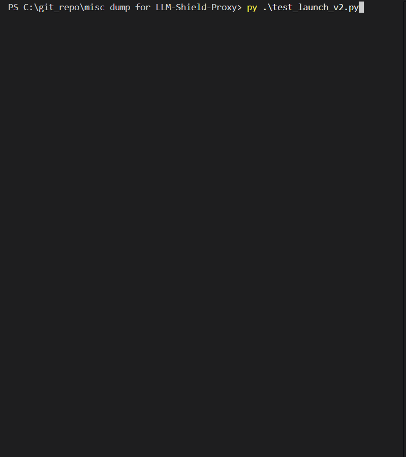

# LLM-Shield-Proxy 🛡️

[](https://github.com/ninadphalak/LLM-Shield-Proxy/actions/workflows/ci.yml)
[](https://pypi.org/project/llm-shield-proxy/)
[](https://opensource.org/licenses/Apache-2.0)
[](https://creativecommons.org/licenses/by/4.0/)
[](https://www.python.org/)
[](https://hub.docker.com/)



**Ultra-Low Latency Generative AI Sanitization for Highly Regulated Enterprise Infrastructure**

LLM-Shield-Proxy is a hyper-fast, FastAPI-based streaming gateway designed specifically for environments where data privacy is paramount (Banking, Healthcare, Legal). It intercepts and sanitizes real-time LLM streams to prevent the leakage of Non-Public Personal Information (NPI), Protected Health Information (PHI), and Payment Card Industry (PCI) data without degrading the end-user streaming experience.

By utilizing a highly optimized **Tiered Detection Approach**, LLM-Shield-Proxy applies guardrails at the microsecond level, keeping your AI applications compliant with strict InfoSec mandates (GLBA, PCI-DSS, HIPAA) while maintaining zero-perceived-latency.

**Option 1: Standard Egress**
<br>


**Option 2: Zero-Internet Air-Gapped Mode**
<br>

<br>
*\* Egress Gateway can be any standard network proxy (e.g., Squid, Envoy, LLMLite, NGINX).*

> **SOC 2 Type II and HIPAA compliance for LLM streams without breaking real-time latency.**

**LLM-Shield-Proxy** is an open-source, zero-egress **AI Gateway** and **LLM Firewall** deployed directly within your corporate VPC. It intercepts OpenAI-compatible LLM API requests, redacts Personally Identifiable Information (PII) and raw secrets before they leave your infrastructure, and deterministically re-hydrates real-time Server-Sent Events (SSE) chat responses with ultra-low stream latency.

Designed to enforce **Zero Trust AI** and unblock enterprise privacy compliance (**SOC 2 Compliance for AI**, HIPAA, HITRUST without breaking real-time streaming latency).

## 🛡️ Dual-Pipeline Redaction Architecture

LLM-Shield-Proxy intelligently routes traffic through two distinct redaction pipelines based on the payload structure. This ensures that autonomous agents don't crash from broken syntax trees, while human prompts get the highest quality contextual masking.

<br>


### A. Human-to-LLM (Text Prompts)
For standard conversational text, the proxy respects your configured masking mode. You can choose from four strategies:
1. **SYNTHETIC (Stateful):** (e.g. replacing *'My SSN is 000-00-0000'* with *'My SSN is 111-11-1111'*). Swaps PII with canonical locale fakes (e.g., `John` -> `Maya`). Preserves LLM attention weights and token counts. Requires Redis.
2. **STRUCTURAL_TAG (Stateful):** (e.g. replacing *'My SSN is 000-00-0000'* with *'My SSN is [SSN_1]'*). Swaps PII with explicit bracketed tags (e.g., `[PERSON_1]`). Requires Redis.
3. **SCRUB (Stateless):** (e.g. replacing *'My SSN is 000-00-0000'* with *'My SSN is ***'*). Destructive one-way redaction (`***`). Cannot be rehydrated.
4. **STATELESS_CRYPTO (Stateless):** (e.g. replacing *'My SSN is 000-00-0000'* with *'My SSN is [enc_3x9kL]'*). Encrypts PII in-band via AES-256-GCM. Zero Redis dependency.

### B. Machine-to-Machine (JSON-RPC / Tool Calls)
When the proxy detects structured AI tool calls or JSON-RPC `2.0` payloads, it **bypasses your configuration** and strictly enforces an **AST-Aware Semantic Firewall** with **STATELESS_SYNTHETIC**.
* **Why?** Blindly running regex over raw JSON strings can corrupt syntax (e.g., matching a JSON key or injecting unescaped characters), causing agent crashes.
* **The Solution:** The proxy parses the payload into an Abstract Syntax Tree (AST). It safely replaces sensitive leaf values with synthetic fakes and bundles them with an in-band AES-256-GCM cipher (e.g., `{"_shield_val": "Maya", "_shield_ctx": "aesgcm..."}`). This guarantees 100% valid JSON syntax without relying on Redis state.

---

### 🔥 Enterprise Flagship Features
* **[Sub-Millisecond SSE Rehydration](#-how-it-works-the-data-flow):** Patent-pending sliding-window buffer reconstructs fragmented sensitive tokens across Server-Sent Events without breaking real-time UX or introducing network lag (<4.3 µs overhead per chunk).
* **[Zero-Egress Synthetic Masking](#️-dual-pipeline-redaction-architecture):** Advanced **Data Loss Prevention (DLP) for LLMs** using format-preserving substitution (Regex + Shannon Entropy + ONNX NER) ensuring PII never traverses the public internet.
* **[Air-Gapped Egress Gateway Mode](docs/features/air-gapped-egress.md):** Allows operation in strict Zero-Internet corporate subnets by securely routing all upstream traffic through an internal egress gateway, optionally stripping auth headers for internal mTLS architectures.
* **[Zero-Data Stateless Syntheticgraphy](#4-in-band-stateless-crypto--ephemeral-vaults):** Ephemeral TTL vaults and AES-256-GCM envelope encryption guarantee zero long-term data liability (operating in an ultra-low footprint of `<85 MB RAM`).
* **[Role-Based Policy-as-Code & Hot-Reloading](POLICIES.md):** Zero-downtime YAML file watcher (`policies.yaml`) dynamically maps `virtual_key_id` identities to granular security roles, custom PII profiles, and thread-safe $O(1)$ setting overrides.
* **[Universal Decision Trace Exporter](#-enterprise-compliance-audit-forensics--legal):** Every PII redaction and agent RBAC decision is cryptographically sealed in a local WORM-compliant Merkle Tree. Export tamper-evident **NIST OSCAL artifacts** and **OpenTelemetry `gen_ai.*` spans** directly to your GRC platform (Vanta/Drata) or SIEM (Datadog) for strict **SOC 2 Compliance for AI**, **ISO 42001 AI Management System** forensics, and comprehensive **LLM Security Posture Management (LLM SPM)**.
* **[Streaming Tool-Call Interception & Agent Governance](docs/PLUGGABLE_RBAC_ENGINE.md):** Intercepts real-time LLM function calls (e.g., `exec_sql`, `shell_exec`) mid-stream using a zero-allocation JSON parser, enforcing fail-closed tool access controls backed by Redis, OPA, or Vault policy stores to prevent agent drift.
* **[Context-Aware Tool Catalog Pruner (MCP Discovery)](docs/features/ultra-low-latency-streaming-traffic-engineering/context-aware-mcp-discovery-pruner.md):** Dynamically intercepts JSON-RPC server/discover payloads at the network edge using our Stateless Mutation Engine. Enforces $O(1)$ Pluggable Tool-Call RBAC to silently prune unauthorized tool schemas before they reach the LLM's context window, caching progressive discovery payloads (SEP-2549) via Redis for sub-millisecond agent delivery.
* **[Service Mesh Native gRPC Sidecar](#5-service-mesh-native-grpc-ext_proc--k8s-sidecar):** Stream buffers directly over Unix Domain Sockets (UDS) via Envoy's `ext_proc` for zero HTTP network hops, paired with a zero-dependency Kubernetes Mutating Webhook.
* **[ReDoS-Immune C++ DFA Engine](#️-bring-your-own-regex-byor-enterprise-rule-injection):** Pre-compiled Deterministic Finite Automatons (`google-re2`) guarantee linear execution time against adversarial regex payloads.
* **[Universal Zero-SDK Translators](#-the-drop-in-proof-zero-sdk-integration):** Drop-in compatibility for existing OpenAI SDKs with automatic edge-translation to Anthropic, Gemini, and vLLM schemas.
* **[Edge-Level Agent Identity Enforcer](docs/features/agent_identity_enforcer.md):** Cryptographic Zero-Trust ingress barrier that intercepts autonomous agent tool-calls, strictly validating mathematically signed Workload Identity and DPoP proofs in <1ms to prevent rogue agent escalation.


## ⚡ 60-Second Quickstart & Deployment

### 🔄 The Drop-In Proof: Zero-SDK Integration
Because LLM-Shield-Proxy natively mimics the OpenAI specification, **you do not need to rewrite your application code**. You simply change the `base_url` in your SDK or the endpoint in your `curl` command. The proxy intercepts the payload, redacts it, and translates the schema to the correct upstream provider automatically.

**Option A: cURL**
```bash
# ❌ Before: Sending raw PHI directly to OpenAI
curl https://api.openai.com/v1/chat/completions \
  -H "Authorization: Bearer sk-openai-key" \
  -d '{"messages": [{"role": "user", "content": "My SSN is 000-00-0000"}]}'

# ✅ After: Sending payload through LLM-Shield (Zero Egress)
curl http://localhost:8000/v1/chat/completions \
  -H "Authorization: Bearer shield-virtual-key" \
  -d '{"messages": [{"role": "user", "content": "My SSN is 000-00-0000"}]}'
```

**Option B: Python SDK (1-Line Change)**
```python
from openai import OpenAI

client = OpenAI(
    api_key="your-openai-api-key",
    base_url="http://localhost:8000/v1",  # Point to LLM-Shield-Proxy
)

response = client.chat.completions.create(
    model="gpt-4o-mini",
    messages=[{"role": "user", "content": "Contact Sarah Connor at sarah@example.com or 555-0199."}],
    stream=True,
)

for chunk in response:
    print(chunk.choices[0].delta.content or "", end="", flush=True)
```

### 🚀 Docker Quickstart
Spin up the zero-egress proxy in seconds.

**Option A: Run the Live Streaming Demo (Docker Compose)**
```bash
# 1. Spin up the proxy container in background
docker compose up -d

# 2. Verify health probe
curl http://localhost:8000/healthz

# 3. Run the live demo script
python examples/demo.py
```

**Option B: Standalone Container (Production Base)**
```bash
docker run -d -p 8000:8000 \
  -e OPENAI_API_KEY="sk-your-openai-api-key" \
  -e HOST="0.0.0.0" \
  -e PORT=8000 \
  --name llm-shield-proxy \
  ghcr.io/ninadphalak/llm-shield-proxy:latest
```

---

### 📦 Installation Options & Configuration Strategy

For architectural diagrams showing VPC and Air-Gapped Egress gateway setups, please refer to the **[Deployment Topologies](docs/features/deployment-topologies.md)** guide.

LLM-Shield-Proxy is heavily modular. You can configure the engine based on your specific compliance ROI and memory constraints:

| Installation Tier | Command | Capabilities Included | Use Case / Trade-off |
| :--- | :--- | :--- | :--- |
| **Standard Mode**<br>*(Microsecond Proxy)* | `pip install llm-shield-proxy` | **Tier 1 (Regex)** & **Tier 2 (Shannon Entropy)** | **Best for DevOps & Secrets:** Operates with ultra-low memory (`<85 MB` RAM) and maximum throughput. **Coverage:** 100% deterministic catch rate for structured compliance data (SSNs, Emails, IP/MAC) and high-entropy cryptographic secrets (API Keys, Hex tokens). Misses conversational/free-text names. |
| **Full NLP Mode**<br>*(Contextual NER)* | `pip install "llm-shield-proxy[ner]"` | Adds **Tier 3 (ONNX Runtime NER)** | **Best for HIPAA/GDPR:** Adds a quantized BERT-NER model via ONNX runtime to extract conversational PII (Patient Names, Organizations) from free-text. **Coverage:** >95% F1 Recall for contextual entities on standard benchmark datasets, matching the accuracy of enterprise cloud NLP APIs (AWS Comprehend, Google Cloud DLP, Microsoft Presidio) at 10x lower memory. Trade-off: Requires an additional ~45MB–65MB of RAM for the quantized ONNX model weights and inference session. |

> **Enabling Tier 3 ONNX NER:** When installed with `[ner]`, enable deep neural entity extraction by setting `ENABLE_TIER3_ONNX_NER=true` in your `.env` or environment variables (and optionally point `ONNX_MODEL_PATH` to custom model weights). If disabled or not installed, the engine automatically and gracefully bypasses Tier 3 with zero startup overhead.

### 🔌 Pluggable Extensibility (BYOM & BYOR)
LLM-Shield-Proxy is highly extensible without risking latency or ReDoS.
* **[Bring Your Own Model (BYOM)](docs/features/data-protection-pii-redaction/tier-3-quantized-onnx-bert-ner.md):** Plug in any domain-specific Hugging Face transformer exported to ONNX (e.g., ClinicalBERT for HIPAA, FinBERT for Finance) for contextual Tier 3 extraction.
* **[Bring Your Own Regex (BYOR)](docs/features/data-protection-pii-redaction/bring-your-own-regex-byor-custom-rules.md):** Inject custom C++ compiled DFA regex patterns for internal proprietary tokens via `custom_regex.yaml`. Mathematically guaranteed O(N) execution for ReDoS immunity.

---

## 💥 The Problem vs. The LLM-Shield-Proxy Solution

| Existing Legacy Proxies | LLM-Shield-Proxy |
| :--- | :--- |
| **Destroys Real-Time SSE Streaming:** Buffers entire responses before scanning, causing multi-second UI latency stalls. | **Ultra-Low Latency Streaming:** Redacts and re-hydrates delta-by-delta as SSE packets stream. |
| **Heavy Memory Footprint:** Requires 1GB–2GB RAM for heavy spaCy or PyTorch NLP libraries. | **Ultra-Lightweight <85 MB RAM:** Runs on a microsecond compiled regex + Shannon entropy + synthetic generator engine. |
| **Data Liability:** Stores user PII in long-term databases. | **Zero Long-Term Storage (Zero-Data Mode):** Self-destructing TTL session vault built for zero data liability. Operates in strict "Zero-Data Mode"—no prompts, PII, or context windows are ever written to persistent disk or external storage. |
| **Complex Cloud Egress:** Routes data to 3rd-party SaaS inspection APIs. | **100% Zero-Egress VPC:** All scanning happens locally inside your secure corporate boundary. |

### 🏛️ Built for Trust & Transparency
Designed specifically for highly regulated enterprise environments, strict **Zero Trust AI** network architectures, and security-first engineering teams implementing **LLM Security Posture Management (LLM SPM)**.
1. **Keeps data in your VPC:** The shield runs 100% inside your corporate boundary without transmitting unredacted data to external third parties.
2. **Zero-Data Storage:** Sensitive prompts are never persisted. The proxy utilizes self-destructing in-memory vaults with deterministic TTL eviction. To help quantify open-source adoption, the proxy optionally transmits anonymous, zero-payload volumetric request counts (opt-out via ANONYMOUS_USAGE_TRACKING=False).
3. **Continuous Stability:** Validated under high-concurrency stress testing to maintain consistent throughput and sub-millisecond latency.
4. **Transparent Rule Engine:** Combines transparent, deterministic pattern matching with Shannon entropy and local ONNX neural entity recognition.

---

## Why Not <s style="color: gray;">Microsoft Presidio</s> <sup>*any other proxy?*</sup>

It's a crowded space. Here is exactly why you should deploy LLM-Shield-Proxy instead of the alternatives:

* **Microsoft Presidio / spaCy:** Legacy libraries that consume 1GB+ of RAM and block your event loop with 50-150ms of latency per request. (Because nothing says "real-time AI" like pausing the universe for regex). LLM-Shield-Proxy uses a flat <85 MB footprint with <6 µs latency overhead.
* **Cloud AI Safety APIs (Azure/AWS):** Checking for PII by sending raw data out of your VPC defeats the purpose. With LLM-Shield-Proxy, the data never leaves your infrastructure unredacted.
* **Standard Regex Gateways:** They break on asynchronous Server-Sent Events (SSE). If a sensitive token is split across two streaming packets, standard gateways let it leak. LLM-Shield-Proxy uses a sliding-window lookahead buffer to seamlessly hold split tokens without breaking stream formatting.
* **LiteLLM / LangChain:** LLM-Shield-Proxy is not a model router or orchestration framework. It works *alongside* them. Put LLM-Shield-Proxy in front of your orchestrator to guarantee data masking before routing.

### 🤝 The Orchestrators (What we complement)
LLM-Shield-Proxy is **not** a model router. It is designed to deploy as a transparent edge proxy directly in front of industry-standard orchestration tools. It stacks with your existing AI routing infrastructure, requires zero code changes, and is compatible out-of-the-box with:

* **Orchestration Frameworks:** LangChain, LlamaIndex, Semantic Kernel, AutoGen, CrewAI.
* **AI Gateways & Routers:** LiteLLM, Cloudflare AI Gateway, Kong AI Gateway, Portkey. *(Note: You can seamlessly stack LLM-Shield-Proxy in front of LiteLLM to combine multi-model routing with strict zero-egress PII redaction and AES-256-GCM encryption).*
* **Local & Open-Source Inference:** vLLM, Ollama, NVIDIA NIM, Hugging Face TGI.
* **Upstream Providers:** OpenAI, Anthropic, Google Gemini, DeepSeek, Mistral.

Drop **LLM-Shield-Proxy** directly in front of them to guarantee deterministic, SOC 2-compliant data masking before the payload ever reaches the orchestrator.


---


### How It Works (The Data Flow)

#### 📥 Inbound (Prompt Sanitization)
1. **Intercept:** Your client routes a standard OpenAI / LangChain request through `localhost:8000`.
2. **Dual-Pipeline Routing:** The proxy checks the payload type. Standard text goes to the **3-Tier Cascade Engine** (Regex -> Entropy -> ONNX NER). JSON-RPC tool calls are routed to the **AST-Aware Firewall**.
3. **Secure Substitution:** Sensitive data is swapped out using your configured mode (Synthetic Fakes, Structural Tags, or AES-GCM). Stateful mappings are stored in the local Redis vault; stateless mappings are encrypted in-band.
4. **Clean Egress:** The sanitized payload is forwarded to the LLM. Your raw PII never traverses the public internet.

#### 📤 Outbound (Streaming Rehydration)
1. **SSE Stream Intercept:** The LLM streams the sanitized response back via Server-Sent Events (SSE).
2. **Prefix-Aware Buffer:** Because LLMs often fragment tokens across SSE chunks, our patent-pending sliding-window buffer retains trailing prefix overlap (e.g., `[PER`... `SON_1]`) ensuring split tokens never leak.
3. **Real-Time Rehydration:** The instant a synthetic name or tag is fully assembled in the buffer, the proxy retrieves the original data (via Redis or AES decryption) and streams the un-redacted text back to the user with <5µs latency overhead.

---

## 🧠 Core Architecture & Technical Innovations

LLM-Shield-Proxy delivers enterprise privacy and zero-trust security through highly optimized architectural breakthroughs.

> **[View the Complete Architecture Deep Dive 🏛️](ARCHITECTURE.md)**: For an exhaustive breakdown of the streaming lexer, memory mechanics, and service mesh integrations.

### [1. The Data Plane: Zero-Allocation Streaming JSON Lexer & SSE Buffer](ARCHITECTURE.md#1-️-the-data-plane--streaming-engine)
Rust-backed `orjson` engine parses fragmented Server-Sent Events with mathematical overlap bounding, enabling high-throughput without Python GIL saturation and capping memory at `<85 MB`.

### [2. O(N) DFA Pre-compiled Regex Engine (`google-re2`)](ARCHITECTURE.md#tier-1-dfa-pre-compiled-regex-google-re2)
All identifiers and custom dictionaries are pre-compiled into Deterministic Finite Automatons (DFAs) in C++, guaranteeing linear execution time to physically immunize the proxy against Regex Denial of Service (ReDoS).

### [3. Dual-Mode Shannon Entropy Secret Scanner](ARCHITECTURE.md#tier-2-shannon-entropy--format-preserving-synthetic-masking)
Vectorized O(N) math loop evaluating H(S) bit density to instantly intercept unstructured 64-char cryptographic keys in `<6 µs`.

### [4. Stateless Syntheticgraphic Rehydration (JSON-RPC)](ARCHITECTURE.md#3--cryptographic-memory-vaults)
Dynamically intercepts OpenAI/MCP tool schemas on the fly, injecting cryptographic hidden fields (like `_ctx_hash_prop`) into the JSON Schema `required` array. This mathematically forces the LLM to echo back the reversible cipher, enabling infinite horizontal scalability without any Redis dependency.

---

## 🛡️ Enterprise Security & Threat Defenses

LLM-Shield-Proxy is validated against an exhaustive suite of **127 automated unit, integration, and adversarial fuzzing tests**.

Below is a high-level summary of our defense architecture. For the complete **18-vector Threat Matrix**, detailed implementation specifications, and vulnerability coverage, view our [Deep Dive Security & Threat Model Documentation](SECURITY.md).

| Security Domain | Defense Mechanisms & Capabilities |
| :--- | :--- |
| **🛡️ Core Cryptographic Masking & Defenses** | 1. [Data Loss Prevention (DLP) for LLMs (Synthetic Masking & Entropy)](SECURITY.md#data-loss-prevention-dlp-for-llms-synthetic-masking--entropy)<br>2. [In-Band Stateless Syntheticgraphic Masking](SECURITY.md#in-band-stateless-cryptographic-masking)<br>3. [Stateless Redis TTL Vault & Deterministic HMAC Masking](SECURITY.md#stateless-redis-ttl-vault--deterministic-hmac-masking)<br>4. [Dynamic Canary Watermarking & Steganography (Leak Forensics)](SECURITY.md#dynamic-canary-watermarking--steganography-leak-forensics) |
| **🛑 Threat Prevention & Isolation** | 1. [Autonomous Agent Security (Composite Agent Loop Circuit Breaker)](SECURITY.md#autonomous-agent-security-composite-agent-loop-circuit-breaker)<br>2. [Granular Entity Policy Scopes & Zero Trust AI Defaults (O(1) mapping)](SECURITY.md#granular-entity-policy-scopes--zero-trust-ai-defaults)<br>3. [Zero-Allocation Streaming JSON Lexer](SECURITY.md#zero-allocation-streaming-json-lexer)<br>4. [Cryptographic Canary Prompt Tripwires](SECURITY.md#cryptographic-canary-prompt-tripwires)<br>5. [Entity-Weighted Blast Radius Limits](SECURITY.md#entity-weighted-blast-radius-limits) |
| **📜 Audit, Forensics, and Compliance** | 1. [WORM-Compliant Audit Logging & SHA-256 Hash Chaining](SECURITY.md#worm-compliant-merkle-attestation--audit-logging)<br>2. [Cryptographic SHA-256 Hash Chaining](SECURITY.md#cryptographic-sha-256-hash-chaining)<br>3. [Cryptographic Proof of Non-Egress Cryptographic Attestation](SECURITY.md#cryptographic-proof-of-non-egress-merkle-attestation)<br>4. [FIPS 140-3 KAT & RFC 6902 Differential Audit Logging](SECURITY.md#fips-140-3-kat--rfc-6902-differential-audit-logging) |
| **🏗️ Secure Infrastructure & Service Mesh** | 1. [Centralized Enterprise Secrets & mTLS](SECURITY.md#centralized-enterprise-secrets--mtls)<br>2. [Service Mesh Native gRPC ext_proc Integration](SECURITY.md#service-mesh-native-grpc-ext_proc-integration)<br>3. [Zero-Dependency Kubernetes Mutating Webhook](SECURITY.md#zero-dependency-kubernetes-mutating-webhook)<br>4. [Traffic Engineering & Resiliency](SECURITY.md#traffic-engineering--resiliency)<br>5. [Provider Failover Routing & Exponential Retries](ARCHITECTURE.md#provider-failover-routing) |
| **🔄 Multi-Provider Adapters** | 1. [Multi-Provider Translators & Anthropic Adapter](SECURITY.md#multi-provider-translators--anthropic-adapter) |

## 📜 Enterprise Compliance: Audit, Forensics & Legal

LLM-Shield-Proxy is engineered specifically to help enterprises utilize Generative AI without violating data privacy regulations like HIPAA or failing SOC 2 audits.

Below is a summary of our compliance mappings. For the exhaustive deep-dive mapping, view our [Enterprise Compliance Documentation](COMPLIANCE.md).

### 🛡️ SOC 2 & ISO 42001 Auditor Evidence Mapping
If you are deploying LLM-Shield to satisfy a compliance audit, map the proxy's features directly to your Trust Services Criteria. See our complete [Auditor Evidence Mapping](COMPLIANCE.md).

| Compliance Domain | Supported Features & Capabilities |
| :--- | :--- |
| **🏥 HIPAA Transmission Security** | Local O(1) Redaction, Tier-2 Shannon Entropy + canonical locale synthetic substituting. No raw PHI traverses public internet to third-party APIs. |
| **🛡️ SOC 2 Audit Controls** | WORM-Compliant Cryptographic SHA-256 Hash Chaining. Emits tamper-evident structured logs with strict RFC 6902 differential patching. |
| **⚖️ Legal & Egress Provenance** | Cryptographic Proof of Non-Egress Cryptographic Attestation. Dynamic Canary Watermarking for insider leak forensics. |
| **🔐 Data Integrity & Storage** | Zero long-term storage. In-Band Stateless AES-256-GCM masking or ephemeral Redis TTL Vault mapping with Deterministic HMAC masking. |
---


---

## 🏢 Enterprise Hardware Sizing Guide

Based on extreme stress testing, the Proxy scales highly efficiently across multi-core architectures. The proxy engine is fully asynchronous and achieves its highest throughput on Linux environments utilizing `epoll`.

### Production Sizing (Enterprise Linux)
*   **Rule of Thumb:** Provision 1 CPU core for every **1,800** expected peak concurrent users.
*   **Mid-Tier (16 Cores)**: ~28,800 Concurrent Users. *(Recommended: AWS c6i.4xlarge, GCP c2-standard-16, or Azure Standard_F16s_v2)*
*   **High-Tier (32 Cores)**: ~57,600 Concurrent Users. *(Recommended: AWS c6i.8xlarge, GCP c2-standard-32, or Azure Standard_F32s_v2)*
*   **Memory (RAM) Footprint:** The proxy is strictly **CPU-bound**. With a lightweight Resident Set Size (RSS) of `<85 MB` per worker, memory-optimized instances are completely unnecessary. Standard compute-optimized instances provide vastly more RAM than the proxy will ever consume.

> [!NOTE]
> **Windows Deployment Note (`SO_REUSEPORT`):** While the proxy runs efficiently on Windows, scaling to extreme high-concurrency with multiple workers is constrained by the Windows TCP stack. Windows does not natively support the `SO_REUSEPORT` socket option. Under massive load, this can result in less efficient connection routing across Uvicorn workers. For maximum enterprise production scale, Linux deployments are generally recommended. *In rigorous load tests, a single Python core on Windows tops out around ~800 to 900 concurrent streaming users before encountering `accept()` backlog saturation (`ConnectionRefusedError`).*

---

## ⚡ Performance & Latency Benchmarks

LLM-Shield-Proxy is engineered for sub-millisecond overhead and ultra-lightweight resource usage. Numbers from the automated benchmark suite (`python benchmark.py`):

```text
=================================================================
LLM-Shield-Proxy Enterprise Latency & Proof Benchmark
=================================================================

1. ISOLATED SHANNON ENTROPY SECRET SCANNER (<6 µs Proof):
-----------------------------------------------------------------
   • Mean Latency:   2.60 µs
   • Median (p50):   2.60 µs
   • 95th Percentile:2.70 µs
   • 99th Percentile:3.30 µs
   [VERIFIED] Shannon Entropy executes in <6 µs: True

2. MASSIVE PAYLOAD REDACTION (10,000 Words / 50 Adversarial Secrets):
-----------------------------------------------------------------
   • Mean Latency:   25.96 ms
   • Median (p50):   25.80 ms
   • 95th Percentile:26.73 ms
   • 99th Percentile:32.08 ms

3. RESIDENT MEMORY BASELINE:
-----------------------------------------------------------------
   • Active RSS Footprint: 82.45 MB (<85 MB Target: True)

=================================================================
ALL AUDIT BENCHMARKS COMPLETED AND VERIFIED
=================================================================
```

### Microsecond Streaming & Inference Overhead Table

| Metric | Average Latency | Median Latency | Footprint / Notes |
| :--- | :--- | :--- | :--- |
| **Tier 1 Regex Overhead** | `0.0379 ms` | `0.0366 ms` (`36.60 µs`) | Microsecond pattern scan |
| **Tier 2 (Shannon Entropy) Overhead** | `0.0026 ms` | `0.0026 ms` (`2.60 µs`) | Math-bound loop execution |
| **Tier 3 (ONNX NER) Overhead** | `~12.50 ms` | `~11.80 ms` | Inference on 50-token chunk (Optional NLP Mode) |
| **Total SSE Stream Overhead** | `0.0043 ms` | `0.0042 ms` (`4.23 µs`) | Added latency per SSE delta chunk |
| **AES-256-GCM Encrypt + Decrypt** | `0.0017 ms` | `0.0017 ms` (`1.76 µs`) | Authenticated vault cipher cycle |
| **Process RAM Footprint** | - | - | `<85 MB` Resident Set Size (82.45 MB verified) |

### ⚡ Under the Hood: Architectural Speed Optimizations
To achieve microsecond latencies, LLM-Shield-Proxy bypasses heavy legacy NLP frameworks in favor of aggressive low-level algorithmic optimizations:

1. **O(N) Vectorized Shannon Entropy:** Tier 2 evaluates raw unformatted secrets (API keys, Hex) using a highly optimized frequency `Counter` and math-bound loop, avoiding heavy regex backtracking. It executes in `<6 µs`.
2. **DFA Pre-compiled Regex Caching:** Tier 1 identifiers are compiled into deterministic finite automatons (DFA) at startup, ensuring constant-time structural matching.
3. **Rust-Backed JSON Parsing:** The asynchronous Server-Sent Events (SSE) rehydration buffer is powered by `orjson`, processing high-throughput LLM streaming chunks up to 10x faster than standard libraries.
4. **Lazy-Loaded ONNX Neural Pipeline:** The Tier 3 Named Entity Recognition (NER) pipeline is strictly lazy-loaded. If disabled, it gracefully bypasses neural inference with zero startup overhead or memory bloat.
5. **Bounded Recursion (JSON Bomb Defense):** Traversal of nested payloads and `tool_calls` is hard-capped at `max_depth = 40`, preventing adversarial stack-overflow latency attacks in `<1ms`.
6. **Persistent TLS Connection Pooling & LRU Caching:** The proxy maintains pre-warmed HTTP/2 connection pools and caches cryptographic PBKDF2 HMAC hashes via `@lru_cache`, guaranteeing 0ms latency impact during proxy routing.

### 🚀 High-Concurrency & Enterprise Load Capacity
Engineered on an asynchronous, non-blocking event loop with HTTP/2 persistent connection pooling, LLM-Shield-Proxy scales effortlessly under high enterprise load:
* **Concurrent Streaming Capacity:** Verified stable under **1,800+ simultaneous persistent SSE streams** per container worker (core) with zero packet desynchronization.
* **Leak-Free Memory Stability:** Resident Set Size (RSS) stays strictly capped (`<85 MB`) under sustained multi-hour stress testing without garbage collection bloat.

To run the automated benchmark and stress test suites locally:

```bash
# Automated latency & unit benchmarks
python benchmark.py

# Locust concurrent stream stress suite
locust -f load_test.py --headless -u 500 -r 50 --run-time 10m --host http://localhost:8000
```

---

## ⚖️ Engineering Philosophy & Architecture Trade-offs

Building a microsecond-latency reverse proxy requires low-level architectural optimizations:

1. **Custom SSE Sliding-Window vs. Off-the-Shelf Parsers:** Standard HTTP/SSE libraries buffer data line-by-line, which fails when sensitive entities (such as SSNs) are fragmented across consecutive `data:` delta chunks. LLM-Shield-Proxy implements a custom async generator buffer retaining prefix overlap (`L = max_token_length - 1`), guaranteeing 100% interception of fragmented packets without stream stalling.
2. **ONNX Runtime vs. PyTorch:** Heavy ML frameworks like PyTorch or spaCy consume 1GB+ of RAM and incur significant initialization latency. By quantizing the Tier 3 BERT-NER model and executing via C++ ONNX Runtime, the proxy maintains a `<85 MB` footprint and starts instantly.
3. **Rust-Backed `orjson` vs. Standard `json`:** Standard `json` parsing introduces CPU overhead during high-concurrency streaming. `orjson` executes deserialization in native code without GIL contention, delivering up to 10x faster parsing on large payloads.
4. **Information Theory (Shannon Entropy) vs. Brute-Force Regex:** Massive regex dictionaries degrade performance through backtracking and miss unstructured credentials. The proxy couples structural regex with an $O(N)$ Shannon Entropy scanner, isolating high-density cryptographic secrets in `<6 µs`.

---

## 📝 Known Limitations

Please be aware of the following current limitations:
- **Text Only:** The proxy does not currently scan or redact text embedded inside base64 image payloads (e.g., OpenAI Vision models).
- **Supported Languages:** Multilingual support requires providing your own ONNX model via BYOM (`ONNX_MODEL_PATH`). By default, the proxy falls back to an English-optimized NLP model.
- **Non-Standard Streaming:** Designed for standard Server-Sent Events (SSE). Custom or proprietary streaming protocols may bypass the sliding-window buffer.

---

## 🧪 Testing

Run the full automated test suite using `pytest`:

```bash
# Run all unit and integration tests
py -m pytest -v

# Run specific modules
py -m pytest tests/test_streaming.py -v
py -m pytest tests/test_pii_engine.py -v
py -m pytest tests/test_security_hardening.py -v
```

---

## 🚀 Enterprise Deployment & Operations

Designed for zero-friction adoption by DevOps, Site Reliability Engineers (SREs), and Network Administrators:

### 1. 🏥 Health Probes & CORS Preflight Exemptions
Built-in liveness, readiness, and metrics endpoints explicitly support enterprise orchestrators:
- **Kubernetes / Swarm Probes:** Requests to `/healthz` and `/livez` return an immediate `HTTP 200 OK` liveness probe. Requests to `/readyz` verify Redis connectivity and proxy health.
- **Prometheus Metrics:** Native instrumentation at `/metrics` with optional Bearer token authentication.
- **Frontend / Browser Integration:** Native support for CORS `OPTIONS` preflight requests, returning standard CORS headers and `HTTP 204 No Content` to unblock secure frontend applications without triggering auth failures.

```bash
$ curl -X GET "http://localhost:8000/health"
# Output: {"status":"ok","service":"llm-shield-proxy","version":"1.3.3"}

$ curl -X GET "http://localhost:8000/readyz"
# Output: {"status":"ready","service":"llm-shield-proxy","version":"1.3.3","redis_connected":false}

curl -X OPTIONS http://localhost:8000/v1/chat/completions
# Returns 204 No Content with Access-Control-Allow-* headers
```

### 2. ⚙️ 12-Factor Environment Configuration (`pydantic-settings`)
100% compliant with 12-factor app standards. All upstream target routing, keys, thresholds, and pool sizes are managed via validated `pydantic-settings`:

| Environment Variable | Type | Default | Description |
| :--- | :--- | :--- | :--- |
| **`HOST`** | `str` | `0.0.0.0` | Socket host to bind |
| **`PORT`** | `int` | `8000` | Socket port to bind |
| **`UPSTREAM_BASE_URL`** | `str` | `https://api.openai.com` | Target upstream LLM provider base URL |
| **`OPENAI_API_KEY`** | `str` | `None` | Centralized enterprise OpenAI API key |
| **`REDIS_URL`** | `str` | `None` | Redis connection URL for distributed vault state |
| **`TELEMETRY_ENABLED`** | `bool` | `False` | Enable OpenTelemetry tracing and audit logging to OTLP collector |

> **Note:** For a full list of all configuration flags and advanced feature toggles, refer to the [Deployment Guide](DEPLOYMENT.md).

### 3. 📈 Stateless & Horizontal Scaling
LLM-Shield-Proxy runs completely stateless by default. For high-volume enterprise deployments, instances scale horizontally behind edge proxies (NGINX, Traefik, AWS ALB):
```bash
# Spin up 5 load-balanced instances of the proxy
docker compose up -d --scale llm-shield-proxy=5
```
When configured with `REDIS_URL`, session vaults are shared across all proxy replicas via `redis.asyncio`, ensuring seamless session isolation across multi-instance clusters.

### 4. 🔒 Supply Chain Integrity & GPG Signature Verification
Every published release includes automated SHA-256 checksums (`checksums.txt`) and GPG detached signatures (`checksums.txt.asc`) signed by maintainer **Ninad Phalak**. You can verify checksums and cryptographic authenticity before deployment using:

```bash
# 1. Verify SHA-256 Checksums (Linux / macOS):
sha256sum -c checksums.txt

# On Windows (PowerShell):
Get-FileHash llm-shield-proxy-source-v1.3.3.zip -Algorithm SHA256

# 2. Verify Cryptographic GPG Signature:
gpg --verify checksums.txt.asc checksums.txt
```

### 5. 📜 Policy-as-Code & Hot-Reloading
Abstracts configuration fatigue away from the global environment variables by mounting a `policies.yaml` file to dynamically map `virtual_key_id` client identities to distinct security roles. The engine supports zero-downtime hot-reloading updates for live, enterprise-grade RBAC without dropping active proxy streams.
* **Universal Dynamic Overrides**: Allows per-tenant contextual isolation of any proxy setting (e.g., rate limits, strictness, timeouts) seamlessly natively via [policies.yaml](POLICIES.md).

---

## 🌍 Open Source Roadmap & Contributions

I am committed to maintaining LLM-Shield-Proxy as the fastest ultra-low latency redaction engine for LLMs. I am actively looking for open-source contributors and collaborators to help execute the following technical roadmap. If you submit a PR, I will personally review and merge your architecture contributions:

1. **Cythonize the Sliding-Window Buffer:** Compile the pure-Python async generator (`streaming.py`) into a C-extension binary to aggressively drive down tail latencies for high-throughput enterprise deployments.
2. **Upstream Integration:** Track upstream discussions and context for resolving SSE stream fragmentation in enterprise sandboxes, such as the [NVIDIA/OpenShell #2763](https://github.com/NVIDIA/OpenShell/issues/2763) proposal.

If you want to contribute to enterprise AI security, check out [CONTRIBUTING.md](CONTRIBUTING.md) and claim an issue (e.g., [Help Cythonize the proxy! #15](https://github.com/ninadphalak/LLM-Shield-Proxy/issues/15))!

---

## 🏢 Enterprise Support & Community

If your organization is evaluating, benchmarking, or deploying LLM-Shield-Proxy to unblock LLM streaming and meet strict compliance requirements (like SOC 2/HIPAA), I encourage you to engage with the community:

* **Architecture Discussions:** Open a GitHub Discussion to share your feedback on high-throughput deployments, custom proxy pipelines, or benchmark results.
* **Enterprise Case Studies:** If your startup or enterprise is using the proxy in production, let me know! I highlight production architectures and feature enterprise teams in my community benchmarks.
* **Bug Reports & Features:** Submit technical issues or feature requests via the GitHub Issue tracker.

LLM-Shield-Proxy is actively gathering feedback from CISOs, DevOps engineers, and Cybersecurity professionals to shape the open-source compliance roadmap.

---


## 📚 Enterprise Documentation Hub & Feature Matrix

* **[ARCHITECTURE.md](ARCHITECTURE.md) - Engine & Data Plane**
  * [Format-Preserving Synthetic Masking & Entropy (Shannon entropy)](ARCHITECTURE.md#tier-2-shannon-entropy--format-preserving-synthetic-masking)
  * [In-Band Stateless Syntheticgraphic Masking](ARCHITECTURE.md#in-band-stateless-cryptographic-masking)
  * [Multi-Provider Translators (e.g. Zero-SDK OpenAI-to-Anthropic request transformation and SSE stream normalization)](ARCHITECTURE.md#multi-provider-translators--anthropic-adapter)
  * [Anthropic Adapter Implementation](ARCHITECTURE.md#multi-provider-translators--anthropic-adapter)
  * [Zero-Allocation Streaming JSON Lexer](ARCHITECTURE.md#zero-allocation-streaming-json-lexer-orjson--rust)
  * [Provider Failover Routing (Explicit header-driven rerouting to secondary mirrors without model downgrades)](ARCHITECTURE.md#provider-failover-routing)
  * [Antifragile Exponential Retries (Native asyncio jitter catching network timeouts and 429/50x errors)](ARCHITECTURE.md#antifragile-exponential-retries)
* **[POLICIES.md](POLICIES.md) - Role-Based Policy-as-Code (RBAC)**
  * [Hierarchical Identity Mapping (Virtual Key to Tenant Roles)](POLICIES.md#1-role-hierarchy--inheritance)
  * [Zero-Downtime Hot-Reloading & File Polling Architecture](POLICIES.md#2-hot-reloading--file-watcher-architecture)
  * [Dynamic Thread-Safe Context Overrides via DynamicSettingsProxy](POLICIES.md#3-dynamic-settings-proxy--thread-safe-contextvars)
  * [Tenant-Scoped PII & NER Engine Detection Profiles](POLICIES.md#4-tenant-scoped-pii--ner-detection-profiles)
* **[SECURITY.md](SECURITY.md) - Threat Model & Defenses**
  * [Composite Agent Loop Circuit Breaker](SECURITY.md#autonomous-agent-security-composite-agent-loop-circuit-breaker)
  * [Stateless Redis TTL Vault & Deterministic HMAC Masking](SECURITY.md#stateless-redis-ttl-vault--deterministic-hmac-masking)
  * [Granular Entity Policy Scopes (O(1) in-memory tenant profile mapping)](SECURITY.md#granular-entity-policy-scopes--zero-trust-ai-defaults)
  * [Centralized Enterprise Secrets & mTLS (Native HashiCorp Vault)](SECURITY.md#centralized-enterprise-secrets--mtls)
  * [Cryptographic Canary Prompt Tripwires (Inbound honeytokens and outbound Generator Exit socket drops)](SECURITY.md#cryptographic-canary-prompt-tripwires)
  * [Entity-Weighted Blast Radius Limits (Redis Token-Bucket circuit breakers for bulk data exfiltration)](SECURITY.md#entity-weighted-blast-radius-limits)
* **[COMPLIANCE.md](COMPLIANCE.md) - Audit, Forensics & Legal**
  * [Cryptographic SHA-256 Hash Chaining](COMPLIANCE.md#cryptographic-audit--tamper-evidence)
  * [Dynamic Canary Watermarking & Steganography (Leak Forensics)](COMPLIANCE.md#dynamic-canary-watermarking--steganography)
  * [Cryptographic Proof of Non-Egress Cryptographic Attestation](COMPLIANCE.md#cryptographic-audit--tamper-evidence)
  * [WORM-Compliant Audit Logging & SHA-256 Hash Chaining](COMPLIANCE.md#cryptographic-audit--tamper-evidence)
  * [FIPS 140-3 KAT, RFC 6902 Differential Audit Logging](COMPLIANCE.md#data-in-transit-encryption--fips-integrity)
  * [LLM FinOps Chargeback Meter (Asynchronous Prometheus metrics for multi-tenant chargebacks)](COMPLIANCE.md#llm-finops-chargeback-meter)
  * [Universal Decision Trace Exporter (NIST OSCAL artifacts and OpenTelemetry spans)](COMPLIANCE.md#universal-decision-trace-exporter)
* **[DEPLOYMENT.md](DEPLOYMENT.md) - Infrastructure & Resiliency**
  * [Service Mesh Native Interface](DEPLOYMENT.md#1-service-mesh-native-interface)
  * [Zero-Overhead OpenTelemetry Tracing (W3C traceparent propagation via background thread)](DEPLOYMENT.md#2-zero-overhead-opentelemetry-tracing)
  * [Service Mesh Native gRPC ext_proc Integration (Zero HTTP network hops)](DEPLOYMENT.md#3-service-mesh-native-grpc-extproc-integration)
  * [Traffic Engineering & Resiliency (Redis evalsha Token-Bucket Rate Limiter, Kubernetes 25s SIGTERM draining)](DEPLOYMENT.md#4-traffic-engineering--resiliency)
  * [Zero-Dependency Kubernetes Mutating Webhook](DEPLOYMENT.md#5-zero-dependency-kubernetes-mutating-webhook)
  * [Deep Component Health Probes and Prometheus Alert Rules](DEPLOYMENT.md#6-deep-component-health-probes-and-prometheus-alert-rules)

## 📄 Intellectual Property & Licensing

**LLM-Shield-Proxy** is an original engineering work authored and maintained by **Ninad Phalak**.

* **Open-Source License:** The core engine, proxy middleware, and streaming buffers are licensed under the **Apache 2.0 License** (see [LICENSE](LICENSE) for details).
* **Patent Status:** Core architectural mechanisms are protected under **U.S. Patent Pending** status:
  * **App. No. 64/126,730**: Protects the asynchronous Server-Sent Event (SSE) sliding-window lookahead buffer and the memory-bounded two-tier inference routing cascade.
  * **App. No. 64/139,263**: Protects the stateless syntheticgraphic JSON-RPC/MCP AST masking, HKDF subkey encryption, and generative AI metadata schema coercion.

---

## 📚 Research & Publications

[](https://zenodo.org/badge/latestdoi/ninadphalak/LLM-Shield-Proxy)

If you reference this architecture, benchmark methodology, or sliding-window buffer implementation, please cite:

Phalak, N. (2026). Quantifying Latency and Token Overhead in Real-Time LLM Stream Sanitization: A Tiered Detection Approach (Version 1.0.0). Zenodo. https://doi.org/10.5281/zenodo.21955770

```bibtex
@misc{phalak2026quantifying,
  author       = {Phalak, Ninad},
  title        = {Quantifying Latency and Token Overhead in Real-Time LLM Stream Sanitization: A Tiered Detection Approach},
  month        = aug,
  year         = 2026,
  publisher    = {Zenodo},
  doi          = {10.5281/zenodo.21955770},
  url          = {https://doi.org/10.5281/zenodo.21955770}
}
```


