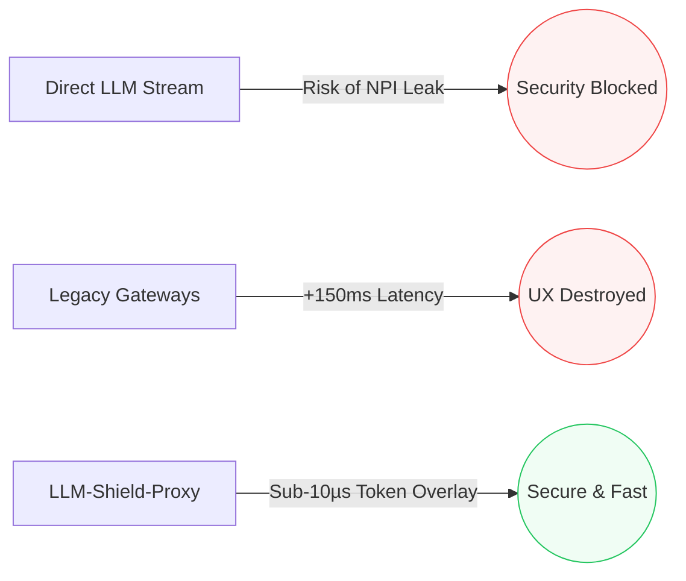
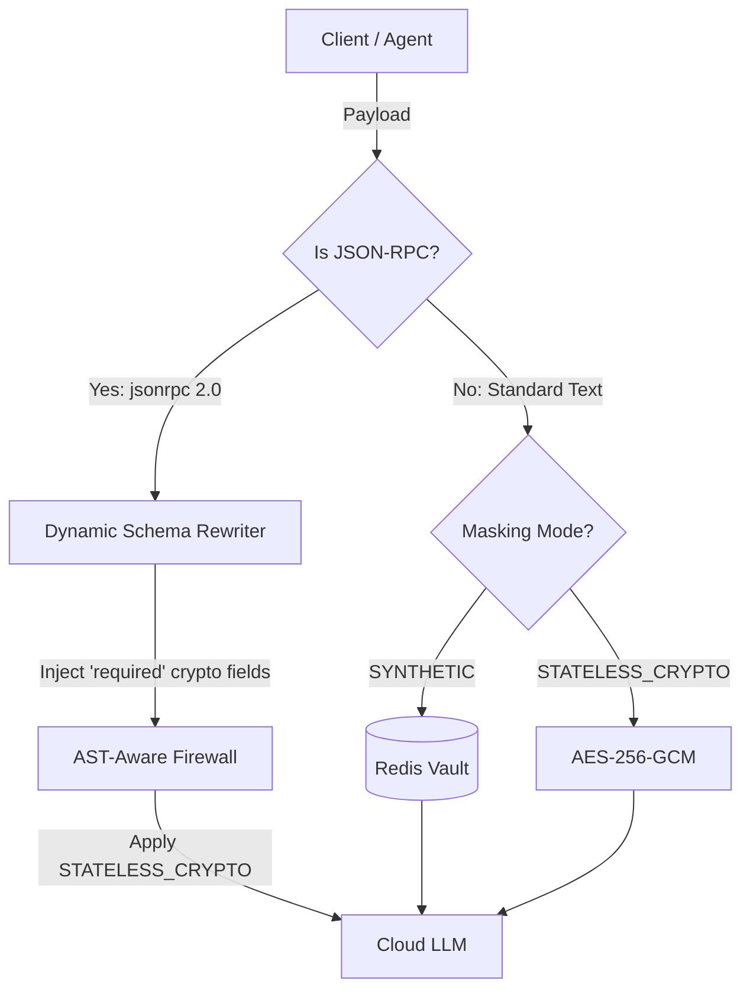

# LLM-Shield-Proxy 🛡️


**Ultra-Low Latency Generative AI Sanitization for Financial Infrastructure**

LLM-Shield-Proxy is a hyper-fast, FastAPI-based streaming gateway designed specifically for highly regulated environments (Banking, FinTech, Healthcare). It intercepts and sanitizes real-time LLM streams to prevent the leakage of Non-Public Personal Information (NPI) and Payment Card Industry (PCI) data without degrading the end-user streaming experience.

By utilizing a highly optimized **Tiered Detection Approach**, LLM-Shield-Proxy applies guardrails at the microsecond level, keeping your AI applications compliant with strict InfoSec mandates (GLBA, PCI-DSS, HIPAA) while maintaining zero-perceived-latency.

[](https://github.com/ninadphalak/LLM-Shield-Proxy/actions/workflows/ci.yml)
[](https://pypi.org/project/llm-shield-proxy/)
[](https://opensource.org/licenses/Apache-2.0)
[](https://creativecommons.org/licenses/by/4.0/)
[](https://www.python.org/)
[](https://hub.docker.com/)

---

## 🏦 The Enterprise Bottleneck
Financial institutions and healthcare providers are rushing to deploy Generative AI, but face a critical infrastructure roadblock:
1. **Compliance Risk:** Direct LLM streams can leak sensitive customer data (SSNs, Routing Numbers, PANs).
2. **The Latency Trade-off:** Traditional API gateways and enterprise Data Loss Prevention (DLP) proxies add 100ms+ of latency per request. For token-by-token LLM streaming, this destroys the UX.

**LLM-Shield-Proxy solves this.** It is a lightweight, drop-in middleware that redacts sensitive data in transit with a measured token overhead of just **~5 microseconds**.



## ⚙️ Core Features for Regulated Environments

* **Microsecond Token Overhead:** Built on FastAPI's `StreamingResponse` to process tokens faster than network jitter.
* **Tiered Detection Architecture:** Dynamically scale your sanitization strictness for any Data Protection Impact Assessment (DPIA):
  * *Tier 1 (Regex/Pattern):* Sub-10µs redaction of standard financial PII (Credit Cards, SSNs, Account Numbers).
  * *Tier 2 (Heuristics):* Lightweight logic for complex cryptographic secrets (API Keys, Hex tokens).
  * *Tier 3 (Semantic):* Context-aware ONNX BERT-NER evaluation for sophisticated contextual entities (e.g., Medical Diagnoses, Organization Names).
* **Zero Long-Term Storage (Zero-Data Mode):** Self-destructing TTL session vault built for zero data liability. No prompts or context windows are ever written to persistent disk.
* **Universal Decision Trace Exporter:** Every PII redaction decision is cryptographically sealed for WORM-compliant Merkle Tree logging.

> [!NOTE]
> See the complete list of [Enterprise Flagship Features](FEATURES.md) including BYOM, BYOR, and Pluggable RBAC.

## ⚡ Verifiable Benchmarks

Performance in financial infrastructure must be quantified. We strictly isolate and measure Time to First Token (TTFT) and Inter-Token Latency overhead.

| Gateway Setup | TTFT Overhead | Inter-Token Delay | Best For |
|---------------|---------------|-------------------|----------|
| Direct Stream (Baseline)| 0.00 ms | 0.00 ms | Unregulated PoCs |
| **LLM-Shield-Proxy (Tier 1)** | **+ 0.05 ms** | **+ 5 µs** | **Strict NPI/PCI Compliance** |
| Legacy Enterprise Gateway | + 45.00 ms | + 2.5 ms | Non-streaming APIs |

*We encourage infrastructure teams to verify these claims locally using the included benchmark suite.*

---

## 🚀 5-Minute Local Audit

Evaluate the proxy's latency and redaction locally without exposing corporate network traffic.

```bash
# 1. Spin up the proxy container in background
docker compose up -d

# 2. Send a test stream containing dummy PII
curl -X POST http://localhost:8000/v1/chat/completions \
  -H "Content-Type: application/json" \
  -H "Authorization: Bearer shield-virtual-key" \
  -d '{"messages": [{"role": "user", "content": "My routing number is 021000021."}], "stream": true}'
```

*(The stream will return with the account number seamlessly redacted in real-time).*

---

## Why Not Microsoft Presidio / Legacy Proxies?

It's a crowded space. Here is exactly why you should deploy LLM-Shield-Proxy instead of the alternatives:

* **Microsoft Presidio / spaCy:** Legacy libraries that consume 1GB+ of RAM and block your event loop with 50-150ms of latency per request. LLM-Shield-Proxy uses a flat `<85 MB` footprint with `<6 µs` latency overhead.
* **Cloud AI Safety APIs (Azure/AWS):** Checking for PII by sending raw data out of your VPC defeats the purpose. With LLM-Shield-Proxy, the data never leaves your infrastructure unredacted.
* **Standard Regex Gateways:** They break on asynchronous Server-Sent Events (SSE). If a sensitive token is split across two streaming packets, standard gateways let it leak. LLM-Shield-Proxy uses a sliding-window lookahead buffer to seamlessly hold split tokens without breaking stream formatting.

LLM-Shield-Proxy is **not** a model router (like LiteLLM or LangChain). It works *alongside* them. Put LLM-Shield-Proxy directly in front of your orchestrator to guarantee deterministic data masking before routing.

---

## 🛡️ Dual-Pipeline Redaction Modes

LLM-Shield-Proxy intelligently routes traffic through one of two specialized pipelines based on the payload structure. Read the [Architecture Document](ARCHITECTURE.md) for full details on the sliding-window buffer and Vault integrations.



---

## 📖 Complete Documentation

* **[Features Catalog](FEATURES.md)**
* **[Deployment & Configuration](DEPLOYMENT.md)**
* **[Architecture & Math](ARCHITECTURE.md)**
* **[Policy-as-Code (RBAC)](POLICIES.md)**
* **[Security Model](SECURITY.md)**
