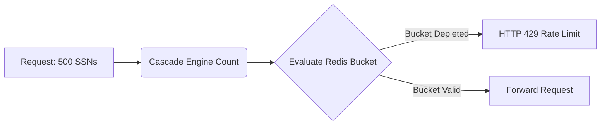

# Entity-Weighted Blast Radius Limits

[⬅️ Back to Features Catalog](../../../FEATURES.md)

## What It Does
**Entity-Weighted Blast Radius Limits** protect enterprises from massive, bulk data exfiltration events. Instead of simply rate-limiting a user based on the *number* of API requests they make, this feature utilizes a Redis Token-Bucket circuit breaker that penalizes users based on the *density of sensitive data* (entities) present in their requests.

## How It Works
Traditional rate limiters (e.g., 100 requests per minute) are easily bypassed by an attacker submitting a single request containing 10,000 credit card numbers.

1. **Entity Accounting:** During the 3-Tier Redaction Cascade, the proxy counts the exact number of PII entities identified (e.g., 50 SSNs, 12 API keys).
2. **Weighted Deductions:** Rather than deducting "1" from the rate limit bucket for the HTTP request, the proxy deducts a weight relative to the entity count (e.g., deducting 62 points).
3. **Circuit Breaking:** If an autonomous agent goes rogue or an insider threat attempts to summarize a massive database dump, the entity count instantly depletes their token bucket. The proxy triggers an `HTTP 429 Too Many Requests` (or drops the connection), effectively capping the "blast radius" of any single breach.

<!-- EDIT THIS MERMAID SCRIPT TO UPDATE THE DIAGRAM:

-->

View diagram on GitHub mobile 📱 -->

## Performance Profile
- **Execution Speed:** Evaluated in `<1ms` utilizing an atomic Redis `evalsha` Lua script.
- **Overhead:** Eliminates race conditions in distributed multi-pod environments without requiring distributed locks.

## Configuration Flags

| Environment Variable | Description | Linked Deployment Guide |
| :--- | :--- | :--- |
| `ENTITY_RATE_LIMIT_BUCKET` | The maximum number of entities a user can process per minute (default 200). | [View in DEPLOYMENT.md](../../DEPLOYMENT.md) |
| `REDIS_URL` | Required for distributed state synchronization. | [View in DEPLOYMENT.md](../../DEPLOYMENT.md) |

## Critical Logic & Edge Cases
* **Atomic Lua Evaluation:** The entire Token-Bucket deduction logic is written in a Lua script executed directly on the Redis server (`evalsha`). This guarantees 100% atomicity, meaning an attacker cannot bypass the limit by issuing hundreds of concurrent parallel requests.
* **Granular Role Limits:** The blast radius limits are not globally static. Using `policies.yaml`, a `role_data_scientist` might be granted an entity limit of 10,000, while a `role_contractor` is hard-capped at 50, providing incredible Zero-Trust flexibility.

## FAQ

**Q: What if I don't use Redis?**
A: If the proxy is running in single-node, stateless mode without Redis, it utilizes a local Python `asyncio` implementation of the Token-Bucket algorithm. While effective for a single pod, Redis is highly recommended for production clusters to enforce global limits.

**Q: Does it count entities on the request (ingress) or response (egress)?**
A: Both. The proxy deducts tokens for sensitive data detected in the user's prompt, and actively tracks de-masked entities streaming back from the LLM, ensuring bi-directional blast radius protection.

## Plainspeak
This feature prevents a catastrophic data leak by putting a strict limit on how much sensitive information can be moved at one time.

Standard security limits only care about how many *questions* you ask (e.g., "10 questions a minute"). This feature is much smarter: it counts the actual *amount of sensitive data* (like counting how many Credit Card numbers) in the response. If an AI accidentally tries to output an entire database of 500 credit cards in a single response, this feature slams the brakes and blocks the massive leak, acting as a blast shield.

## Related Tests
See the following test file for reference implementations and edge-case testing: [`tests/test_blast_radius.py`](../../../tests/test_blast_radius.py).
