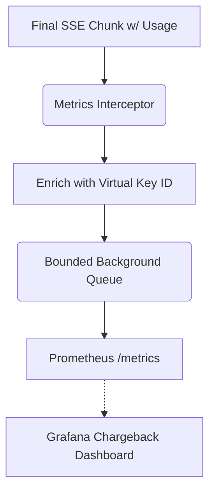

# LLM FinOps Chargeback Meter

[⬅️ Back to Features Catalog](../../../FEATURES.md)

## What It Does
The **LLM FinOps Chargeback Meter** provides enterprise-grade observability into AI consumption. It actively intercepts token usage statistics from upstream providers (like OpenAI and Anthropic) and streams them asynchronously as Prometheus metrics. This allows organizations to build strict, multi-tenant chargeback models, billing individual departments or users down to the exact fraction of a cent.

## How It Works
Without the proxy, an enterprise using a single corporate OpenAI key has no idea if the Marketing department is burning \$10,000 a month on GPT-4 while HR uses \$100. 

1. **Usage Interception:** The proxy monitors the final chunk of Server-Sent Events (SSE) or the JSON root of non-streaming responses for the `usage` object (e.g., `prompt_tokens`, `completion_tokens`).
2. **Metadata Tagging:** It enriches this raw usage data with critical metadata: the `virtual_key_id`, the `applied_role_name`, the selected `model`, and the target `upstream_provider`.
3. **Asynchronous Emission:** To guarantee zero latency impact on the user's stream, the enriched metric is placed onto a bounded background queue. A dedicated worker thread dequeues these events and publishes them to the `/metrics` endpoint for Prometheus scraping.

<!-- EDIT THIS MERMAID SCRIPT TO UPDATE THE DIAGRAM:

-->

View diagram on GitHub mobile 📱 -->

## Performance Profile
- **Execution Speed:** Metric enrichment occurs in `O(1)` time.
- **Overhead:** Completely offloaded to a background thread using a `queue.Queue(maxsize=5000)`. If Prometheus is down or the queue backs up, it safely drops metrics rather than blocking live traffic.

## Configuration Flags

| Environment Variable | Description | Linked Deployment Guide |
| :--- | :--- | :--- |
| `ENABLE_PROMETHEUS_METRICS` | Toggles the exposure of the `/metrics` endpoint on port 9090. | [View in DEPLOYMENT.md](../../DEPLOYMENT.md) |

## Critical Logic & Edge Cases
* **FinOps Stream Options:** OpenAI does not emit usage data on SSE streams by default. The proxy integrates with the [Automatic FinOps `stream_options` Injection](./automatic-finops-stream-options-injection.md) feature to force OpenAI to return this data, guaranteeing accurate metering.
* **Anthropic Normalization:** Anthropic Claude uses different terminology (`input_tokens`, `output_tokens`) in its streaming events. The proxy automatically normalizes these into the standard `prompt_tokens` and `completion_tokens` metric labels.

## FAQ

**Q: Do I need a separate database to store these metrics?**
A: No. The proxy acts as a Prometheus exporter. You configure your existing Prometheus/Datadog agent to scrape the proxy's `/metrics` endpoint. The data is stored and queried inside your existing TSDB (Time Series Database).

**Q: Does this meter track the tokens saved by the PII redaction engine?**
A: Yes! The proxy exposes a specific metric `shield_proxy_tokens_saved_total` which calculates the delta between the length of the original bracketed structural tags and the length of the highly-optimized synthetic masked entities, allowing you to calculate the exact ROI (Return on Investment) of the proxy.

## Plainspeak
This feature is a highly detailed billing meter that helps companies figure out exactly which team is spending money on AI.

Instead of just getting one massive bill from OpenAI at the end of the month, this feature tracks every single chat message and tags it with the specific user or department who sent it. It then sends this usage data to a dashboard, so the finance team can accurately charge each department for the exact amount of AI computing power they used.

## Related Tests
See the following test file for reference implementations and edge-case testing: [`tests/test_finops_meter.py`](../../../tests/test_finops_meter.py).
