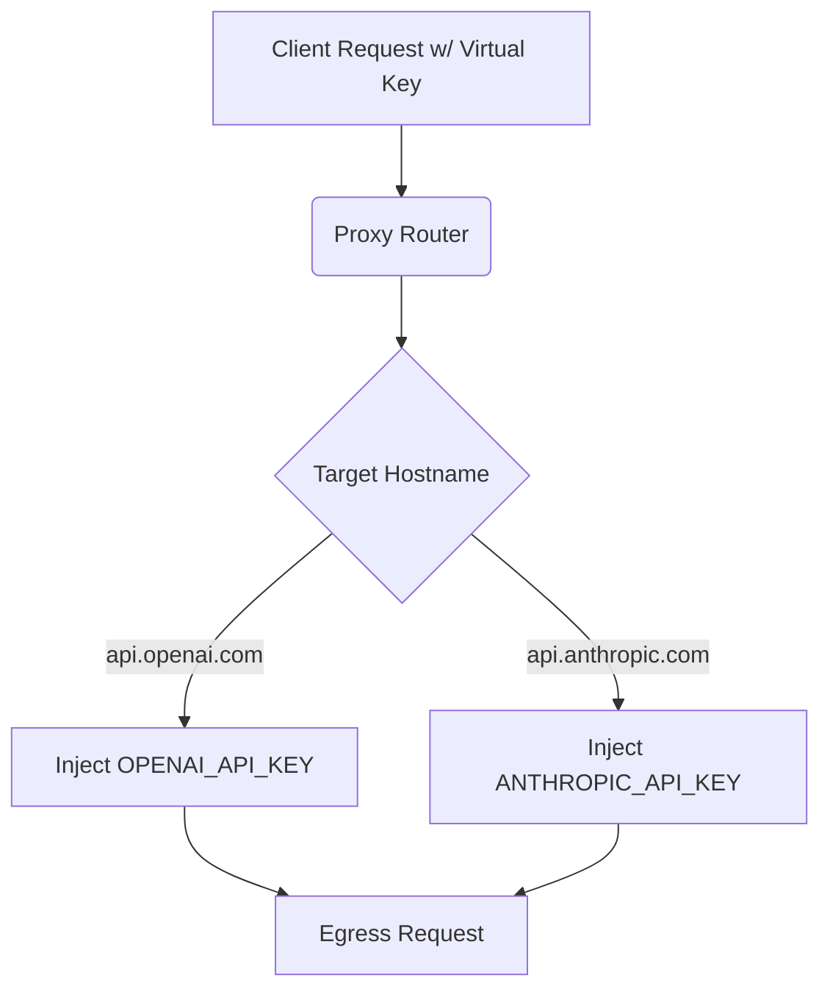

# Multi-Provider Upstream Key Registry

[⬅️ Back to Features Catalog](../../../FEATURES.md)

## What It Does
The **Multi-Provider Upstream Key Registry** centralizes and secures API key management for enterprises using multiple AI models. Instead of forcing client applications to juggle keys for OpenAI, Anthropic, Gemini, and DeepSeek, the proxy manages all upstream authentication securely behind the firewall, auto-resolving the correct key based on the target destination.

## How It Works
Distributing raw OpenAI or Anthropic API keys to hundreds of developers is a massive security risk. The proxy abstracts this entirely.

1. **Client Virtualization:** Developers authenticate to the proxy using a single, internally managed `virtual_key_id` (e.g., an internal Active Directory token or a proxy-generated UUID).
2. **Registry Mapping:** The proxy holds a secure, in-memory registry of real API keys mapped to specific provider hostnames.
3. **Dynamic Interception:** When a request is routed, the proxy intercepts the outbound connection, identifies the target hostname (e.g., `api.anthropic.com`), extracts the corresponding real API key from the registry, and injects it into the `Authorization` or `x-api-key` header just microseconds before egress.

<!-- EDIT THIS MERMAID SCRIPT TO UPDATE THE DIAGRAM:

-->

View diagram on GitHub mobile 📱 -->

## Performance Profile
- **Execution Speed:** Dictionary hostname lookup executes in O(1) time (`<0.1µs`).
- **Overhead:** Completely in-memory, requiring no database lookups during the critical request path.

## Configuration Flags

| Environment Variable | Description | Linked Deployment Guide |
| :--- | :--- | :--- |
| `OPENAI_API_KEY` | Real key injected for OpenAI/Azure destinations. | [View in DEPLOYMENT.md](../../DEPLOYMENT.md) |
| `ANTHROPIC_API_KEY` | Real key injected for Anthropic destinations. | [View in DEPLOYMENT.md](../../DEPLOYMENT.md) |
| `GEMINI_API_KEY` | Real key injected for Google Gemini destinations. | [View in DEPLOYMENT.md](../../DEPLOYMENT.md) |

## Critical Logic & Edge Cases
* **Key Stripping:** If a developer accidentally hardcodes a real OpenAI key into their client application and sends it to the proxy, the proxy's middleware strips the rogue key completely, replacing it with the central registry key. This prevents developers from intentionally bypassing corporate billing accounts.
* **HashiCorp Vault Integration:** While keys can be loaded via `.env`, the proxy natively supports pulling these keys directly from HashiCorp Vault at startup, ensuring the real API keys never touch a developer's hard drive or a Kubernetes `ConfigMap`.

## FAQ

**Q: Can I use different OpenAI keys for different departments?**
A: Yes. While the global registry sets a baseline, you can define `upstream_api_key` overrides directly inside specific roles in `policies.yaml`. When the HR department authenticates, the proxy will resolve and inject the HR-specific OpenAI key instead of the global one.

**Q: How does this work with Azure OpenAI's unique authentication?**
A: The registry is schema-aware. If the target is an Azure OpenAI endpoint, it intelligently injects the key into the `api-key` HTTP header rather than formatting it as an `Authorization: Bearer` token.
