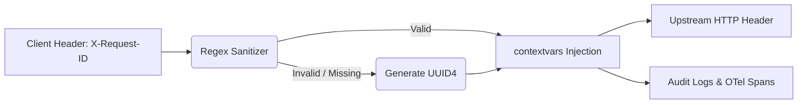

# Request-ID Correlation & Sanitization

[⬅️ Back to Features Catalog](../../../FEATURES.md)

## What It Does
**Request-ID Correlation & Sanitization** provides enterprise traceability across complex distributed microservices. It ensures every single LLM interaction can be traced from the frontend UI, through the proxy, to the upstream AI provider, and finally into the OpenTelemetry / Grafana dashboards using a unified, mathematically sanitized identifier.

## How It Works
Without a unified ID, debugging a failed LLM request across multiple Kubernetes pods and upstream dashboards is nearly impossible.

1. **Ingress Extraction:** When a request arrives, the proxy looks for the `X-Request-ID` or `X-Correlation-ID` HTTP headers.
2. **Regex Sanitization:** To prevent HTTP Header Injection attacks (CWE-113), the supplied ID is validated against a strict `^[a-zA-Z0-9-]{10,40}$` regex. If it contains invalid characters (like newlines or scripts), it is discarded.
3. **UUID4 Generation:** If no valid header is found, the proxy automatically generates a cryptographically secure `UUID4`.
4. **Context Propagation:** The verified ID is injected into Python's `contextvars`, automatically appending it to every log line, OpenTelemetry trace span, and upstream HTTP request header.

<!-- EDIT THIS MERMAID SCRIPT TO UPDATE THE DIAGRAM:

-->

View diagram on GitHub mobile 📱 -->

## Performance Profile
- **Execution Speed:** Regex validation and context assignment execute in `<1µs`.
- **Overhead:** `contextvars` execution is thread-safe and eliminates the need to pass `request_id` variables deeply through the call stack.

## Configuration Flags
This feature operates fundamentally at the middleware layer and requires no explicit configuration flags to activate.

## Critical Logic & Edge Cases
* **Egress Echoing:** The finalized `X-Request-ID` is guaranteed to be returned to the client application in the HTTP Response Headers. This allows the frontend UI to display the exact trace ID to the user if an error occurs ("Please provide Error ID: 1234-abcd to IT Support").
* **Log Obfuscation Defense:** By sanitizing the incoming header, the proxy guarantees attackers cannot inject forged newline characters into the ID to simulate fake log entries in Splunk or Datadog.

## FAQ

**Q: Can I use standard W3C `traceparent` headers instead?**
A: The proxy natively supports both! The `X-Request-ID` is used for application-level correlation and log tagging, while the W3C `traceparent` header is independently parsed and passed directly into the [Zero-Overhead OpenTelemetry Tracing](./zero-overhead-opentelemetry-otel-tracing.md) engine for strict distributed span tracking.

**Q: Is the Request ID passed to OpenAI/Anthropic?**
A: Yes. It is appended as a custom header on the upstream HTTP/2 connection. While OpenAI doesn't natively expose this in their standard dashboards, it provides critical proof during enterprise support tickets when correlating proxy traffic with upstream provider logs.
