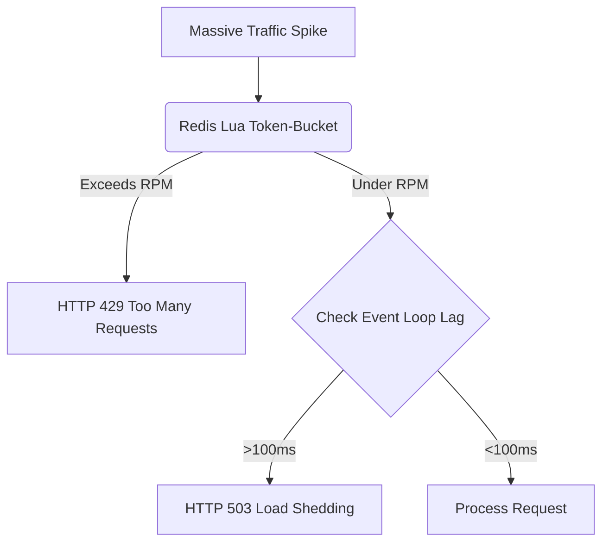

# Traffic Engineering & Resiliency

[⬅️ Back to Features Catalog](../../../FEATURES.md)

## What It Does
**Traffic Engineering & Resiliency** encompasses a suite of low-level networking safeguards designed to protect the LLM-Shield-Proxy against massive traffic spikes, volumetric DDoS attacks, and backend LLM bottlenecks. It ensures the proxy remains highly available (99.99%) even when subjected to adversarial loads.

## How It Works
The proxy leverages high-performance Python `asyncio` primitives combined with Redis Lua scripting to enforce strict traffic discipline.

1. **Token-Bucket Rate Limiting:** The proxy executes a Lua script (`evalsha`) on the Redis cluster for every incoming request. It enforces a strict RPM (Requests Per Minute) limit mapped to the client's Virtual Key. 
2. **Concurrency Shedding:** If the proxy detects that the `asyncio` event loop is experiencing severe latency (e.g., event loop lag > 100ms), it activates load-shedding, instantly returning `503 Service Unavailable` to new connections to protect active streams.
3. **Timeout Disciplines:** Every outbound HTTP request is wrapped in a strict `httpx.Timeout` structure, enforcing absolute limits on `connect`, `read`, and `write` operations. 

<!-- EDIT THIS MERMAID SCRIPT TO UPDATE THE DIAGRAM:

-->

View diagram on GitHub mobile 📱 -->

## Performance Profile
- **Execution Speed:** Lua script evaluation takes `<1ms`. Event loop monitoring is instantaneous (`O(1)`).
- **Overhead:** Extremely lightweight. Rejecting a request via `429` or `503` bypasses the entire JSON lexer and PII cascade, costing nearly zero CPU cycles.

## Configuration Flags

| Environment Variable | Description | Linked Deployment Guide |
| :--- | :--- | :--- |
| `DEFAULT_RATE_LIMIT_RPM` | Base Requests Per Minute allowed per Virtual Key (default 6000). | [View in DEPLOYMENT.md](../../DEPLOYMENT.md) |
| `MAX_CONCURRENT_STREAMS` | Hard cap on active HTTP/2 SSE streams per pod. | [View in DEPLOYMENT.md](../../DEPLOYMENT.md) |

## Critical Logic & Edge Cases
* **Burst Allowances:** The Token-Bucket algorithm natively supports bursts. A client can execute 200 requests in a single second, provided they do not exceed the 6,000 RPM average over the rolling window, seamlessly supporting map-reduce style agent workloads.
* **Upstream Timeout Segregation:** `connect` timeouts are kept aggressively short (e.g., 2 seconds) because TCP handshakes should be instant. `read` timeouts are set significantly longer (e.g., 60 seconds) to accommodate slow-generating LLM responses.

## FAQ

**Q: Can I set different rate limits for different departments?**
A: Yes! Using `policies.yaml`, you can assign `rate_limit_rpm: 10000` to a `role_data_science`, while limiting `role_interns` to `100`.

**Q: What happens if Redis goes down? Do all requests get rate-limited?**
A: No. The proxy fails *open* for rate limiting. If the Redis cluster is unreachable, the proxy logs a severe warning but allows the traffic to flow through, prioritizing availability over strict rate enforcement (unless configured to fail-closed via security policies).

## Related Tests
See the following test file for reference implementations and edge-case testing: [`tests/test_enterprise_resiliency.py`](../../../tests/test_enterprise_resiliency.py).
