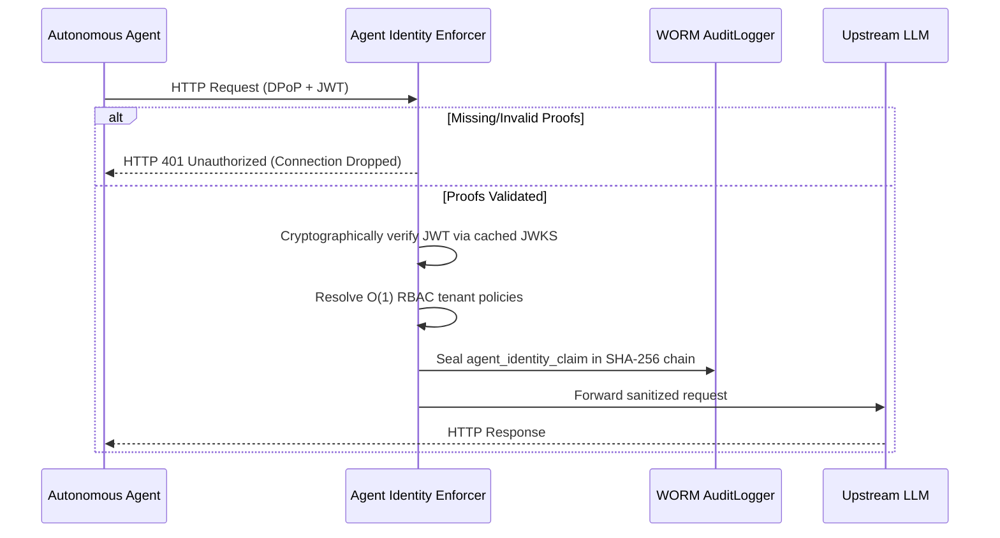

# Agent Identity Enforcer

The Agent Identity Enforcer is an edge-level zero-trust middleware for LLM-Shield-Proxy. It guarantees mathematically proven machine-to-machine identities for autonomous agent workflows by acting as a strict, cryptographic ingress barrier.

## Architectural Overview

By default, LLM-Shield-Proxy trusts upstream clients based on virtual API keys. The Agent Identity Enforcer upgrades this to a cryptographic zero-trust model where every tool-call intent is validated against a signed Workload Identity (JWT) and a Demonstrating Proof-of-Possession (DPoP) proof.

This middleware extracts and decodes proofs in `< 1ms` by utilizing heavily cached JSON Web Key Sets (JWKS), strictly enforcing per-tenant policies, and logging the validated identities into a WORM-compliant sequential SHA-256 hash chain.

### Request Flow Diagram



## Configuration

To globally configure the Enforcer, set the environment variable to one of the following 3 states:
```env
AGENT_IDENTITY_ENFORCER="off"
```
* `"off"`: Identity verification is bypassed completely (Default).
* `"lenient"`: Verifies the base JWT/Identity and signature, but skips the strict DPoP URI (htu) and Method (htm) validations.
* `"strict"`: Fully secures the proxy by strictly validating the JWT, binding the DPoP key to the `cnf.jkt` claim, and enforcing HTTP Method and URI matches.

For per-tenant enforcement, configure your `policies.yaml`:
```yaml
virtual_keys:
  vk_tenant_alpha: "strict_agent_role"

roles:
  strict_agent_role:
    agent_identity_enforcer: "strict"
```

## Plainspeak

Imagine a company with 50 different AI agents performing automated tasks like reading emails or querying databases. 

**The Problem:** Normally, when an agent requests an action (like "delete database row"), it uses a generic, shared API password. If an agent goes rogue, the security team knows a password was used, but they cannot prove exactly *which* agent used it or verify that it had the authority to act at that exact second.

**The Solution:** This feature acts as a cryptographic notary at the front door. Before an agent can execute a tool, it cannot rely on a shared password. It must present an unforgeable, mathematically signed digital ID card (DPoP/Workload token). The proxy verifies this ID in real-time against allowed permissions to prove exactly who the agent is and what it is allowed to do. Finally, it mathematically seals the agent's verified identity, the exact time, and its intent into a tamper-proof log so nobody can deny it happened. 

It is the difference between a building having a single front-door key that everyone shares, versus requiring every individual to scan a biometric badge every single time they open a door.
