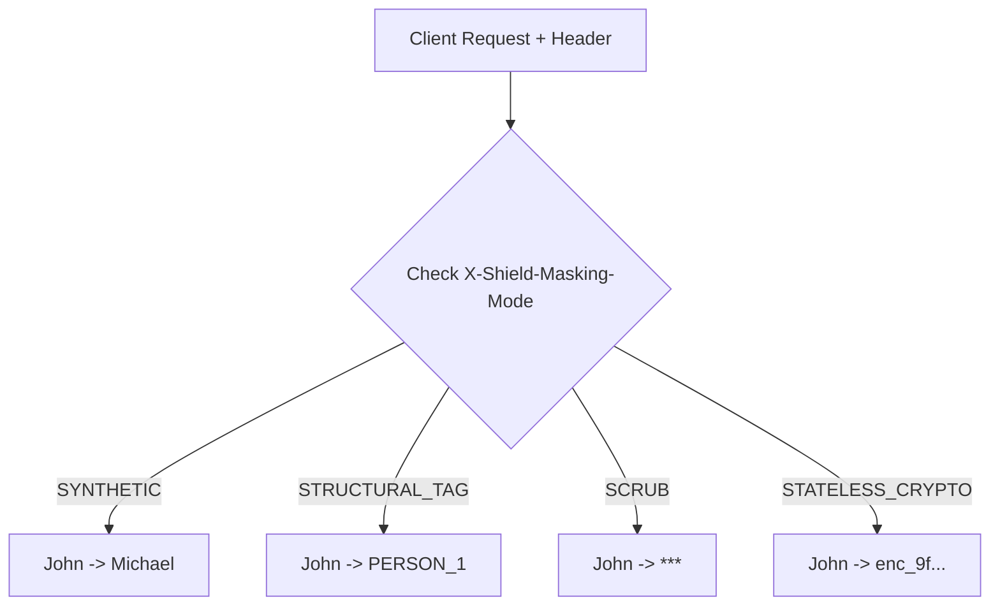

# 4-Mode Per-Request Masking Pipeline

[⬅️ Back to Features Catalog](../../../FEATURES.md)

## What It Does
The **4-Mode Per-Request Masking Pipeline** empowers client applications to dynamically select their desired redaction strategy on a per-request basis without requiring server restarts. By passing a specific HTTP header, engineers can choose exactly how sensitive data is masked before it hits the LLM.

## How It Works
The proxy intercepts the `X-Shield-Masking-Mode` header and dynamically overrides the global `.env` configuration for the duration of that specific request using thread-safe `contextvars`.

The available modes are:
1. **`SYNTHETIC` (Default):** Replaces entities with mathematically coherent canonical locale substitutes (e.g., fake SSNs, fake names) to preserve downstream LLM attention weights and syntax.
2. **`STRUCTURAL_TAG`:** Replaces entities with explicit, bracketed placeholder tokens (e.g., `[PERSON_1]`, `[EMAIL_1]`). Ideal for legacy compliance pipelines or explicit regex auditing.
3. **`SCRUB`:** Performs a hard redaction, completely removing the text or replacing it with `***`. Useful when the context of the sensitive data is entirely irrelevant to the LLM's task.
4. **`STATELESS_CRYPTO`:** Secures data in-transit using AES-256-GCM envelope encryption directly within the payload, bypassing the need for Redis storage.

<!-- EDIT THIS MERMAID SCRIPT TO UPDATE THE DIAGRAM:

-->

View diagram on GitHub mobile 📱 -->

## Configuration Flags

| Header / Override | Description | Linked Deployment Guide |
| :--- | :--- | :--- |
| `X-Shield-Masking-Mode` | HTTP header to dynamically set the mode (`SYNTHETIC`, `STRUCTURAL_TAG`, `SCRUB`, `STATELESS_CRYPTO`). | [View in POLICIES.md](../../POLICIES.md) |
| `SHIELD_DEFAULT_MASKING_MODE` | The global default mode if the client does not specify the header. | [View in DEPLOYMENT.md](../../DEPLOYMENT.md) |

## Critical Logic & Edge Cases
* **Thread-Safety:** Because the proxy processes thousands of concurrent streaming requests, overriding a setting via a header must not affect other active streams. The proxy uses Python's `contextvars.ContextVar` and `copy_context().run()` to ensure the mode override is strictly isolated to the specific asyncio task handling the request.
* **Vault Interoperability:** If a request switches to `STATELESS_CRYPTO`, the proxy intelligently bypasses the Redis TTL Vault for that specific payload, avoiding unnecessary network calls.

## FAQ

**Q: Will allowing clients to set this header bypass security?**
A: No. The header only dictates *how* the data is masked (the formatting), not *what* data is masked. The underlying Granular Entity Policy Scopes and Tier 1/2/3 engines still forcefully enforce what data is redacted regardless of the format chosen.

**Q: Can I force all clients to use a specific mode and ignore the header?**
A: Yes. You can define a strict `enforced_masking_mode` within `policies.yaml` for a specific security role, which will override and ignore any header supplied by the client application.

**Q: Why use `SCRUB` if it destroys the LLM context?**
A: `SCRUB` is highly efficient and guarantees zero token bloat. If you are using an LLM to summarize a document where the specific names are completely irrelevant (e.g., summarizing meeting minutes into action items), scrubbing saves tokens and maximizes privacy.

## Plainspeak
This feature gives you the ultimate flexibility to choose exactly how sensitive data is hidden on a case-by-case basis. 

Instead of being locked into one method, you can tell the system what to do for each individual request. You can choose to replace the data with a realistic fake (Synthetic), a standard placeholder tag, completely black it out (Scrub), or scramble it with a password so you can read it later (Crypto). This means developers have full control over the privacy technique they want to use at any given moment.

## Related Tests
See the following test file for reference implementations and edge-case testing: [`tests/test_pii_engine.py`](../../../tests/test_pii_engine.py).
