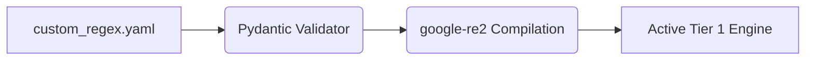

# Bring-Your-Own-Regex (BYOR) Custom Rules

[⬅️ Back to Features Catalog](../../../FEATURES.md)

## What It Does
**Bring-Your-Own-Regex (BYOR)** allows enterprise security operators to inject their own proprietary detection rules into the proxy without modifying the core source code. It is designed to extend the Tier 1 detection cascade to catch custom corporate identifiers, internal project codenames, or proprietary billing tokens.

## How It Works
The BYOR feature is dynamically injected at proxy startup, ensuring custom rules perform exactly as efficiently as built-in rules.

1. **YAML Ingestion:** The proxy reads a mounted `custom_regex.yaml` file during the FastAPI `lifespan` event.
2. **Pydantic Validation:** The rules are parsed and validated by Pydantic to ensure they contain a valid `name`, `pattern`, and optional `description`.
3. **C++ Compilation:** The extracted regex patterns are passed into the `google-re2` C++ engine. They are compiled into Deterministic Finite Automatons (DFAs) alongside the built-in PII rules. This mathematically guarantees that poorly written custom regexes cannot cause a ReDoS attack.

<!-- EDIT THIS MERMAID SCRIPT TO UPDATE THE DIAGRAM:

-->

View diagram on GitHub mobile 📱 -->


## Configuration Flags

| Environment Variable | Description | Linked Deployment Guide |
| :--- | :--- | :--- |
| `CUSTOM_REGEX_PATH` | Absolute path to the YAML file containing custom rules. | [View in DEPLOYMENT.md](../../DEPLOYMENT.md) |

### Configuration Example
```yaml
custom_patterns:
  - name: INTERNAL_PROJECT_CODENAME
    pattern: "(?i)PROJECT-(APOLLO|ZEUS|ARES)-\\d+"
    description: "Matches sensitive internal R&D project codes"
  - name: PROPRIETARY_BILLING_ID
    pattern: "^BILL-[A-Z0-9]{8,12}$"
```

## Critical Logic & Edge Cases
* **Regex Flavor Compatibility:** Because BYOR utilizes `google-re2` for ReDoS immunity, standard Python `re` syntax that relies on backtracking (like unbounded lookaheads `(?=...)` or lookbehinds `(?<=...)`) is strictly forbidden and will fail to compile.
* **Order of Execution:** Custom rules are executed concurrently with the built-in Tier 1 rules. If a custom rule and a built-in rule overlap (e.g., both match a string), the proxy safely tags the string without double-masking.

## FAQ

**Q: What happens if I write a terrible regex like `(a+)+$` in the custom YAML?**
A: Unlike standard Python or Node.js proxies which will instantly crash (CPU spiking to 100%) due to catastrophic backtracking, LLM-Shield-Proxy will safely compile it using `re2`. If `re2` determines the pattern violates DFA rules, it will reject the pattern at startup. If it accepts it, it guarantees O(N) execution time, physically preventing the CPU spike.

**Q: Can I hot-reload the `custom_regex.yaml` file without dropping active streams?**
A: Currently, regex compilation is performed at the FastAPI `lifespan` event for maximum performance. To apply new regex rules, the proxy pod must be restarted. (Note: `policies.yaml` RBAC rules *can* be hot-reloaded, but core regex compilation requires a restart).

**Q: How do custom rules interact with Synthetic Masking?**
A: Custom BYOR entities are currently treated as structural strings. If Synthetic Masking is enabled, custom entities will typically be masked using an anonymized hash or generic placeholder unless a specific canonical locale provider is mapped to the custom rule name.


## Plainspeak
This feature allows you to teach the system how to recognize your company's own unique sensitive data.

Out of the box, the system knows what a credit card or email looks like. But what if your company uses a special internal ID format (like "EMP-XYZ-123")? This feature lets you add those custom rules in a simple configuration file. The proxy will then seamlessly learn to redact your custom IDs just as fast as it redacts standard credit card numbers.

## Related Tests
See the following test file for reference implementations and edge-case testing: [`tests/test_pii_engine.py`](../../../tests/test_pii_engine.py).
