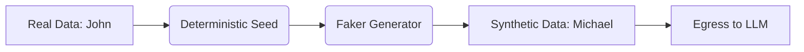

# Format-Preserving Synthetic Masking & Entropy

[⬅️ Back to Features Catalog](../../../FEATURES.md)

## What It Does
**Format-Preserving Synthetic Masking** is the proxy's default Data Loss Prevention (DLP) substitution strategy. Instead of replacing sensitive data with structural tags (e.g., turning a name into `[PERSON_1]`), it deterministically replaces the data with a realistic, unbracketed synthetic entity (e.g., turning "John Doe" into "Michael Smith", or a real SSN into a validly formatted fake SSN). 

## How It Works
Traditional structural tagging damages the performance of Large Language Models in two critical ways:
1. **Grammatical Damage:** Bracketed tags `[LIKE_THIS_1]` disrupt the natural language attention weights of transformer models, degrading the quality of the LLM's reasoning and generation.
2. **BPE Token Bloat:** Byte-Pair Encoding tokenizers split brackets and underscores into multiple tokens, increasing the cost of the prompt and slowing down generation.

LLM-Shield-Proxy solves this utilizing the `Faker` library combined with deterministic hashing:
1. **Deterministic Seeding:** When a sensitive entity is found, its value is hashed. This hash is used as the random seed for the synthetic generator. This guarantees that "John" is always swapped for "Michael" within the same session, preserving referential integrity.
2. **Coherent Substitution:** A real 9-digit SSN is swapped for a fake 9-digit SSN. A real email is swapped for a fake email. The downstream LLM cannot tell the data was redacted.
3. **Seamless Rehydration:** When the LLM streams the synthetic token back ("Michael"), the SSE sliding window detects it and swaps it back to the original value ("John") before sending it to the user.

<!-- EDIT THIS MERMAID SCRIPT TO UPDATE THE DIAGRAM:

-->

View diagram on GitHub mobile 📱 -->

## Configuration Flags

| Environment Variable | Description | Linked Deployment Guide |
| :--- | :--- | :--- |
| `ENABLE_SYNTHETIC_SWAPPING` | Toggles between Synthetic Masking (`true`) and Structural Tagging (`false`). | [View in DEPLOYMENT.md](../../DEPLOYMENT.md) |

## Critical Logic & Edge Cases
* **Referential Integrity:** If a user mentions the same patient name five times in a prompt, deterministic seeding guarantees the LLM receives the exact same synthetic name five times. The LLM's logic and memory are completely preserved.
* **Stream Desynchronization:** Because synthetic names are unbracketed, the SSE buffer uses strict string matching and overlap trailing to ensure that split tokens (e.g. `Mich` and `ael`) are accurately caught during the outbound stream.

## FAQ

**Q: Can I turn off synthetic masking and use standard bracket tags for auditing?**
A: Yes. Set `ENABLE_SYNTHETIC_SWAPPING=false` in your `.env`. The proxy will instantly revert to structural tagging (e.g., `[PERSON_1]`, `[EMAIL_1]`). This is often preferred by legacy compliance pipelines that rely on explicit regex auditing.

**Q: Does generating synthetic data slow down the request?**
A: No. The proxy caches the generated synthetic entities in the active session's memory vault, meaning the `Faker` library is only invoked once per unique entity, keeping latency near zero.
