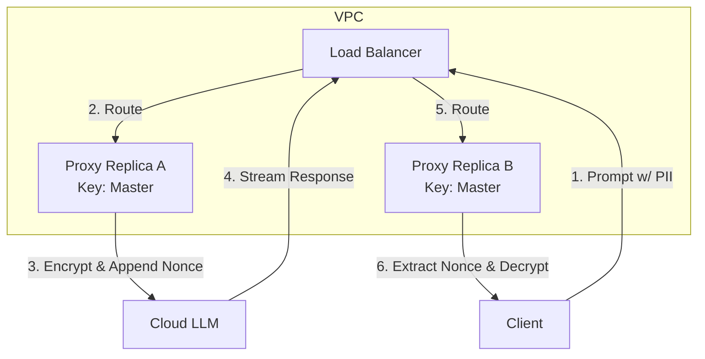

# In-Band Stateless Syntheticgraphic Masking

[⬅️ Back to Features Catalog](../../../FEATURES.md)

## What It Does
**In-Band Stateless Syntheticgraphic Masking** enables the proxy to operate in a 100% Zero-Data environment. Instead of relying on an external state store (like Redis) to map sensitive PII to tokens, it encrypts the sensitive data directly and passes the ciphertext into the downstream LLM prompt. This guarantees that your proxy maintains absolutely zero data liability.

## How It Works
When enabled, the proxy performs AES-256-GCM envelope encryption on the fly.

1. **Encryption (Prompt Ingress):** Sensitive entities (e.g., a credit card number) are encrypted using a 256-bit Data Encryption Key (DEK). The resulting ciphertext is converted into a URL-safe Base62 string (e.g., `[enc_3aF9z...]`) and injected into the prompt before egressing to OpenAI.
2. **LLM Processing:** The upstream LLM treats the Base62 string as an opaque identifier, maintaining its contextual position in the text.
3. **Decryption (Streaming Egress):** As the LLM streams the response via Server-Sent Events (SSE), the proxy's sliding-window buffer detects the Base62 ciphertext, instantly decrypts it using the AES-256-GCM cipher, and streams the original credit card number back to the user application.

<!-- EDIT THIS MERMAID SCRIPT TO UPDATE THE DIAGRAM:

-->

View diagram on GitHub mobile 📱 -->

## Multi-Instance Stateful Independence (Load Balancing)

A critical advantage of this architecture is its infinite horizontal scalability.

**How it works in Multi-Instance Deployments:**
The encryption is completely stateless. All proxy replicas share a master symmetric key injected securely (e.g., via HashiCorp Vault). During encryption, the cryptographic nonce/Initialization Vector (IV) is generated and embedded *directly* within the base62 cipher-token itself.

Because the nonce travels with the data, the returning SSE stream from the LLM can be routed by a load balancer to a completely different proxy replica (e.g., Replica B). Replica B simply extracts the nonce from the cipher-token and uses the shared master key in memory to decrypt it instantly. This eliminates the need for sticky sessions or a synchronized state store like Redis.

## Performance Profile
- **Execution Speed:** `~1.76 µs` per encrypt/decrypt cycle.
- **Overhead:** Extremely lightweight, adding negligible latency to the stream.

## Configuration Flags

| Environment Variable | Description | Linked Deployment Guide |
| :--- | :--- | :--- |
| `SHIELD_DEFAULT_MASKING_MODE` | Set to `STATELESS_SYNTHETIC` to enable in-band encryption. | [View in DEPLOYMENT.md](../../DEPLOYMENT.md) |

## Critical Logic & Edge Cases
* **Key Rotation:** The AES-256-GCM keys are derived via PBKDF2 HMAC. This allows enterprise operators to safely rotate master keys in HashiCorp Vault without downtime.
* **Token Bloat Trade-off:** While stateless synthetic removes the need for Redis, the Base62 ciphertext strings do consume slightly more BPE tokens than short synthetic names.

## FAQ

**Q: If the data is encrypted, how does the LLM know how to format it?**
A: The LLM will treat it as a unique ID. However, if your use case requires the LLM to understand the *format* of the data (e.g., verifying a zip code), you should use `SYNTHETIC` swapping instead of stateless synthetic.

**Q: What happens if the AES key is lost or rotated while a request is in flight?**
A: Because LLMs respond within seconds, key rotation is designed to maintain the previous key in a short-lived memory cache (TTL) until all in-flight streaming requests using that DEK have completed.

## Plainspeak: The "Safe"
This feature acts as a mathematical **"Safe"** for your data. It allows you to securely hide sensitive data and retrieve it later, without ever having to save it to a database.

Normally, to hide a name and restore it later, you have to store the real name in a secure vault somewhere. Instead, this feature takes the sensitive text and mathematically scrambles it into a secure token (using AES-256-GCM authenticated encryption, which inherently guarantees the ciphertext hasn't been tampered with, similar to an HMAC). It stores the decryption key directly in that string so you don't need a Redis database. When the message comes back, the proxy uses the master password to unscramble it. This means there is zero risk of a database being hacked, because no database is used!

## How It Works with Other Proxy Modes
Because In-Band Cryptographic Masking is a core mathematical mechanism, it serves as the foundational "Safe" that other structural proxy modes rely on:
- **Standard Text Prompts:** It scans and replaces conversational text directly.
- **AST-Aware Semantic Firewall:** When autonomous AI agents communicate using complex machine-to-machine JSON code (like JSON-RPC or MCP), the AST Firewall acts as a "Robotic Arm" that parses the code and uses this Cryptographic Masking mode to encrypt just the specific values without breaking the JSON structure.

## Related Tests
See the following test file for reference implementations and edge-case testing: [`tests/test_stateless_synthetic.py`](../../../tests/test_stateless_synthetic.py).
