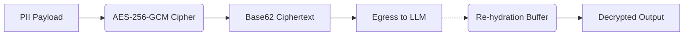

# In-Band Stateless Cryptographic Masking

[⬅️ Back to Features Catalog](../../../FEATURES.md)

## What It Does
**In-Band Stateless Cryptographic Masking** enables the proxy to operate in a 100% Zero-Data environment. Instead of relying on an external state store (like Redis) to map sensitive PII to tokens, it encrypts the sensitive data directly and passes the ciphertext into the downstream LLM prompt. This guarantees that your proxy maintains absolutely zero data liability.

## How It Works
When enabled, the proxy performs AES-256-GCM envelope encryption on the fly.

1. **Encryption (Prompt Ingress):** Sensitive entities (e.g., a credit card number) are encrypted using a 256-bit Data Encryption Key (DEK). The resulting ciphertext is converted into a URL-safe Base62 string (e.g., `[enc_3aF9z...]`) and injected into the prompt before egressing to OpenAI.
2. **LLM Processing:** The upstream LLM treats the Base62 string as an opaque identifier, maintaining its contextual position in the text.
3. **Decryption (Streaming Egress):** As the LLM streams the response via Server-Sent Events (SSE), the proxy's sliding-window buffer detects the Base62 ciphertext, instantly decrypts it using the AES-256-GCM cipher, and streams the original credit card number back to the user application.

<!-- EDIT THIS MERMAID SCRIPT TO UPDATE THE DIAGRAM:

-->

View diagram on GitHub mobile 📱 -->

## Performance Profile
- **Execution Speed:** `~1.76 µs` per encrypt/decrypt cycle.
- **Overhead:** Extremely lightweight, adding negligible latency to the stream.

## Configuration Flags

| Environment Variable | Description | Linked Deployment Guide |
| :--- | :--- | :--- |
| `SHIELD_DEFAULT_MASKING_MODE` | Set to `STATELESS_CRYPTO` to enable in-band encryption. | [View in DEPLOYMENT.md](../../DEPLOYMENT.md) |

## Critical Logic & Edge Cases
* **Key Rotation:** The AES-256-GCM keys are derived via PBKDF2 HMAC. This allows enterprise operators to safely rotate master keys in HashiCorp Vault without downtime.
* **Token Bloat Trade-off:** While stateless crypto removes the need for Redis, the Base62 ciphertext strings do consume slightly more BPE tokens than short synthetic names.

## FAQ

**Q: If the data is encrypted, how does the LLM know how to format it?**
A: The LLM will treat it as a unique ID. However, if your use case requires the LLM to understand the *format* of the data (e.g., verifying a zip code), you should use `SYNTHETIC` swapping instead of stateless crypto.

**Q: What happens if the AES key is lost or rotated while a request is in flight?**
A: Because LLMs respond within seconds, key rotation is designed to maintain the previous key in a short-lived memory cache (TTL) until all in-flight streaming requests using that DEK have completed.

## Related Tests
See the following test file for reference implementations and edge-case testing: [`tests/test_stateless_crypto.py`](../../../tests/test_stateless_crypto.py).
