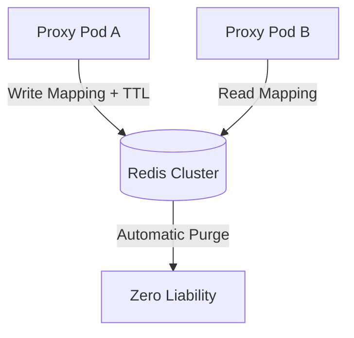

# Stateless Redis TTL Vault

[⬅️ Back to Features Catalog](../../../FEATURES.md)

## What It Does
The **Stateless Redis TTL Vault** provides a high-performance, distributed memory store for the proxy's tokenization mappings. When running LLM-Shield-Proxy in a clustered environment (e.g., multiple Kubernetes pods), it ensures that all proxy replicas share the same PII-to-token mappings for the duration of a session, with guaranteed automatic self-destruction to maintain zero long-term data liability.

## How It Works
The vault uses `redis.asyncio` to manage ephemeral state without blocking the Python event loop.

1. **Deterministic Hashing:** When PII is identified (e.g., "John Doe"), the vault generates a deterministic HMAC-SHA256 hash using the session's Virtual Key. This hash acts as the Redis lookup key.
2. **TTL Eviction (Self-Destruct):** Every mapping inserted into Redis is assigned a strict Time-To-Live (TTL). Once the LLM stream concludes or the user session times out, Redis automatically purges the data. 
3. **Cross-Pod Synchronization:** Because the mappings are stored in Redis, an LLM request can hit Pod A, and the streaming response can theoretically be intercepted by Pod B, with Pod B successfully de-masking the data using the shared Vault.

<!-- EDIT THIS MERMAID SCRIPT TO UPDATE THE DIAGRAM:

-->

View diagram on GitHub mobile 📱 -->

## Performance Profile
- **Execution Speed:** Read/Write operations execute in `<1ms` over local VPC networks.
- **Overhead:** Uses Redis connection pooling to maintain persistent sockets and avoid TCP handshake latency.

## Configuration Flags

| Environment Variable | Description | Linked Deployment Guide |
| :--- | :--- | :--- |
| `REDIS_URL` | The connection string for the Redis cluster. | [View in DEPLOYMENT.md](../../DEPLOYMENT.md) |
| `SESSION_TTL_SECONDS` | Duration before the vault automatically evicts session data (default 3600). | [View in DEPLOYMENT.md](../../DEPLOYMENT.md) |

## Critical Logic & Edge Cases
* **Graceful Degradation:** If the Redis cluster experiences a network partition, the proxy's deep component health probes will immediately flag the cluster as unhealthy, and the proxy will gracefully fail-closed or fall back to stateless crypto depending on the active policy.
* **Namespace Isolation:** Keys are inherently isolated by tenant namespaces, meaning Tenant A cannot accidentally decrypt Tenant B's synthetic tokens.

## FAQ

**Q: Do I *have* to use Redis to run the proxy?**
A: No! The proxy is completely operational in a single-instance mode using an in-memory TTL dictionary, or entirely stateless using In-Band Crypto. Redis is only required if you are load-balancing across multiple proxy instances and using synthetic/structural tagging.

**Q: What happens if a user stream takes longer than `SESSION_TTL_SECONDS`?**
A: The proxy actively refreshes the TTL of the session vault on every chunk received during an active stream. The `SESSION_TTL_SECONDS` only applies to idle time *after* a stream has concluded.

**Q: Are the actual PII strings stored in plaintext in Redis?**
A: The values are stored in Redis, but access is gated by the proxy's VPC perimeter. For extreme compliance (e.g., DoD workloads), you can enable at-rest encryption within your Redis deployment.
