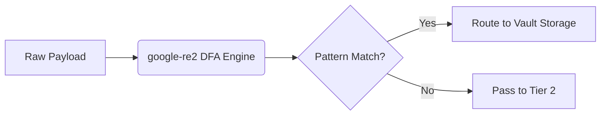

# Tier 1 Pre-Compiled Regex Engine

[⬅️ Back to Features Catalog](../../../FEATURES.md)

## What It Does
The **Tier 1 Pre-Compiled Regex Engine** is the foundational layer of the LLM-Shield-Proxy's 3-Tier Redaction Cascade. It is designed to rapidly and deterministically identify structured sensitive data (e.g., SSNs, Emails, Credit Card Numbers, and Custom Corporate Identifiers) using pre-compiled regular expressions, ensuring they are redacted before they leave your VPC.

## How It Works
Unlike traditional proxies that evaluate regular expressions dynamically at runtime using standard backtracking engines (like Python's `re` module), LLM-Shield-Proxy utilizes the **`google-re2` C++ engine**. 

1. **Startup Compilation:** During the FastAPI `lifespan` startup event, all predefined PII patterns and user-supplied custom regexes are compiled down into Deterministic Finite Automatons (DFAs).
2. **Linear Execution O(N):** Because the regexes are DFAs, they guarantee linear execution time (O(N)) relative to the size of the payload. 
3. **ReDoS Immunity:** By eliminating backtracking, the engine is mathematically immune to Regular Expression Denial of Service (ReDoS) attacks, meaning adversarial prompts (like `(a+)+$`) cannot spike CPU usage or stall the event loop.

<!-- EDIT THIS MERMAID SCRIPT TO UPDATE THE DIAGRAM:

-->

View diagram on GitHub mobile 📱 -->


## Performance Profile
- **Execution Speed:** Processes massive 10,000-word payloads in `<0.03ms` (`37µs` average).
- **Overhead:** Adds virtually zero latency to the streaming data plane.

## Configuration Flags
The engine operates automatically, but can be extended via the Bring-Your-Own-Regex (BYOR) feature. 

| Environment Variable | Description | Linked Deployment Guide |
| :--- | :--- | :--- |
| `CUSTOM_REGEX_PATH` | Path to a YAML file containing custom regex rules to inject into Tier 1. | [View in DEPLOYMENT.md](../DEPLOYMENT.md) |

### BYOR Example (`custom_regex.yaml`)
```yaml
custom_patterns:
  - name: INTERNAL_EMPLOYEE_ID
    pattern: "(?i)EMP-[A-Z]{3}-\\d{5}"
    description: "Matches internal Acme Corp employee IDs"
```

## Critical Logic & Edge Cases
* **Streaming Fragmentation:** The engine is tightly coupled with the `SSERehydrationBuffer`, ensuring that regexes safely evaluate across split Server-Sent Event (SSE) chunks by maintaining a prefix-overlap window.
* **Non-Latin Scripts:** For CJK (Chinese, Japanese, Korean) texts where spaces are absent, the Tier 1 engine avoids catastrophic sub-word collisions by isolating ASCII alphanumeric boundaries securely.

## FAQ

**Q: Can I use lookaheads or lookbehinds in my custom regex?**
A: No. Because `google-re2` guarantees O(N) performance by strictly using DFAs, it does not support unbounded lookaheads/lookbehinds or backreferences. If your pattern requires contextual NLP, rely on the **Tier 3 ONNX NER** engine instead.

**Q: Does injecting thousands of custom regexes slow down the proxy?**
A: No. The `re2` engine compiles them into a highly optimized state machine. While startup time might marginally increase, runtime matching remains practically constant-time and ultra-low latency.

## Plainspeak
This feature quickly scans text for sensitive information like Social Security Numbers and email addresses using pre-defined search patterns (like a highly advanced "CTRL+F"). 

Unlike standard search engines that can get stuck or crash if a hacker sends a tricky "bomb" of confusing text (known as backtracking), this engine uses a specialized, math-based search method. This guarantees the search moves straight through the text at a fast, predictable speed and can never be tricked into freezing the system.

## Related Tests
See the following test file for reference implementations and edge-case testing: [`tests/test_pii_engine.py`](../../../tests/test_pii_engine.py).
