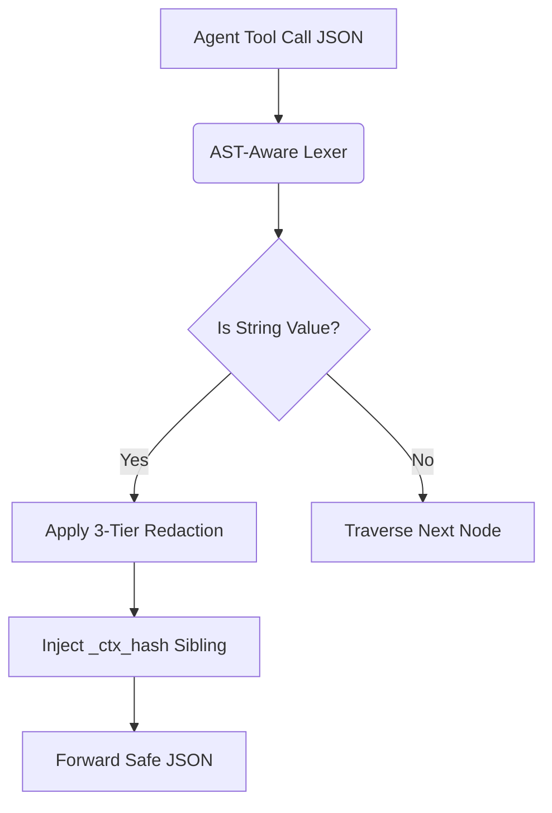

# v3 Stateless AST-Aware Semantic PII Firewall

[⬅️ Back to Features Catalog](../../../FEATURES.md)

## What It Does
The **v3 Stateless AST-Aware Semantic PII Firewall** extends the proxy's redaction capabilities beyond basic text prompts and directly into autonomous agent workflows. It intercepts and safely mutates structured tool invocations (such as JSON-RPC 2.0 payloads or MCP protocol commands) to ensure agents do not leak sensitive PII when executing backend tools like `exec_sql` or `fetch_profile`.

## How It Works
When LangChain, AutoGen, or an MCP client issues a tool call, the payload is often deeply nested JSON. Standard regex filters corrupt JSON structure by blindly replacing text.

1. **AST-Aware Traversal:** The engine uses a zero-allocation streaming lexer (`orjson`) to parse the Abstract Syntax Tree (AST) of the payload, specifically targeting `tool_calls[*].function.arguments`.
2. **Schema-Safe Redaction:** It redacts string values deep within the JSON object without breaking the structural integrity of the payload, ensuring the downstream API or LLM doesn't crash with a `JSONDecodeError`.
3. **Stateless Sibling Injection:** During redaction, the engine automatically augments the MCP/OpenAI function schema by injecting `_ctx_hash_<prop>` sibling fields. This allows the proxy to utilize AES-256-GCM stateless rehydration when the tool returns, without needing a Redis state store.

<!-- EDIT THIS MERMAID SCRIPT TO UPDATE THE DIAGRAM:

-->

View diagram on GitHub mobile 📱 -->

## Performance Profile
- **Execution Speed:** Sub-millisecond JSON traversal.
- **Overhead:** Hard-capped max depth traversal guarantees latency remains flat even against adversarial payloads.

## Critical Logic & Edge Cases
* **JSON Bomb (Slowloris) Defense:** To prevent attackers from submitting infinitely nested JSON objects to exhaust CPU recursion limits, the firewall enforces a strict `max_depth = 40`. Any payload exceeding this is instantly rejected with a `400 Bad Request`.
* **Schema Integrity:** By mutating only primitive string values and utilizing `_ctx_hash` fields, the proxy ensures Pydantic validators on the client side continue to pass successfully.

## FAQ

**Q: Will this corrupt my strict OpenAI Structured Outputs (JSON Schema)?**
A: No. The firewall replaces PII with Format-Preserving Synthetic Masking (e.g., swapping a real email for a fake one). Because the data type (string) and the format (email) remain identical, strict JSON Schema validation will continue to succeed flawlessly.

**Q: Why are `_ctx_hash_<prop>` fields injected into my schema?**
A: This is the mechanism for stateless crypto. By injecting the AES-256-GCM encrypted original value into a sibling field, the proxy can re-hydrate the real value when the tool executes on your backend, completely eliminating the need for the proxy to store your data in a database.

## Plainspeak
This feature acts as a smart translator between an AI agent and the tools it uses (like a database or a calculator). 

When an AI wants to use a tool, it sends instructions in a specific computer format (called JSON). If we just blindly blacked-out sensitive words in those instructions, it would break the formatting and cause the tool to crash. Instead, this firewall carefully unpackages the instructions, hides only the sensitive data while keeping the structure intact, and then seamlessly repackages it so the tool still works perfectly.

## Related Tests
See the following test file for reference implementations and edge-case testing: [`tests/test_tool_rbac_and_compliance.py`](../../../tests/test_tool_rbac_and_compliance.py).
