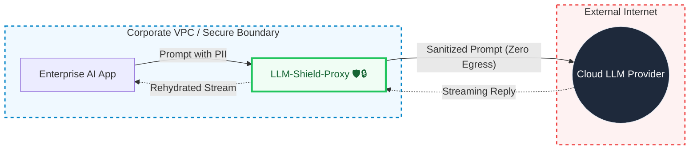
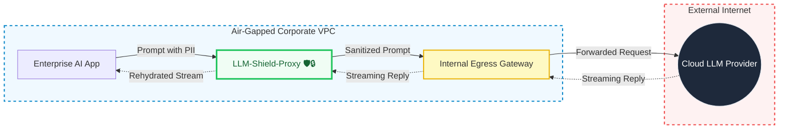

# Deployment Topologies

LLM-Shield-Proxy is designed for highly regulated enterprise environments where data egress is strictly controlled. By default, the proxy operates in **Zero-Egress Mode**, ensuring that no unredacted data or PII ever leaves your secure Corporate VPC.

Below are the two primary deployment topologies supported by the proxy.

---

## 1. Standard Egress to Cloud LLM

In this topology, the enterprise application resides within the secure Corporate VPC. The LLM-Shield-Proxy is deployed as an internal gateway. It intercepts the traffic, performs cryptographic masking and PII redaction, and then securely routes the sanitized payload over the internet to a Cloud LLM Provider (like OpenAI, Anthropic, or Azure).

### Setup Instructions
1. Deploy `LLM-Shield-Proxy` inside your VPC (e.g., via Kubernetes or Docker Compose).
2. Ensure the proxy has outbound NAT access to reach the Cloud LLM provider (e.g., `api.openai.com`).
3. Configure your AI applications to point their `base_url` to the internal proxy endpoint instead of the public LLM endpoint.

---

## 2. Air-Gapped Egress Gateway Mode

For organizations with **Zero-Internet** policies (where workloads have absolutely no outbound internet access), LLM-Shield-Proxy can be configured to route traffic through an internal Egress Gateway (e.g., Squid, Envoy, or a corporate proxy) before it reaches the internet.

### Setup Instructions
1. Deploy `LLM-Shield-Proxy` alongside your application.
2. In your proxy configuration or environment variables, configure standard HTTP proxy routing (e.g., set `HTTPS_PROXY=http://internal-egress-gateway:3128`).
3. The LLM-Shield-Proxy will automatically route all sanitized outbound connections through the designated Egress Gateway, maintaining strict air-gap compliance.
