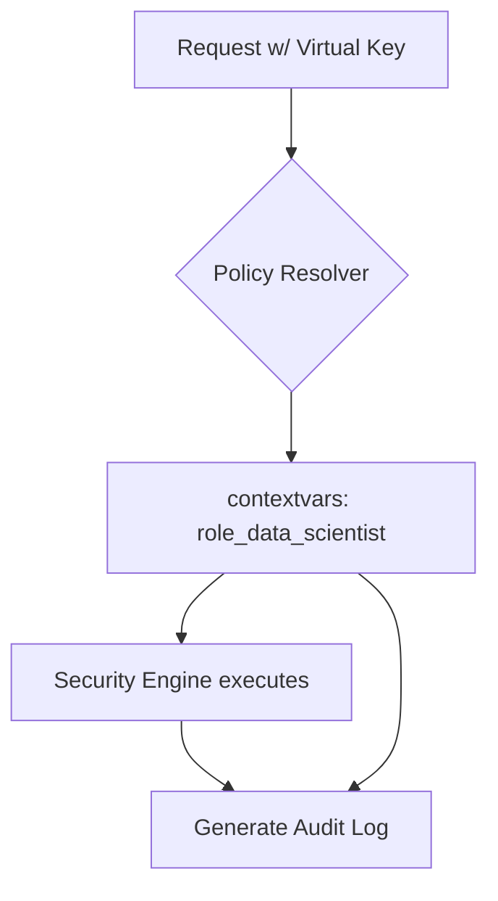

# Applied Role Name in Audit Events

[⬅️ Back to Features Catalog](../../../FEATURES.md)

## What It Does
The **Applied Role Name in Audit Events** feature provides exact attribution for every security decision made by the proxy. It ensures that compliance officers and security analysts know exactly *which* YAML policy role governed a specific request, vastly simplifying access control audits.

## How It Works
When a user authenticates, their `virtual_key_id` maps to a specific role (e.g., `role_data_scientist`).

1. **Context Propagation:** During the authentication phase, the resolved role name is injected into Python's `contextvars`.
2. **Event Enrichment:** Whenever the proxy emits a WORM-compliant audit log or an OSCAL assessment artifact, it pulls the role name from the context variable.
3. **Structured Output:** The event is permanently tagged with `"applied_role_name": "role_data_scientist"`.

<!-- EDIT THIS MERMAID SCRIPT TO UPDATE THE DIAGRAM:

-->

View diagram on GitHub mobile 📱 -->

## Performance Profile
- **Execution Speed:** Variable lookup executes in `O(1)`.
- **Overhead:** Extremely low memory overhead.

## Configuration Flags
This feature is natively embedded in the logging and policy engines.

## Critical Logic & Edge Cases
* **Fallback Role:** If a client authenticates successfully but their specific role is missing from `policies.yaml`, the proxy defaults to the strict `role_default` (Fail-Closed). In this scenario, the audit log will accurately reflect `"applied_role_name": "role_default (fallback)"`.
* **Impersonation Auditing:** If an admin utilizes a feature to assume a different role temporarily, the audit log retains both the primary identity and the `applied_role_name`, preventing privilege escalation without a forensic trace.

## FAQ

**Q: Why is this important for SOC 2?**
A: SOC 2 requires proof of Logical Access Controls (who has access to what). If you just log "SSN Redacted", an auditor will ask *why* it was redacted. By logging the `applied_role_name`, you instantly prove that the redaction occurred because the user was assigned a specific, governed policy.
