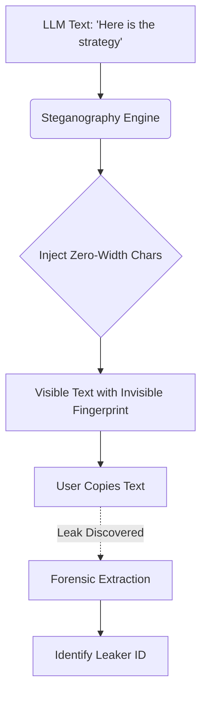

# Dynamic Canary Watermarking & Steganography

[⬅️ Back to Features Catalog](../../../FEATURES.md)

## What It Does
**Dynamic Canary Watermarking & Steganography** provides unprecedented forensic traceability for enterprise data. It injects mathematically verifiable, invisible watermarks into the text generated by the LLM. If an employee copies the LLM's response and leaks it to the public or a competitor, security teams can analyze the leaked text and instantly identify exactly which user session generated the leak.

## How It Works
Standard text cannot be easily tracked. If text is leaked, proving *who* leaked it is nearly impossible. The proxy solves this using Zero-Width Unicode Steganography.

1. **Fingerprint Generation:** When a user initiates a session, the proxy creates an HMAC-SHA256 fingerprint combining their `virtual_key_id`, the timestamp, and a secret salt.
2. **Binary Encoding:** This fingerprint is converted into a binary sequence (1s and 0s).
3. **Zero-Width Injection:** The proxy intercepts the SSE stream coming *back* from the LLM. It seamlessly injects zero-width Unicode characters (invisible to the human eye) between the visible words, encoding the binary fingerprint into the text.
4. **Forensic Extraction:** If a leaked document is found, a security analyst pastes the text into an extraction tool. The tool reads the invisible characters, decodes the binary, and outputs the exact `virtual_key_id` that leaked the data.

<!-- EDIT THIS MERMAID SCRIPT TO UPDATE THE DIAGRAM:

-->

View diagram on GitHub mobile 📱 -->

## Performance Profile
- **Execution Speed:** String injection executes in `<1µs` per stream chunk.
- **Overhead:** Adds roughly 1-2 bytes per injected bit, resulting in negligible bandwidth overhead.

## Configuration Flags

| Environment Variable | Description | Linked Deployment Guide |
| :--- | :--- | :--- |
| `ENABLE_WATERMARKING` | Toggles the injection of zero-width cryptographic watermarks. | [View in DEPLOYMENT.md](../../DEPLOYMENT.md) |
| `WATERMARK_SECRET_SALT` | A secure string used to salt the HMAC fingerprint. | [View in DEPLOYMENT.md](../../DEPLOYMENT.md) |

## Critical Logic & Edge Cases
* **Resilience:** The zero-width characters are injected redundantly throughout long paragraphs. Even if the leaker deletes half of the text, the fingerprint can usually be fully recovered from the remaining fragments.
* **Scrubbing Vulnerability:** If a sophisticated attacker explicitly runs the text through a Unicode sanitizer or pastes it into a strict ASCII-only terminal, the zero-width characters will be stripped. This feature defends against insider threats copying to emails, Slack, and Word documents, not cryptographers.

## FAQ

**Q: Will the invisible characters confuse downstream systems or APIs?**
A: Zero-width spaces (`U+200B`), non-joiners (`U+200C`), and joiners (`U+200D`) are valid, standard UTF-8 characters. Modern applications (browsers, Word, Slack, PDFs) render them flawlessly (by ignoring them visually). However, if your application parses the text for strict byte-length limits, the watermark will consume a few extra bytes.

**Q: Does this alter the actual AI output or meaning?**
A: Not at all. The visible letters, punctuation, and markdown formatting remain 100% untouched. The text reads perfectly to the user.
