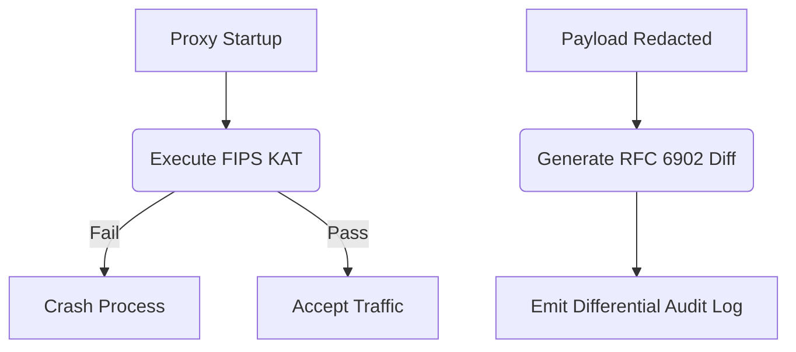

# FIPS 140-3 KAT & RFC 6902 Differential Audit Logging

[⬅️ Back to Features Catalog](../../../FEATURES.md)

## What It Does
This feature explicitly targets strict Federal (FedRAMP High / DoD IL5) compliance requirements. It ensures the proxy continuously validates its own cryptographic health via **Known Answer Tests (KAT)** per FIPS 140-3 standards, and emits granular, mathematically precise **RFC 6902 JSON Patch** structures to prove exactly *how* a payload was mutated.

## How It Works
Federal auditors require absolute proof that crypto engines are functioning correctly and that data modifications are precisely tracked.

1. **FIPS 140-3 KAT:** On startup, and periodically during operation, the proxy executes Known Answer Tests against the underlying OpenSSL libraries. It encrypts a known string with a known AES-256-GCM key and verifies the ciphertext matches a hardcoded, mathematically proven answer. If it fails, the proxy immediately enters a terminal `CrashLoopBackOff`, refusing to process data with broken cryptography.
2. **RFC 6902 Differential Logging:** Instead of just logging "We redacted PII", the proxy calculates the exact diff between the original prompt and the redacted prompt. It emits an RFC 6902 compliant JSON Patch array (e.g., `[{"op": "replace", "path": "/messages/0/content", "value": "***"}]`).

<!-- EDIT THIS MERMAID SCRIPT TO UPDATE THE DIAGRAM:

-->

View diagram on GitHub mobile 📱 -->

## Performance Profile
- **Execution Speed:** KAT executes only on startup/intervals. RFC 6902 diff generation takes `<2µs` using fast-path AST evaluation.
- **Overhead:** Extremely low.

## Configuration Flags

| Environment Variable | Description | Linked Deployment Guide |
| :--- | :--- | :--- |
| `ENABLE_FIPS_STRICT_MODE` | Enforces KAT validation and disables non-FIPS approved ciphers. | [View in DEPLOYMENT.md](../../DEPLOYMENT.md) |
| `ENABLE_RFC6902_LOGGING` | Toggles the generation of differential JSON patches in the audit logs. | [View in DEPLOYMENT.md](../../DEPLOYMENT.md) |

## Critical Logic & Edge Cases
* **Host OS Dependency:** The proxy's FIPS compliance heavily relies on the underlying Python interpreter being compiled against a FIPS-validated OpenSSL module (e.g., running the proxy on Ubuntu Pro FIPS or Red Hat Enterprise Linux).
* **Data Privacy in Diffs:** Even in differential logging, the *original* sensitive value is never logged. The JSON patch explicitly shows the `value` being injected (the synthetic name or `***`), but never the `old_value` that was removed, preserving the integrity of the logging pipeline.

## FAQ

**Q: Does enabling `ENABLE_FIPS_STRICT_MODE` slow down the proxy?**
A: No. It simply enforces cryptographic boundary checks and ensures that weak ciphers (like DES or MD5) are physically unavailable to the proxy's TLS and masking engines. Execution speed remains identical.

**Q: Why is RFC 6902 better than standard logging?**
A: Because it is a deterministic, machine-readable standard. An auditor can write a script that takes the final payload, applies the RFC 6902 patch in reverse, and mathematically prove the sequence of operations the proxy executed on the payload.

## Related Tests
See the following test file for reference implementations and edge-case testing: [`tests/test_fips_and_audit_diff.py`](../../../tests/test_fips_and_audit_diff.py).
