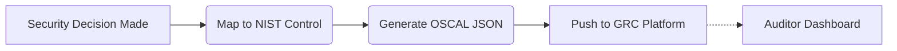

# NIST OSCAL Assessment Results Generation

[⬅️ Back to Features Catalog](../../../FEATURES.md)

## What It Does
**NIST OSCAL Assessment Results Generation** transforms the proxy's runtime security decisions into standardized, machine-readable compliance artifacts. Instead of manually mapping proxy logs to security controls during an audit, the proxy automatically generates NIST SP 800-53 Rev. 5 compliant OSCAL (Open Security Controls Assessment Language) payloads.

## How It Works
Proving compliance to federal auditors or enterprise risk teams is traditionally a manual, screenshot-heavy process.

1. **Control Mapping:** Inside `policies.yaml`, security roles and redaction rules are explicitly mapped to NIST control identifiers (e.g., Redacting SSNs maps to `PE-19`, Information Leakage).
2. **Runtime Assessment:** When the proxy successfully enforces a rule (e.g., blocking a tool call or masking PII), the Decision Engine flags this as an automated assessment event.
3. **OSCAL Generation:** The proxy aggregates these events and structures them into valid OSCAL `assessment-results` JSON models.
4. **Export:** These standardized artifacts are pushed directly to GRC platforms via the [GRC Webhook Transport](./grc-webhook-sidecar-file-transport.md), allowing auditors to view real-time compliance posture in their native dashboards.

<!-- EDIT THIS MERMAID SCRIPT TO UPDATE THE DIAGRAM:

-->

View diagram on GitHub mobile 📱 -->

## Performance Profile
- **Execution Speed:** JSON templating executes asynchronously in `<2ms`.
- **Overhead:** Offloaded entirely to background workers to preserve microsecond streaming performance on the main event loop.

## Configuration Flags

| Environment Variable | Description | Linked Deployment Guide |
| :--- | :--- | :--- |
| `ENABLE_OSCAL_EXPORTER` | Toggles the generation of OSCAL assessment artifacts. | [View in DEPLOYMENT.md](../../DEPLOYMENT.md) |

## Critical Logic & Edge Cases
* **Batching:** Generating an OSCAL artifact for every single SSN redacted would flood GRC APIs. The proxy intelligently batches assessment results into rolling time-windows (e.g., every 5 minutes), aggregating 10,000 successful redactions into a single "Pass" attestation for the `PE-19` control.
* **Chain of Custody:** Every OSCAL artifact includes a reference to the `X-Request-ID` and the specific [WORM-Compliant Hash Chain](./worm-compliant-audit-logging-with-hash-chaining.md) block, providing an unbreakable forensic trail from the high-level compliance dashboard down to the exact byte-level network event.

## FAQ

**Q: Do I need to be a government agency to use this?**
A: No! While OSCAL was designed by NIST, it is rapidly becoming the universal standard for continuous compliance. Modern GRC tools (like Vanta or Drata) can ingest OSCAL data to automatically prove SOC 2 or ISO 27001 compliance for commercial startups.

**Q: Can I map custom policies to custom controls?**
A: Yes. The `policies.yaml` file allows you to inject custom control IDs (e.g., `ACME-SEC-01`) alongside the standard NIST IDs, ensuring the generated OSCAL fits your company's proprietary risk framework.

## Plainspeak
This feature acts as an automatic paperwork generator for government security audits.

When a government auditor reviews your system, they usually demand massive, confusing spreadsheets detailing every single security rule. Instead of humans doing this manually, this feature automatically translates the proxy's real-time security actions into the exact, strict paperwork format (OSCAL) required by the US Government (NIST), saving hundreds of hours of manual compliance work.

## Related Tests
See the following test file for reference implementations and edge-case testing: [`tests/test_audit_remediation.py`](../../../tests/test_audit_remediation.py).
