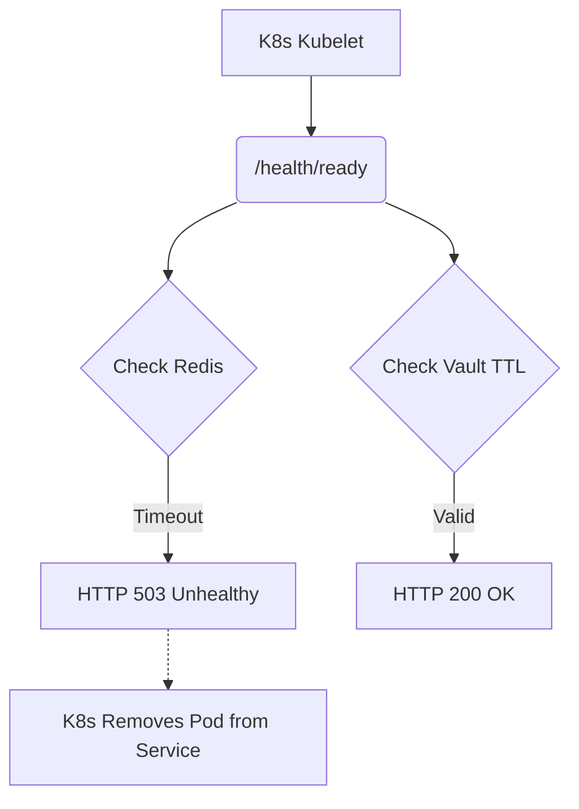

# Deep Component Health Probes and Prometheus Alert Rules

[⬅️ Back to Features Catalog](../../../FEATURES.md)

## What It Does
**Deep Component Health Probes** provide Kubernetes with absolute clarity regarding the proxy's operational status. Rather than simply returning a "200 OK" if the HTTP server is running, the proxy performs deep, asynchronous diagnostic checks against its critical dependencies (Redis, Vault, Upstream APIs) to ensure it is truly ready to handle traffic.

## How It Works
If a proxy pod loses connection to the Redis Vault but continues accepting traffic, it could result in catastrophic tokenization failures or data leaks. 

1. **Liveness Probe (`/health/live`):** Checks if the Python event loop is functioning and the core FastAPI process is responsive.
2. **Readiness Probe (`/health/ready`):** Executes an active PING against the Redis cluster, validates that the HashiCorp Vault token is unexpired, and optionally performs a lightweight socket connection to the upstream LLM provider.
3. **Prometheus Alerting:** The results of these deep probes are exposed as metrics. If a specific dependency (like Redis) experiences high latency, Prometheus fires pre-packaged alert rules to notify the on-call engineer via PagerDuty.

<!-- EDIT THIS MERMAID SCRIPT TO UPDATE THE DIAGRAM:

-->

View diagram on GitHub mobile 📱 -->

## Performance Profile
- **Execution Speed:** Health probes execute in `<5ms` by utilizing persistent connection pools.
- **Overhead:** Extremely low. Probes are cached for 2-3 seconds to prevent Kubernetes from accidentally initiating a Denial of Service attack against Redis by probing too aggressively.

## Configuration Flags

| Environment Variable | Description | Linked Deployment Guide |
| :--- | :--- | :--- |
| `PROBE_REDIS_TIMEOUT` | Maximum time to wait for a Redis PING before failing the readiness check. | [View in DEPLOYMENT.md](../../DEPLOYMENT.md) |

## Critical Logic & Edge Cases
* **Graceful Degradation Tolerances:** Depending on your enterprise configuration, losing Redis might *not* be fatal if you are primarily relying on Stateless Crypto. The health probe logic dynamically adjusts its strictness based on the active `SHIELD_DEFAULT_MASKING_MODE`.
* **Pod Draining Synchronization:** When a `SIGTERM` is received, the readiness probe is instantly forced to return `503`. This signals Kubernetes to stop sending new traffic while the proxy finishes draining its active streams.

## FAQ

**Q: Where can I find the Prometheus Alert Rules?**
A: The repository includes a `prometheus-rules.yaml` file in the `/deploy/` directory, containing best-practice thresholds for latency, error rates, and probe failures.

**Q: Will the probe timeout if the upstream LLM (OpenAI) is down?**
A: The readiness probe does not execute a full LLM completion. It only tests the TCP/TLS socket connection to the API gateway. If OpenAI is returning 503s but the network is reachable, the pod remains "Ready" to handle failover routing correctly.

## Plainspeak
This feature acts like a highly sensitive heart monitor for the proxy.

Normally, a cloud server just checks if an app is "turned on." This feature goes much deeper. It actively tests all of the proxy's internal organs (like testing its connection to the password vault and the database). If it detects that a critical organ is failing, it immediately alerts the cloud to stop sending it traffic and pages an engineer before a major crash happens.

## Related Tests
See the following test file for reference implementations and edge-case testing: [`tests/test_health_and_alerts.py`](../../../tests/test_health_and_alerts.py).
