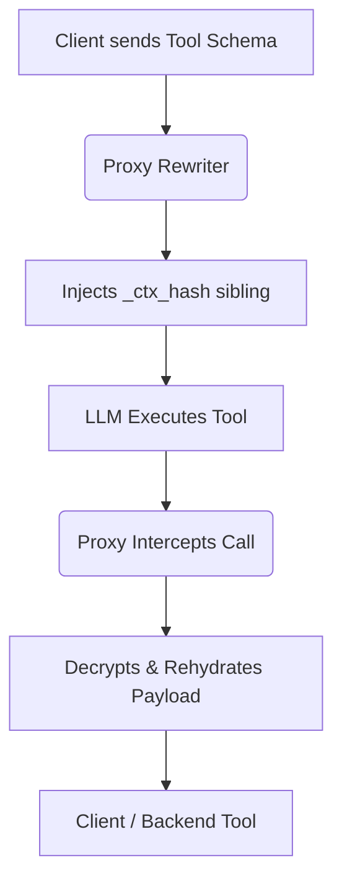

# Dynamic MCP Tool Schema Rewriting

[⬅️ Back to Features Catalog](../../../FEATURES.md)

## What It Does
**Dynamic MCP Tool Schema Rewriting** is a critical component of the v3 Stateless AST-Aware Semantic PII Firewall. It automatically modifies the JSON schema of tools provided by the LLM (like OpenAI's function calling or the Model Context Protocol (MCP)). This allows the proxy to encrypt sensitive data in tool calls and decrypt it later, without requiring developers to change their tool code or the LLM's prompt.

## How It Works
If a proxy uses AES-256-GCM to encrypt a social security number (SSN) before it reaches the LLM, the LLM will see a Base62 encrypted string (e.g., `enc_9f3b...`). If the LLM then calls a tool (e.g., `lookup_credit(ssn="enc_9f3b...")`), the backend tool will fail because it expects a real SSN.

1. **Schema Interception:** When the client sends the tool schemas to the LLM, the proxy intercepts the `tools` array.
2. **Sibling Injection:** For every string property in the tool schema (e.g., `ssn`), the proxy automatically injects a hidden sibling property into the schema called `_ctx_hash_ssn`.
3. **Stateless Rehydration:** When the LLM outputs a tool call, it naturally includes the `ssn` parameter. The proxy intercepts the tool execution, decrypts the Base62 string, places the *real* SSN back into the `ssn` field, and populates the `_ctx_hash` field with metadata. The backend tool receives the real data seamlessly!

<!-- EDIT THIS MERMAID SCRIPT TO UPDATE THE DIAGRAM:

-->

View diagram on GitHub mobile 📱 -->

## Performance Profile
- **Execution Speed:** Schema AST mutation executes in `<1ms`.
- **Overhead:** Extremely lightweight, parsing the schema once during the outbound request phase.

## Configuration Flags
This engine operates natively alongside the v3 PII Firewall and does not require standalone flags.

## Critical Logic & Edge Cases
* **Strict JSON Schema Compatibility:** The proxy modifies the schema strictly adhering to JSON Schema Draft 7 specifications (used by OpenAI). It ensures the injected properties are not marked as `required`, allowing the LLM to ignore them entirely without breaking validation.
* **Anthropic Compatibility:** Anthropic Claude uses a different XML/JSON structure for tool use. The schema rewriter is fully integrated with the [Multi-Provider Translators](./multi-provider-translators.md) to ensure Claude's tool definitions are augmented correctly.

## FAQ

**Q: Do I need to update my Pydantic models on my backend to accept `_ctx_hash`?**
A: Usually, no. Most Pydantic models (and JSON parsers) default to `extra="ignore"`, meaning they will simply discard the injected `_ctx_hash` metadata when the tool call arrives. If your models are set to `extra="forbid"`, you must update them to allow the field.
