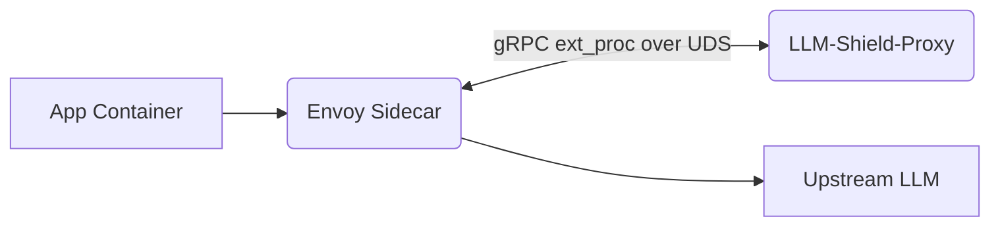

# Service Mesh Native gRPC ext_proc Integration

[⬅️ Back to Features Catalog](../../../FEATURES.md)

## What It Does
**Service Mesh Native gRPC ext_proc Integration** allows the proxy to operate directly inside modern Kubernetes service meshes (like Istio, Linkerd, or Envoy). Instead of acting as a standalone HTTP reverse proxy, LLM-Shield-Proxy can run as an Envoy External Processing (`ext_proc`) sidecar, intercepting and mutating payloads with near-zero network overhead.

## How It Works
Routing traffic out of a service mesh to an external HTTP proxy and back adds redundant TCP handshakes and serialization latency.

1. **Envoy Delegation:** When an application inside the mesh sends an HTTP request to OpenAI, the Envoy sidecar intercepts it and delegates it to the LLM-Shield-Proxy via a high-speed gRPC stream over a Unix Domain Socket (UDS).
2. **Buffer Mutation:** The proxy receives the raw HTTP body buffers via gRPC, applies the Tier 1/2/3 PII masking, and streams the mutated buffers back to Envoy.
3. **Transparent Egress:** Envoy then forwards the sanitized payload to the upstream LLM. The client application is completely unaware the mutation occurred.

<!-- EDIT THIS MERMAID SCRIPT TO UPDATE THE DIAGRAM:

-->

View diagram on GitHub mobile 📱 -->

## Performance Profile
- **Execution Speed:** Bypasses TCP/IP entirely. Data transfer over UDS occurs in microseconds.
- **Overhead:** Eliminates the need for the proxy to manage outbound TLS/HTTPS connections, offloading that entirely to Envoy.

## Configuration Flags

| Environment Variable | Description | Linked Deployment Guide |
| :--- | :--- | :--- |
| `ENABLE_GRPC_EXT_PROC` | Toggles the gRPC server instead of the HTTP server. | [View in DEPLOYMENT.md](../../DEPLOYMENT.md) |
| `UDS_SOCKET_PATH` | The path for the Unix Domain Socket (e.g., `/var/run/shield.sock`). | [View in DEPLOYMENT.md](../../DEPLOYMENT.md) |

## Critical Logic & Edge Cases
* **Streaming Responses:** The `ext_proc` protocol supports bidirectional streaming. The proxy processes Envoy's incoming `ResponseBody` chunks sequentially, applying the SSE Sliding-Window Buffer logic directly to the gRPC messages.
* **Header Manipulation:** The proxy can instruct Envoy to inject the `X-Shield-Attestation` receipts directly into the HTTP headers returning to the client via the gRPC `HeaderMutation` message.

## FAQ

**Q: Can I run this without Istio or Envoy?**
A: Absolutely. The default mode is the standalone HTTP FastAPI server. The gRPC `ext_proc` integration is an advanced feature explicitly for enterprise service mesh architectures.

## Related Tests
See the following test file for reference implementations and edge-case testing: [`tests/test_grpc_ext_proc.py`](../../../tests/test_grpc_ext_proc.py).
