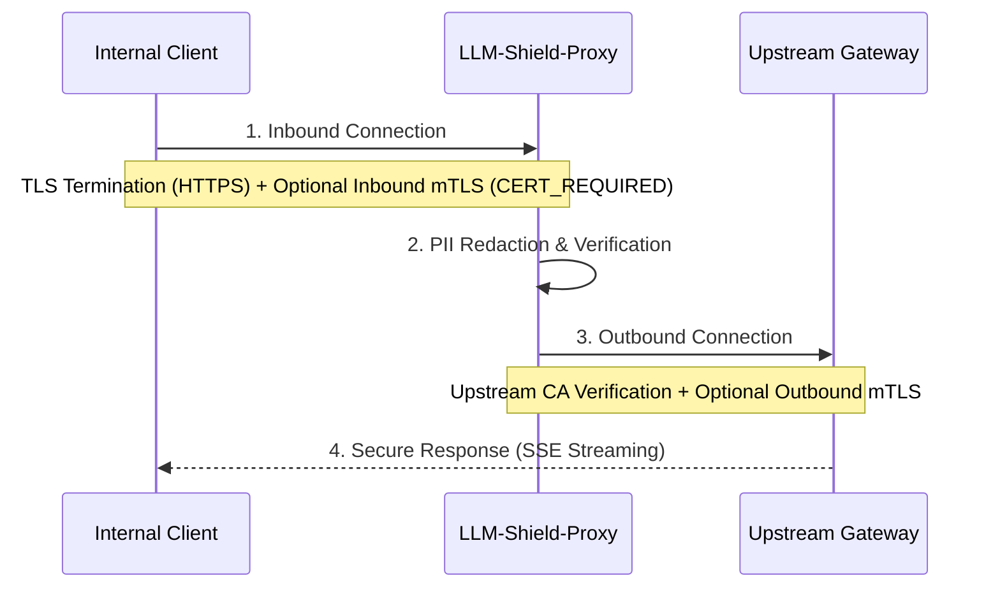

# Comprehensive TLS & mTLS Support

LLM-Shield-Proxy provides comprehensive Transport Layer Security (TLS) and Mutual TLS (mTLS) support for securing prompts over the network, fully supporting zero-trust and air-gapped VPC deployments.

## Architectural Overview

When operating as an AI Gateway, the proxy must secure data both on the **inbound** connection (from internal corporate clients and autonomous agents) and on the **outbound** connection (to upstream LLM providers or corporate egress gateways).

The proxy implements TLS termination using the native `uvicorn` high-performance async loops, and manages outbound TLS utilizing `httpx` and `ssl` contexts.

### Request Flow Diagram



## Inbound TLS Configuration (Server-Side)

### Standard TLS Termination (HTTPS)
To run the proxy over HTTPS, provide the server's public certificate and private key.
```bash
llm-shield-proxy --tls-cert-file /path/to/server.crt --tls-key-file /path/to/server.key
```
*Alternatively via Environment Variables:* `TLS_CERT_FILE` and `TLS_KEY_FILE`.

### Inbound Mutual TLS (mTLS)
To enforce strict zero-trust authentication, require connecting clients to present a valid certificate signed by a specific Certificate Authority (CA).

By providing `--client-ca-file`, the proxy instructs the socket to use `ssl.CERT_REQUIRED`. This guarantees that the connection will forcefully drop at the TCP/TLS layer before any HTTP data is even processed if the client lacks a valid certificate.
```bash
llm-shield-proxy \
  --tls-cert-file /path/to/server.crt \
  --tls-key-file /path/to/server.key \
  --client-ca-file /path/to/ca.pem
```
*Alternatively via Environment Variables:* `CLIENT_CA_FILE`.

## Outbound TLS Configuration (Client-Side)

### Upstream Certificate Verification
By default, the proxy verifies upstream LLM provider certificates using standard system roots. In an air-gapped environment or when routing to internal enterprise API gateways, you can supply a custom CA root bundle:
```bash
llm-shield-proxy --ca-bundle-file /path/to/corporate-root-ca.pem
```
*Alternatively via Environment Variable:* `CA_BUNDLE_FILE`.

For local development or specialized testing, you can bypass outbound verification:
```bash
llm-shield-proxy --insecure-skip-verify
```
*Alternatively via Environment Variable:* `INSECURE_SKIP_VERIFY=true`.

### Outbound Mutual TLS (mTLS)
If your upstream API gateway (e.g., an internal corporate firewall or proxy) requires LLM-Shield-Proxy itself to authenticate, provide the proxy's client certificate and key.

The proxy will bundle these into a tuple and securely pass them to the underlying asynchronous HTTP client.
```bash
export OUTBOUND_CLIENT_CERT=/path/to/proxy-client.crt
export OUTBOUND_CLIENT_KEY=/path/to/proxy-client.key
llm-shield-proxy
```

## Plainspeak

**The Problem:** When building enterprise AI systems, data must be encrypted in transit. Simply using standard HTTPS verifies that the server is legitimate, but it doesn't verify the *client*. Furthermore, standard internet CA roots do not work inside highly secure, air-gapped VPCs where external internet traffic is blocked.

**The Solution:** This feature provides complete end-to-end cryptographic control.
1. **Inbound mTLS** ensures that only authorized corporate machines holding a specific cryptographic ID card can even *connect* to the proxy.
2. **Outbound Custom CAs & mTLS** allow the proxy to securely communicate with internal corporate firewalls without relying on public internet infrastructure, while simultaneously proving its own identity to those internal firewalls.
