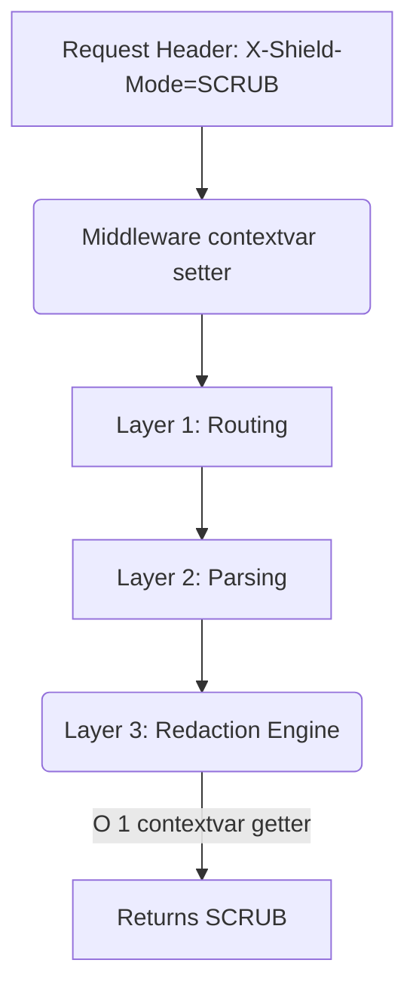

# Universal Dynamic Override Engine

[⬅️ Back to Features Catalog](../../../FEATURES.md)

## What It Does
The **Universal Dynamic Override Engine** gives clients and administrators absolute flexibility by allowing them to override nearly any global `.env` configuration (like masking modes, failover URLs, or downstream telemetry flags) on a per-tenant, per-request basis—without adding massive, bloated parameter lists to internal Python functions.

## How It Works
Passing a user's specific override preferences down through 15 layers of nested function calls (Router -> Middleware -> Redaction Engine -> SSE Buffer -> Network Egress) creates messy, unmaintainable code.

1. **Context Initialization:** When a request is received, the proxy extracts specific HTTP headers (like `X-Shield-Masking-Mode`) or tenant-specific settings from the policy YAML.
2. **Contextvars Injection:** These overrides are injected into Python `contextvars.ContextVar` objects at the very top of the call stack.
3. **O(1) Retrieval:** Deep within the SSE Sliding Buffer, when the system needs to know which masking mode to use, it queries the `ContextVar`. The Python runtime instantly returns the value specific to that single `asyncio` task, completely eliminating global state bleed.

<!-- EDIT THIS MERMAID SCRIPT TO UPDATE THE DIAGRAM:

-->

View diagram on GitHub mobile 📱 -->

## Performance Profile
- **Execution Speed:** Context variable getters execute in pure C-level CPython space in `<0.01µs`.
- **Overhead:** Replaces the need for deep dictionary passing, saving CPU cycles and garbage collection overhead.

## Critical Logic & Edge Cases
* **Thread-Safety Off-Loop:** Standard `contextvars` do not automatically propagate when you execute blocking code in a ThreadPoolExecutor (like pushing logs). The proxy employs `copy_context().run()` to explicitly carry the tenant's context into background threads, ensuring metrics and audit logs are tagged correctly.
* **Priority Hierarchy:** The engine enforces a strict resolution priority: 1. `policies.yaml` Forced Setting > 2. Client HTTP Header Override > 3. Global `.env` Default.

## FAQ

**Q: Can a client use this to override their rate limits?**
A: No! The engine only allows overrides for explicitly whitelisted behaviors (like Masking Mode or Fallback URLs). Rate limits, API keys, and security scopes are tightly locked to the `policies.yaml` RBAC engine and cannot be overridden by client headers.
