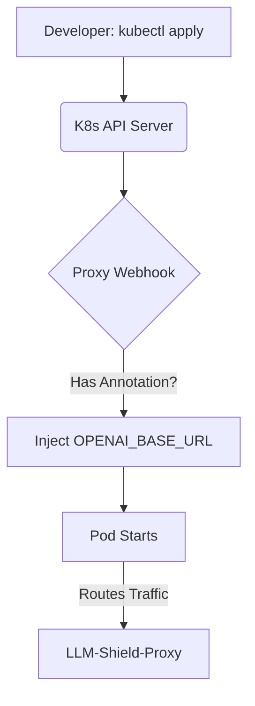

# Zero-Dependency Kubernetes Mutating Webhook

[⬅️ Back to Features Catalog](../../../FEATURES.md)

## What It Does
The **Zero-Dependency Kubernetes Mutating Webhook** allows platform engineering teams to seamlessly inject the LLM-Shield-Proxy into existing workloads. It operates natively as a Kubernetes Admission Controller, automatically intercepting pod deployments and modifying their environment variables to route traffic through the proxy—without requiring developers to change their code.

## How It Works
If you have 100 microservices using OpenAI, forcing 100 teams to manually update their `OPENAI_BASE_URL` in their repositories is a nightmare.

1. **Admission Interception:** When a developer runs `kubectl apply -f deployment.yaml`, the Kubernetes API server pauses the deployment and sends the pod manifest to the proxy's webhook endpoint.
2. **Annotation Trigger:** The proxy checks if the pod has the annotation `llm-shield.security/inject: "true"`.
3. **Transparent Mutation:** If the annotation exists, the proxy generates a JSON Patch (RFC 6902) that automatically injects `OPENAI_BASE_URL=http://shield-proxy.security.svc.cluster.local:8000/v1` into the container's environment variables.
4. **Seamless Deployment:** Kubernetes applies the patch, and the pod spins up automatically routing all AI traffic through the security proxy.

<!-- EDIT THIS MERMAID SCRIPT TO UPDATE THE DIAGRAM:

-->

View diagram on GitHub mobile 📱 -->

## Performance Profile
- **Execution Speed:** Webhook JSON parsing and patching executes in `<2ms`.
- **Overhead:** Runs seamlessly inside the existing FastAPI event loop. No external binaries or sidecars are required to host the webhook.

## Configuration Flags

| Environment Variable | Description | Linked Deployment Guide |
| :--- | :--- | :--- |
| `ENABLE_K8S_WEBHOOK` | Toggles the `/mutate` endpoint. | [View in DEPLOYMENT.md](../../DEPLOYMENT.md) |

## Critical Logic & Edge Cases
* **TLS Requirement:** Kubernetes mandates that all mutating webhooks must be served over HTTPS. The proxy must be configured with a valid TLS certificate (often generated by `cert-manager`) to accept traffic from the K8s API server.
* **Idempotency:** The webhook is intelligent enough to check if the environment variables are *already* set. It will not duplicate injections on pod restarts.

## FAQ

**Q: Can this mutate standard outbound HTTP requests?**
A: No, this mutates the *environment variables* of the pod. By changing the base URL of the SDKs (like `OPENAI_BASE_URL` or `ANTHROPIC_BASE_URL`), the SDK naturally routes to the proxy.

**Q: Do I have to use this feature?**
A: Not at all. If you prefer to manage environment variables via Helm, Kustomize, or Terraform, you can simply leave this disabled and point your apps to the proxy manually.

## Plainspeak
This feature acts as an automatic, invisible traffic diverter for your software engineers.

If you want to force 100 different apps to route their traffic through the security proxy, you usually have to beg 100 different developers to change their code. This feature completely bypasses the developers. When they deploy their app to the cloud, this feature intercepts the deployment and invisibly edits their configuration to point to the proxy, securing the app without the developer lifting a finger.

## Related Tests
See the following test file for reference implementations and edge-case testing: [`tests/test_enterprise_resiliency.py`](../../../tests/test_enterprise_resiliency.py).
