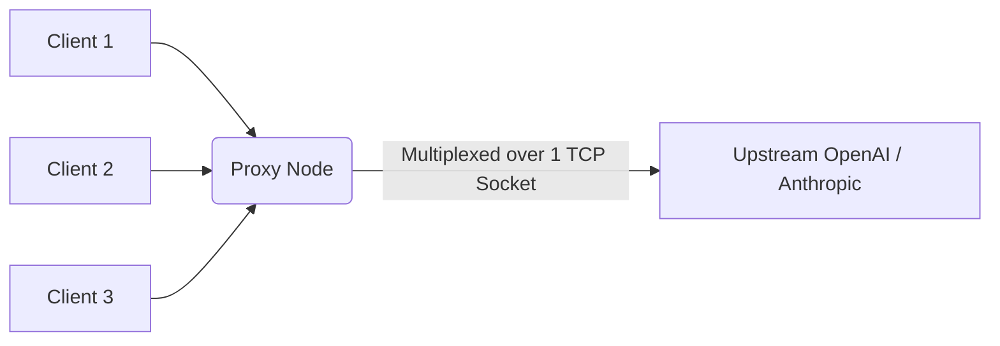

# HTTP/2 Upstream Connection Pooling

[⬅️ Back to Features Catalog](../../../FEATURES.md)

## What It Does
**HTTP/2 Upstream Connection Pooling** fundamentally optimizes the proxy's networking layer. Rather than opening and closing a new TCP socket and performing a TLS handshake for every single LLM request, the proxy maintains a persistent, high-throughput pool of HTTP/2 multiplexed connections to upstream providers like OpenAI and Anthropic.

## How It Works
TLS handshakes are computationally expensive and add significant latency (often 50ms - 150ms) to every request. 

1. **Persistent Sockets:** The proxy's `httpx.AsyncClient` is configured to hold long-lived `keep-alive` sockets open.
2. **HTTP/2 Multiplexing:** Under HTTP/2, multiple concurrent LLM streams are multiplexed simultaneously over a single, highly efficient TCP connection, eliminating the head-of-line blocking problem inherent in older HTTP/1.1 proxies.
3. **Connection Re-Use:** When a client application connects to the proxy, the proxy instantly routes the payload through one of the pre-warmed sockets to the upstream provider, resulting in 0ms of TCP/TLS overhead.

<!-- EDIT THIS MERMAID SCRIPT TO UPDATE THE DIAGRAM:

-->

View diagram on GitHub mobile 📱 -->

## Performance Profile
- **Execution Speed:** Eliminates 50ms to 150ms of network handshake latency per request.
- **Overhead:** Extremely efficient memory usage; maintaining 1,000 HTTP/2 streams on a single socket consumes a fraction of the resources compared to 1,000 separate TCP sockets.

## Configuration Flags

| Environment Variable | Description | Linked Deployment Guide |
| :--- | :--- | :--- |
| `HTTP_MAX_CONNECTIONS` | Maximum number of concurrent connections in the pool (default: 1000). | [View in DEPLOYMENT.md](../../DEPLOYMENT.md) |
| `HTTP_MAX_KEEPALIVE_CONNECTIONS` | Number of persistent idle connections to keep warm (default: 200). | [View in DEPLOYMENT.md](../../DEPLOYMENT.md) |

## Critical Logic & Edge Cases
* **Connection Draining (SIGTERM):** If the proxy pod is scaling down, Kubernetes sends a SIGTERM. The proxy stops accepting new connections but keeps the existing HTTP/2 streams alive for up to 25 seconds (`DRAIN_TIMEOUT_SECONDS`), ensuring in-flight SSE streams successfully complete before closing the connection pool.
* **Timeouts & Stale Sockets:** The proxy actively prunes dead or hanging sockets utilizing exponential backoff and precise read/write/connect timeouts to prevent resource exhaustion.

## FAQ

**Q: Do I need to enable HTTP/2 on my upstream provider manually?**
A: No. The proxy automatically negotiates ALPN (Application-Layer Protocol Negotiation) with OpenAI and Anthropic. If the upstream provider supports HTTP/2, the proxy upgrades instantly. If not, it gracefully falls back to persistent HTTP/1.1 connection pooling.

**Q: Does this help if I am using a local vLLM or Ollama instance?**
A: Yes! Even on a local loopback interface, connection pooling eliminates TCP handshake overhead, increasing your total tokens-per-second (TPS) throughput dramatically.

## Related Tests
See the following test file for reference implementations and edge-case testing: [`tests/test_transport.py`](../../../tests/test_transport.py).
