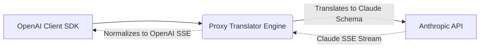

# Multi-Provider Translators

[⬅️ Back to Features Catalog](../../../FEATURES.md)

## What It Does
The **Multi-Provider Translators** feature enables LLM-Shield-Proxy to act as a universal API gateway. It allows client applications to use standard OpenAI SDKs and payload schemas while transparently routing traffic to non-OpenAI providers (like Anthropic Claude or Google Gemini) with full, native compatibility.

## How It Works
Client applications shouldn't need to rewrite their network logic when switching LLM providers. The proxy handles this dynamically at the network edge:

1. **Schema Interception:** The proxy receives standard OpenAI `v1/chat/completions` JSON payloads.
2. **Translation Layer:** Before egress, the payload is translated into the target provider's specific schema (e.g., extracting the `system` role out of the messages array for Anthropic).
3. **SSE Stream Normalization:** As the upstream provider streams its unique format back (e.g., Anthropic's `content_block_delta`), the proxy translates these events back into standard OpenAI `choices[0].delta.content` chunks, allowing the downstream application to parse them without errors.

<!-- EDIT THIS MERMAID SCRIPT TO UPDATE THE DIAGRAM:

-->

View diagram on GitHub mobile 📱 -->

## Performance Profile
- **Execution Speed:** Translation operations happen entirely in-memory and execute in under `~1ms`.
- **Overhead:** Highly optimized `orjson` serialization ensures payload restructuring doesn't block the asyncio event loop.

## Configuration Flags

| Environment Variable | Description | Linked Deployment Guide |
| :--- | :--- | :--- |
| `UPSTREAM_BASE_URL` | The URL of the target LLM provider (e.g., `https://api.anthropic.com`). | [View in DEPLOYMENT.md](../../DEPLOYMENT.md) |
| `UPSTREAM_API_KEY` | The exact API key for the target upstream provider. | [View in DEPLOYMENT.md](../../DEPLOYMENT.md) |

## Critical Logic & Edge Cases
* **Role Alternation:** Some providers (like Anthropic) enforce strict alternating `user` and `assistant` roles. The translator automatically collapses consecutive `user` messages into a single block to prevent API 400 errors.
* **Feature Parity:** If the client requests an OpenAI feature not supported by the upstream provider (e.g., `logit_bias` on certain models), the proxy safely strips the unsupported parameter to ensure successful execution.

## FAQ

**Q: Do I need to change my `langchain` or `openai` Python SDK code?**
A: No. You simply point the `base_url` to the proxy and keep writing standard OpenAI code. The proxy handles the translation seamlessly.

**Q: How does this interact with PII redaction?**
A: PII redaction happens *before* translation on the ingress, and *after* normalization on the egress. The translation layer is completely agnostic to whether the text is raw or synthetically masked.

## Plainspeak
This feature acts as an automatic, universal translator between different AI companies.

Every AI provider (like OpenAI or Anthropic) requires you to speak to them in a slightly different computer language. If you build your app for OpenAI, it usually breaks if you try to switch to Anthropic. This feature automatically translates your app's standard OpenAI requests into whatever language the target AI provider needs, allowing you to seamlessly swap between different AIs without rewriting any code.

## Related Tests
See the following test file for reference implementations and edge-case testing: [`tests/test_provider_adapters.py`](../../../tests/test_provider_adapters.py).
