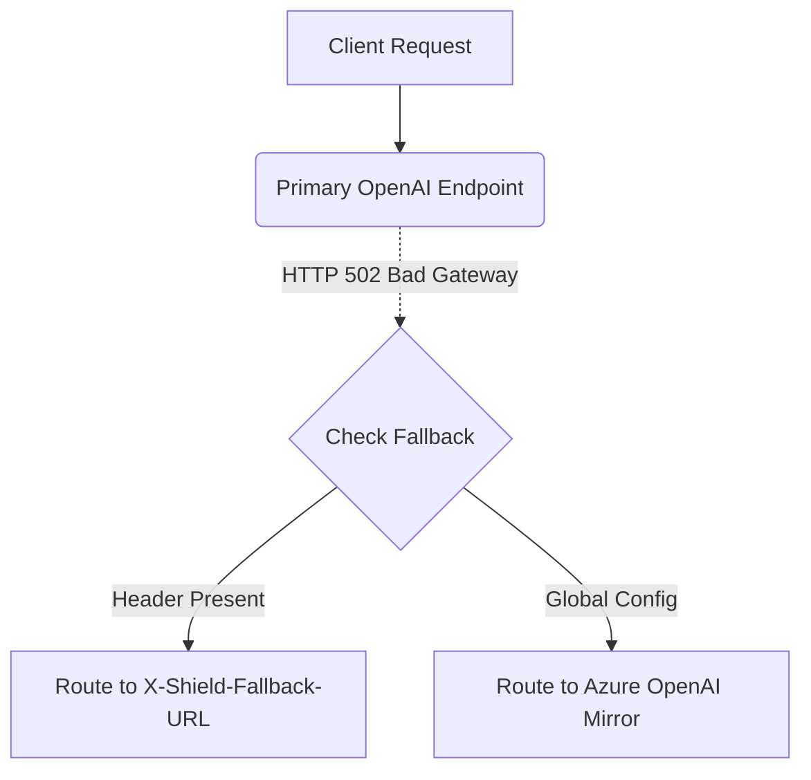

# Provider Failover with Per-Request Override

[⬅️ Back to Features Catalog](../../../FEATURES.md)

## What It Does
**Provider Failover with Per-Request Override** guarantees zero-downtime service continuity for mission-critical AI applications. It allows the proxy to dynamically reroute requests to secondary LLM mirrors (like Azure OpenAI) if the primary provider experiences an outage, or empowers clients to explicitly declare a fallback URL on a per-request basis.

## How It Works
Relying on a single AI provider introduces significant availability risks. This feature operates natively in the routing plane:

1. **Global Failover:** If `FALLBACK_BASE_URL` is configured, and a request to the primary `UPSTREAM_BASE_URL` returns a 50x server error or times out, the proxy automatically retries the identical request against the fallback endpoint.
2. **Key-Swapping:** When failing over, the proxy intelligently swaps the authentication header, replacing the primary `UPSTREAM_API_KEY` with the `FALLBACK_API_KEY`.
3. **Per-Request Client Override:** A client application can bypass the global configuration entirely by injecting the `X-Shield-Fallback-URL` HTTP header. The proxy prioritizes this header, enabling dynamic, client-driven routing.

<!-- EDIT THIS MERMAID SCRIPT TO UPDATE THE DIAGRAM:

-->

View diagram on GitHub mobile 📱 -->

## Performance Profile
- **Execution Speed:** Evaluates routing headers in `<0.5 µs` via `contextvars`.
- **Overhead:** Retries are managed via asynchronous jitter, ensuring failed requests do not block the connection pool.

## Configuration Flags

| Environment Variable / Header | Description | Linked Deployment Guide |
| :--- | :--- | :--- |
| `FALLBACK_BASE_URL` | Global fallback provider URL if the primary fails. | [View in DEPLOYMENT.md](../../DEPLOYMENT.md) |
| `FALLBACK_API_KEY` | Secondary API key for the fallback provider. | [View in DEPLOYMENT.md](../../DEPLOYMENT.md) |
| `X-Shield-Fallback-URL` | Client HTTP header to dynamically override the fallback destination. | [View in POLICIES.md](../../POLICIES.md) |

## Critical Logic & Edge Cases
* **No Unapproved Downgrades:** The proxy will *only* failover to explicitly approved URLs. It protects enterprises from situations where an application silently downgrades to a weaker, cheaper model (e.g., GPT-4 to GPT-3.5) without security authorization.
* **Idempotency:** Failover is safe because LLM text generation requests are generally idempotent. The proxy only fails over on network errors (502, 503, 504) or timeout exceptions, never on 4xx client errors.

## FAQ

**Q: Can I use this to failover from OpenAI to Anthropic?**
A: Yes! Because the proxy features Multi-Provider Translators, you can set the primary to OpenAI and the fallback to Anthropic. The proxy will dynamically translate the schema during the failover event, completely abstracting the outage from the client.

**Q: Does the client have to wait a long time during a failover?**
A: The delay is equal to the configured timeout for the primary request. You can aggressively tune `HTTP_TIMEOUT_SECONDS` (e.g., to 3 seconds) to ensure failovers happen almost instantaneously if a provider hangs.

## Plainspeak
This feature is an automatic backup plan that ensures your app never goes down when an AI provider crashes.

If OpenAI's servers suddenly go offline, this feature detects the crash and instantly reroutes the question to a backup provider (like Anthropic or a different server) before the user even realizes there was a problem. It also allows developers to easily specify exactly which backup server they prefer to use for any given request.

## Related Tests
See the following test file for reference implementations and edge-case testing: [`tests/test_enterprise_resiliency.py`](../../../tests/test_enterprise_resiliency.py).
