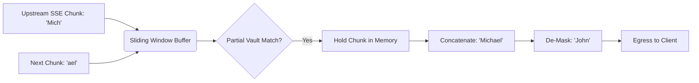

# Sub-Millisecond SSE Sliding-Window Buffer

[⬅️ Back to Features Catalog](../../../FEATURES.md)

## What It Does
The **Sub-Millisecond SSE Sliding-Window Buffer** is the patent-pending, core technological breakthrough of the LLM-Shield-Proxy. It solves the hardest problem in LLM security: securely redacting sensitive data from real-time Server-Sent Events (SSE) streams without destroying the "typing" visual effect that users expect from AI chatbots.

## How It Works
Standard HTTP proxies fail on streaming responses because LLMs generate text one token at a time. A sensitive entity like `[PERSON_1]` might be split across three consecutive network packets: `[PER`, `SON_`, and `1]`. If a proxy evaluates packets individually, the data leaks. If it buffers the whole response, the user waits 10 seconds for the UI to load.

LLM-Shield-Proxy solves this using a prefix-safe sliding window:
1. **Dynamic Chunk Interception:** As raw TCP frames arrive from OpenAI, the buffer parses the SSE `data:` payloads.
2. **Mathematical Overlap Retention:** The buffer evaluates the chunk against the Vault mappings, but *retains* a trailing overlap equal to $L = \max(0, \text{max\_token\_length} - 1)$. 
3. **Prefix-Safe Rehydration:** This ensures that if a token is split across chunks, the trailing piece is held in memory and concatenated with the next chunk before evaluation.
4. **Instant Stream Release:** Safe tokens are immediately flushed to the client socket, resulting in zero perceived latency.

<!-- EDIT THIS MERMAID SCRIPT TO UPDATE THE DIAGRAM:

-->

View diagram on GitHub mobile 📱 -->

## Performance Profile
- **Execution Speed:** Adds merely `~4.23 µs` of latency per SSE delta chunk.
- **Overhead:** Operates as a pure Python asynchronous generator, completely bypassing blocking I/O calls.

## Configuration Flags

| Environment Variable | Description | Linked Deployment Guide |
| :--- | :--- | :--- |
| `MAX_SSE_LINE_LENGTH` | Limits the maximum size of a single SSE frame to prevent buffer overflow attacks. | [View in DEPLOYMENT.md](../../DEPLOYMENT.md) |

## Critical Logic & Edge Cases
* **Slowloris Stream Attacks:** The buffer handles network timeouts gracefully. If the upstream LLM hangs mid-stream, the proxy's `httpx` timeouts and jitter implementations prevent the connection pool from stalling.
* **Non-Latin Streaming:** The sliding window is fully script-aware, preventing sub-word collisions in Chinese, Japanese, and Korean text where whitespace boundaries do not exist to signify the end of a chunk.

## FAQ

**Q: Do I need to change my frontend code to support this streaming?**
A: Absolutely not. The proxy emits standard OpenAI-compliant SSE streams (`data: {...}`). Your existing React/Next.js frontend using `ai` (Vercel AI SDK) or `fetch` will consume it perfectly, completely unaware that the data was de-masked on the fly.

**Q: What happens if the upstream provider sends malformed SSE JSON?**
A: The Rust-backed zero-allocation lexer (`orjson`) is highly resilient. If it encounters structurally invalid JSON inside the `data:` block, the sliding window attempts to repair the stream boundary. If irreparable, it safely flushes the buffer and gracefully terminates the socket, preventing corruption.

**Q: Does this work for Anthropic's Claude as well?**
A: Yes! The proxy's Multi-Provider Translator automatically normalizes Anthropic's complex `content_block_delta` SSE chunks into the standard sliding-window structure, de-masks them, and streams them out.

## Related Tests
See the following test file for reference implementations and edge-case testing: [`tests/test_streaming.py`](../../../tests/test_streaming.py).
