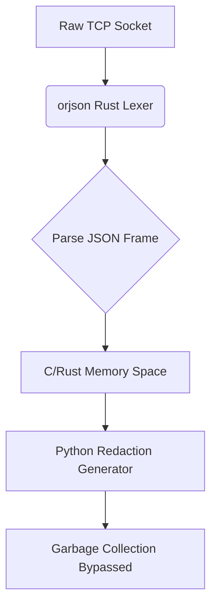

# Zero-Allocation Streaming JSON Lexer

[⬅️ Back to Features Catalog](../../../FEATURES.md)

## What It Does
The **Zero-Allocation Streaming JSON Lexer** is the ultra-fast data parsing engine at the heart of the LLM-Shield-Proxy. By utilizing `orjson` (a high-performance Rust library) instead of the standard Python `json` module, the proxy can deserialize and analyze massive, continuous data streams while maintaining a nearly invisible memory footprint (`<85 MB`).

## How It Works
Traditional HTTP proxies load entire JSON bodies into memory, converting them into massive Python dictionaries. Under high concurrency, this causes massive spikes in the Resident Set Size (RSS) and forces the Python Garbage Collector to freeze the event loop.

1. **Rust-Backed Deserialization:** The lexer uses `orjson` to parse incoming HTTP payloads natively in C/Rust space, bypassing the Python Global Interpreter Lock (GIL).
2. **Zero-Copy Architecture:** Instead of building intermediate dictionaries, the engine maps JSON properties directly to memory where possible, executing structural checks (like AST validation) without heavy allocations.
3. **SSE Chunk Parsing:** When processing streaming Server-Sent Events, the lexer instantly isolates the `data:` block and parses the delta fragments without accumulating the entire response history in memory.

<!-- EDIT THIS MERMAID SCRIPT TO UPDATE THE DIAGRAM:

-->

View diagram on GitHub mobile 📱 -->

## Performance Profile
- **Execution Speed:** Processes gigabytes of JSON throughput up to 10x faster than standard Python libraries.
- **Overhead:** Guarantees memory stability. The proxy's footprint stays under `<85 MB` even when handling 1,800+ concurrent users per core.

## Configuration Flags
The lexer is deeply embedded into the proxy's core and operates automatically without specific configuration flags.

## Critical Logic & Edge Cases
* **Invalid Payload Rejection:** If an attacker sends malformed JSON, the Rust lexer throws an instantaneous exception, allowing the proxy to return a `400 Bad Request` before the Python engine even attempts to allocate memory for the payload.
* **Float / Int Overflow Safety:** `orjson` natively handles massive numerical values (e.g., in `tool_calls`) securely without overflowing Python's standard integer types.

## FAQ

**Q: Why is bypassing the Python GIL so important?**
A: In asynchronous Python (`asyncio`), if one request does heavy CPU work (like parsing a massive JSON string using the standard library), it blocks *all other requests* on that core. By offloading JSON parsing to Rust, the GIL is released, allowing the proxy to stream data to 1,000 other users simultaneously without stuttering.

**Q: Are there any compatibility issues with `orjson`?**
A: Very few. `orjson` is strictly compliant with the JSON specification. The only edge case is that it requires dictionary keys to be strings (which the HTTP protocol guarantees anyway).

**Q: Does this help protect against Denial of Service?**
A: Yes. Because memory allocation is the primary bottleneck during volumetric floods, utilizing a zero-allocation lexer ensures the proxy doesn't run Out Of Memory (OOM) and crash the Kubernetes pod when hit with massive payloads.

## Plainspeak
This feature is a hyper-efficient data reader designed to save computer memory.

Normally, when a computer reads a massive stream of data, it has to create temporary copies of every single word in its memory, which can eventually slow the whole system down (like a desk getting cluttered with sticky notes). This feature uses specialized programming to read the data directly as it flows by, without making any messy copies. This keeps the computer's memory completely clean and fast.

## Related Tests
See the following test file for reference implementations and edge-case testing: [`tests/test_streaming_json_lexer.py`](../../../tests/test_streaming_json_lexer.py).
