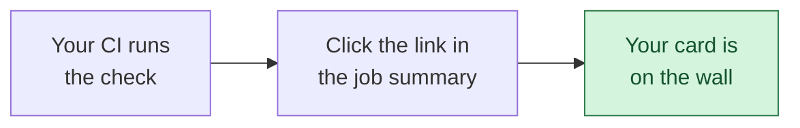

# Add your gateway to the results wall

**No gateway on the [results wall](./who-has-run-it.mdx) has passed yet, other than ours.** If
yours does, you would be the first, and that is worth saying loudly.

## Try it in one line

No account, no API key, no paid model. Point it at a gateway you already have running:

```bash
pipx run pii-leak-benchmark --target-base-url http://localhost:4000/v1
```

It prints what it sent, what came back, and which of the three questions your gateway answered.
About a minute. To put the result in CI and on your README, see [the CI setup](./ci.mdx).

Nothing running yet? [Try it from scratch](./try-it-from-scratch.md) starts with an empty machine
and ends with two results you measured yourself, ours and LiteLLM's, side by side.

## Add your gateway

About ten minutes. No account, no API key, no paid model.



**1. Run it in your CI.** Copy [the CI setup](./ci.mdx) and change three lines: where your gateway
listens, the command that starts it, and the environment variable it reads for its provider URL.
Testing a gateway's source rather than a release? [Test a proxy from your own fork](./source-ci.md)
builds it from a commit and measures that.

**2. Send the result.** Your job summary ends with a link that opens a prefilled submission.
Click it, add your gateway's name and licence, and submit. Or from wherever the report is:

```bash
pii-leak-benchmark submit
```

**3. Wait about three minutes.** Your card appears on the wall on its own, with no maintainer in
the loop. The issue you opened closes itself with a link that goes straight to your card, ringed
in gold so you can find it.

If the page still looks the same, it is cached rather than missing. Hard refresh:
`Ctrl` + `Shift` + `R` on Windows and Linux, `Cmd` + `Shift` + `R` on a Mac.

:::tip What actually gets published
The numbers come out of your CI run's own build artifact, never from anything you type. So
nothing is retyped, nothing can be mistyped, and nothing can be shaded in your favour or against
it. The three things no report records, your gateway's name, its licence and how it reads a
stream, are yours to state and are marked self-reported, like everything else here.

Link a public run or there is nothing to read. A run that has expired often cannot be read
either; rerun and resubmit, and a second submission replaces your row rather than adding one.
:::

## Tell people

A result nobody sees changes nothing. Both of these are worth more than a screenshot, because
they are things a reader can click and check.

**On your README**, a badge that carries the result rather than a green tick. The reply on your
submission issue gives you one, served from your card and linking back to it:

```markdown
[](https://llmshieldproxy.com/docs/conformance/who-has-run-it#issue-123)
```

with your own issue number in place of `123`. It reads `2 of 3 passed`, or turns gold at
`3 of 3`, and it updates when you edit the issue with a new run.

Or publish one from your own CI instead:

```markdown
[](https://github.com/OWNER/REPO/actions/workflows/pii-leak-check.yml)
```

It reads `contained`, or `leaked 4 of 16`, rather than merely saying your workflow exited
cleanly, and it names the version it measured.

**That badge is yours, not ours.** The run writes `pii-leak-badge.json` beside its other
reports and you publish that file from your own repository. Nothing is hosted here, there is
nothing to register, and no permission is asked for or given. Deleting the line from your
README removes it, and deleting the file stops it updating. We never add a badge to anybody's
project and cannot.

**If you would rather not publish what it found**, there is a quieter one:

```bash
pii-leak-benchmark badge current.json --style neutral
```

That badge reads `benchmarked` and nothing else. It is blue rather than green, deliberately,
because a neutral badge wearing the pass colour would be worse than no badge at all. It says
the true and much smaller thing: this project runs the check. What the check found stays in
the run.

Three options, then: publish the result, publish that a check ran, or publish neither.

**Anywhere else**, link the wall. It carries a preview card, and any card on it is fair to point
at, including one that is not yours: the `#` in a card's corner is a link to that card alone. A
gateway quietly forwarding data its users assume is redacted is worth telling people about, and
a card on the wall is checkable in a way a screenshot is not: the version, the configuration and
the run behind it are all on the page.

- [Share on LinkedIn](https://www.linkedin.com/sharing/share-offsite/?url=https%3A%2F%2Fllmshieldproxy.com%2Fdocs%2Fconformance%2Fwho-has-run-it)
- [Share on X](https://twitter.com/intent/tweet?url=https%3A%2F%2Fllmshieldproxy.com%2Fdocs%2Fconformance%2Fwho-has-run-it&text=Which%20LLM%20gateways%20send%20your%20users%27%20data%20to%20the%20model%20provider%2C%20measured%20rather%20than%20asserted%3A)
- [Share on Hacker News](https://news.ycombinator.com/submitlink?u=https%3A%2F%2Fllmshieldproxy.com%2Fdocs%2Fconformance%2Fwho-has-run-it)

Posting a leak is worth as much as posting a pass. A card going from `leak` to `contained` in a
later version says your team found a real bug and fixed it, and the wall draws that arrow for
you.

If you think a row is wrong, ours included, see
[how to dispute one](./reading-the-results-wall.mdx#if-you-think-a-row-is-wrong).

## Forks and branches are welcome

You do not need to be testing a released version. Checking a change before you ship it is one of
the most useful things you can do with this, so a run from a branch or a fork gets a card like
any other. "Who ran it" says which it was, and you can order the wall by it. Nothing is hidden
and nothing is turned away.

## What to send

Send your result whatever it says.

- **It passed.** You would be the first. That is worth saying loudly.
- **It failed.** Post it, then post again when you fix it. A card going from `leak` to
  `contained in 1.4.2` says your team fixed a real bug, and the wall draws the arrow for you.
- **You think the check is wrong.** Say so. That is our bug, we will fix it, and we will
  [credit you](./reading-the-results-wall.mdx#credit).

One thing to leave out: request or response bodies from a real deployment. The block from step 2
carries no customer data, but a captured payload might.
