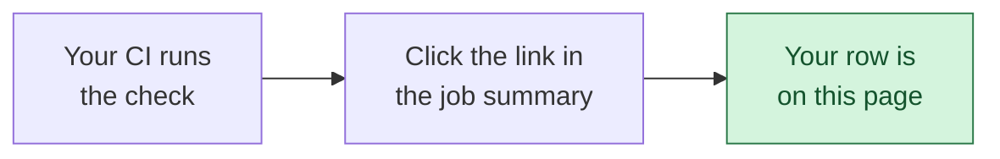

import ResultsWall from '@site/src/components/ResultsWall';
import CorpusCredits from '@site/src/components/CorpusCredits';
import DefinedTerm from '@site/src/components/DefinedTerm';

# Can your LLM gateway pass?

An LLM gateway sits between your application and the model provider. This check asks whether
yours does three things:

1. **Keep the caller's data away from the provider.** If you configured it to redact an email
   address, that address should not appear in the request it sends upstream.
2. **Give the caller their own data back.** The response should still read correctly to the
   person who sent it.
3. **Keep out data the caller never sent.** If the model produces someone else's phone number, it
   must not reach the client. Including when the stream splits it across two chunks.

Do all three and you pass.

## Ours did not pass either, at first

With its response scan on, 1.6.0 leaked 2 of the 16 values sent whole and 4 of the 16 sent
split. We wrote the check and it caught us.

**1.6.6 passes.** Nothing reaches the provider, every value comes back to the caller, and
every injected value is caught both whole and split across two chunks. Both rows are below,
so the change is something you can see rather than take on trust, and the report behind it
is on the [results page](./results.md).

**On the default settings it still does not pass.** Response scanning is off unless you turn
it on, because it changes what callers receive, so the out-of-the-box row leaks 16 of 16
both ways. That row is below too.

A result from the people who built the instrument is the most conflicted row here, which is
why the "Who ran it" column sorts our own runs alongside the self-reported ones rather than
above them. That does not change because the number improved.

**No gateway other than ours has passed yet.** The first one that does gets a mark on its
row in the table below, and keeps it. It goes to any gateway we did not write, whether we
measured it or its own maintainers did, as long as there is a run behind the numbers to
open. It is computed from the published rows rather than handed out, which is not the same
as saying it cannot be gamed: a project that fabricated a report could take it, and would
be doing so in public under its own name.

Find a case that trips either configuration and we will add it to the corpus and credit you.

## Try it in one line

No account, no API key, no paid model. Point it at a gateway you already have running:

```bash
pipx run pii-leak-benchmark --target-base-url http://localhost:4000/v1
```

It prints what it sent, what came back, and which of the three questions your gateway answered.
About a minute. To put the result in CI and on your README, see [the CI setup](./ci.mdx).

Nothing running yet? [Try it from scratch](./try-it-from-scratch.md) starts with an empty machine
and ends with two results you measured yourself, ours and LiteLLM's, side by side.

## Everything we have tested

<ResultsWall />

Read the middle columns together, because any one of them alone will mislead you. A gateway
showing `0` leaked to the client may simply have returned nothing at all, and it may still have
sent the caller's data straight to the provider. Every gateway here was configured to redact, so
a value reaching the provider is a control that was switched on and did not hold.

None of these are product defects in the abstract. Each row is one version in one configuration.

### Why there is no speed column

The obvious missing column is latency, and it is missing on purpose. Every result here would be
timed on whatever machine the submitter happened to use, so a fast gateway on a slow runner would
look worse than a slow one on fast hardware. That is hardware noise published as a product
characteristic.

What you actually want from a speed column is the **design tradeoff**, and that is in the table
already, under "How it reads the stream". There are three ways to build this and each one costs
something:

- **Checks each chunk alone.** Fastest, and it cannot see a value split across two chunks.
- **Waits for the whole response.** Sees everything, and the user waits for the entire answer
  before any of it appears.
- **Holds back a short tail.** Keeps the text streaming and still catches most splits. Leaks if
  the tail is shorter than the value.

There is no free option. That is why it is worth measuring, and why the column tells you more
than a millisecond count would.

## Two bugs that look identical in a leak count {#two-bugs}

The same number in the leak column can mean two different defects, which need different fixes.
This is the main reason the table is not a scoreboard.

| | Sent whole<br/>`user@example.com` | Split across two chunks<br/>`user@exa` + `mple.com` |
| :--- | :--- | :--- |
| <DefinedTerm term="Detector gap" definition="The gateway never spots the value, so it leaks whether the stream splits it or not." /> | leaks | leaks |
| <DefinedTerm term="Boundary bug" definition="The gateway spots the whole value but not its halves, so it only leaks when the stream splits it." /> | caught | leaks |

### Detector gap {#detector-gap}

The gateway never recognises the value at all. Splitting the stream changes nothing, because it
was not going to catch it either way. Usually a missing pattern, an encoding it does not decode,
or a look-alike character it does not fold.

### Boundary bug {#boundary-bug}

The gateway recognises the whole value but not its halves. It is clean until the stream splits
the value across two chunks, and then it leaks. This is the defect the split column exists to
find, and it is invisible to any test that sends values whole.

## Add your gateway

**No gateway on this page has passed yet.** Ours has not either, and we wrote the check. If
yours does, you would be the first, and that is worth saying loudly.

About ten minutes. No account, no API key, no paid model.



**1. Run it in your CI.** Copy [the CI setup](./ci.mdx) and change three lines: where your gateway
listens, the command that starts it, and the environment variable it reads for its provider URL.

**2. Send the result.** Your job summary ends with a link that opens a prefilled submission.
Click it, add your gateway's name and licence, and submit. Or from wherever the report is:

```bash
pii-leak-benchmark submit
```

**3. Wait about three minutes.** Your row appears here on its own, with no maintainer in the
loop. The issue you opened closes itself with a link to it.

If the page still looks the same, it is cached rather than missing. Hard refresh:
`Ctrl` + `Shift` + `R` on Windows and Linux, `Cmd` + `Shift` + `R` on a Mac.

:::tip What actually gets published
The numbers come out of your CI run's own build artifact, never from anything you type. So
nothing is retyped, nothing can be mistyped, and nothing can be shaded in your favour or against
it. The three things no report records, your gateway's name, its licence and how it reads a
stream, are yours to state and are marked self-reported, like everything else here.

Link a public run or there is nothing to read. A run that has expired often cannot be read
either; rerun and resubmit, and a second submission replaces your row rather than adding one.
:::

## Tell people

A result nobody sees changes nothing. Both of these are worth more than a screenshot, because
they are things a reader can click and check.

**On your README**, a badge that carries the result rather than a green tick:

```markdown
[](https://github.com/OWNER/REPO/actions/workflows/pii-leak-check.yml)
```

It reads `contained`, or `leaked 4 of 16`, rather than merely saying your workflow exited
cleanly, and it names the version it measured.

**The badge is yours, not ours.** The run writes `pii-leak-badge.json` beside its other
reports and you publish that file from your own repository. Nothing is hosted here, there is
nothing to register, and no permission is asked for or given. Deleting the line from your
README removes it, and deleting the file stops it updating. We never add a badge to anybody's
project and cannot.

**If you would rather not publish what it found**, there is a quieter one:

```bash
pii-leak-benchmark badge current.json --style neutral
```

That badge reads `benchmarked` and nothing else. It is blue rather than green, deliberately,
because a neutral badge wearing the pass colour would be worse than no badge at all. It says
the true and much smaller thing: this project runs the check. What the check found stays in
the run.

Three options, then: publish the result, publish that a check ran, or publish neither.

**Anywhere else**, link this page. It carries a preview card, and any row is fair to point
at, including one that is not yours. A gateway quietly forwarding data its users assume is
redacted is worth telling people about, and a row here is checkable in a way a screenshot is
not: the version, the configuration and the run behind it are all on the page.

- [Share on LinkedIn](https://www.linkedin.com/sharing/share-offsite/?url=https%3A%2F%2Fllmshieldproxy.com%2Fdocs%2Fconformance%2Fwho-has-run-it)
- [Share on X](https://twitter.com/intent/tweet?url=https%3A%2F%2Fllmshieldproxy.com%2Fdocs%2Fconformance%2Fwho-has-run-it&text=Which%20LLM%20gateways%20send%20your%20users%27%20data%20to%20the%20model%20provider%2C%20measured%20rather%20than%20asserted%3A)
- [Share on Hacker News](https://news.ycombinator.com/submitlink?u=https%3A%2F%2Fllmshieldproxy.com%2Fdocs%2Fconformance%2Fwho-has-run-it)

Posting a leak is worth as much as posting a pass. A row going from `leak` to `contained` in a
later version says your team found a real bug and fixed it, and the table draws that arrow for
you.

### If you think a row is wrong

Ours included. [Open a question](https://github.com/ninadphalak/LLM-Shield-Proxy/issues/new?template=result-dispute.yml)
and the count appears next to that row, linking to what you wrote. Nothing is hidden or moved
down the table while it is open: this page publishes disagreements rather than settling them
quietly, which is the same reason two runs of the same gateway that disagree both stay up. The
count clears when the question is closed.

### Forks and branches are welcome

You do not need to be testing a released version. Checking a change before you ship it is one of
the most useful things you can do with this, so a run from a branch or a fork gets a row like any
other. The "Who ran it" column says which it was, and you can sort by it. Nothing is hidden and
nothing is turned away.

### What to send

Send your result whatever it says.

- **It passed.** You would be the first. That is worth saying loudly.
- **It failed.** Post it, then post again when you fix it. A row going from `leak` to
  `contained in 1.4.2` says your team fixed a real bug, and the table draws the arrow for you.
- **You think the check is wrong.** Say so. That is our bug, we will fix it, and we will credit
  you below.

One thing to leave out: request or response bodies from a real deployment. The block from step 2
carries no customer data, but a captured payload might.

## Credit

<CorpusCredits />

## Why we do not rank these

Click any heading to sort the table for yourself. We do not publish it in a ranked order:

- **Rows are not comparable.** Each result is one version, one configuration, one set of test
  values.
- **A scoreboard starts arguments about fairness instead of getting gateways tested.**
- **The same leak count can mean two different bugs**, as [the table above](#two-bugs) shows.

The arrows are the one comparison we do draw, and they only ever compare a gateway with its own
earlier version on this page. That is revision history rather than a ranking: it says a team
fixed something, which is the entire behaviour this page exists to encourage.

Full numbers for every run above, including the reference policies we use to calibrate the
instrument, are on the [published results](./results.md) page, generated from the report files in
the repository.

Questions about any of this are welcome in the same issue tracker.
