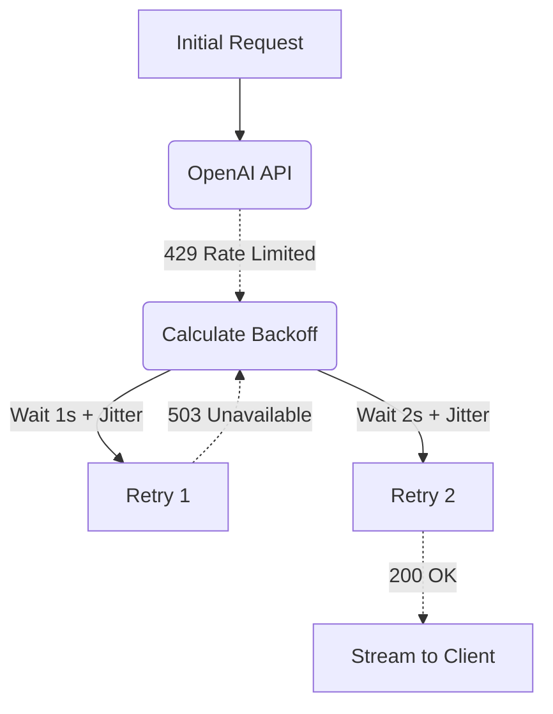

# Exponential Retries

[⬅️ Back to Features Catalog](/docs/features-overview)

## What It Does
The **Exponential Retries** feature retries selected temporary failures, such as configured 429
and 502 responses. It waits longer between attempts and stops after the configured limit.

## How It Works
If a client app simply retries immediately after a `429`, it contributes to a "thundering herd" problem, causing the API provider to throttle them further.

1. **Jittered Backoff:** The proxy uses the `tenacity` library to implement `wait_exponential_jitter`. If the first request fails, the proxy waits ~1 second. If the second fails, it waits ~2 seconds, then ~4 seconds, up to a configurable maximum.
2. **Randomized Jitter:** A random delay spreads retry attempts and reduces synchronized retry bursts; collisions and correlated load can still occur.
3. **`Retry-After`:** When a supported response includes a valid `Retry-After` header, the proxy
   waits for the specified period before retrying.

View diagram on GitHub mobile 📱 -->

## Performance Profile
- **Performance:** Workload and environment dependent; measure this path under the published benchmark protocol.
- **Overhead:** `asyncio.sleep()` does not block the event-loop thread, but the request remains
  active and consumes time, memory, connection capacity, and retry quota.

## Configuration Flags

| Environment Variable | Description | Linked Deployment Guide |
| :--- | :--- | :--- |
| `MAX_RETRIES` | The maximum number of retry attempts before returning the error to the client (default 3). | [View in deployment.md](/docs/deployment) |

## Critical Logic & Edge Cases
* **Non-Recoverable Errors:** The configured retry predicate excludes handled client errors such as `400 Bad Request` and `401 Unauthorized`. Add tests when changing the exception or status-code mapping.
* **Replay effects:** Retrying text generation can produce a different answer or duplicate provider
  charges. Retrying a state-changing tool can repeat the action. Use downstream idempotency keys
  where available and test every retried operation.

## FAQ

**Q: Will the client application timeout while the proxy is retrying?**
A: Possibly, depending on how aggressive your client's timeout settings are. If you configure `MAX_RETRIES=5`, the total sleep time could exceed 15 seconds. Client applications interfacing with the proxy should configure their `read_timeout` to at least 30 seconds to allow the proxy time to recover the request.

**Q: Does this conflict with Provider Failover Routing?**
A: No. The proxy executes retries *first*. Only if the `MAX_RETRIES` limit is entirely exhausted will the proxy escalate the failure to the Provider Failover Routing engine to attempt the secondary mirror.

## Practical effect
For selected temporary failures, the proxy waits and tries again. Each wait generally grows, with
jitter to reduce synchronized retries. Retries can still increase latency, cost, and upstream
load, so keep the attempt limit small and test replay behavior.

## Related Tests
Tests: [`tests/test_antifragile_dispatcher.py`](https://github.com/ninadphalak/LLM-Shield-Proxy/blob/main/tests/test_antifragile_dispatcher.py).
