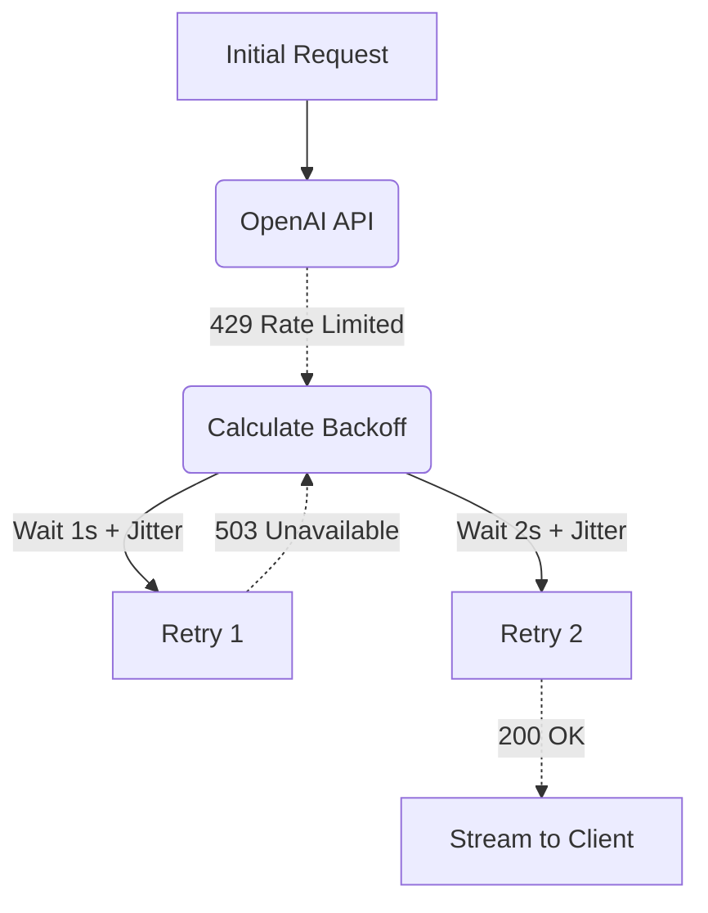

# Exponential Retries

[⬅️ Back to Features Catalog](/docs/features-overview)

## What It Does
The **Exponential Retries** feature automatically recovers from temporary upstream failures (like HTTP `429 Too Many Requests` or `502 Bad Gateway`) by waiting and trying again. It progressively increases the wait time between attempts to avoid overwhelming the provider.

## How It Works
If a client application retries immediately after a `429`, it contributes to a "thundering herd" problem, causing the API provider to throttle them further. The proxy intercepts these errors and handles backoff internally.

1. **Jittered Backoff:** The proxy uses the `tenacity` library to implement `wait_exponential_jitter`. If the first request fails, the proxy waits ~1 second. If the second fails, it waits ~2 seconds, then ~4 seconds, up to a configurable maximum.
2. **Randomized Jitter:** A random delay (jitter) is added to spread out retry attempts and reduce synchronized retry bursts across concurrent requests.
3. **`Retry-After` Header Support:** If the provider's error response includes a valid `Retry-After` header, the proxy respects it and waits for the exact specified period before retrying.

## Performance Profile
- **Latency Impact:** `asyncio.sleep()` does not block the event loop, so other requests continue processing normally. However, the retried request remains active in memory, consuming connection capacity and adding to total response latency.

## Configuration Flags

| Environment Variable | Description | Linked Guide |
| :--- | :--- | :--- |
| `MAX_RETRIES` | The maximum number of retry attempts before returning the error to the client (default 3). | [View in deployment.md](/docs/deployment) |

## Implementation Details & Edge Cases
* **Non-Recoverable Errors:** The retry engine ignores client-side errors like `400 Bad Request` or `401 Unauthorized` because retrying them will never succeed. 
* **Stateful Tool Calls:** Retrying a text generation request is usually safe. However, retrying a state-changing tool call (e.g., `execute_sql_insert`) can cause duplicate actions if the upstream provider lacks idempotency keys. Always test retries on state-changing paths.

## FAQ

**Q: Will the client application timeout while the proxy is retrying?**
A: Possibly, depending on your client's timeout configuration. If you set `MAX_RETRIES=5`, the total backoff sleep time could exceed 15 seconds. Client applications connecting to the proxy should configure their `read_timeout` to at least 30 seconds to allow the proxy enough time to recover the request.

**Q: Does this conflict with Provider Failover Routing?**
A: No. The proxy executes retries *first*. Only if the `MAX_RETRIES` limit is completely exhausted will the proxy escalate the failure to the Provider Failover Routing engine to attempt a secondary provider.

## Practical Effect
This feature transparently shields client applications from transient network blips and API rate limits. By waiting and retrying with jitter, it improves reliability without requiring complex retry logic in downstream SDKs.

## Related Tests
Tests: [`tests/test_antifragile_dispatcher.py`](https://github.com/ninadphalak/LLM-Shield-Proxy/blob/main/tests/test_antifragile_dispatcher.py).
