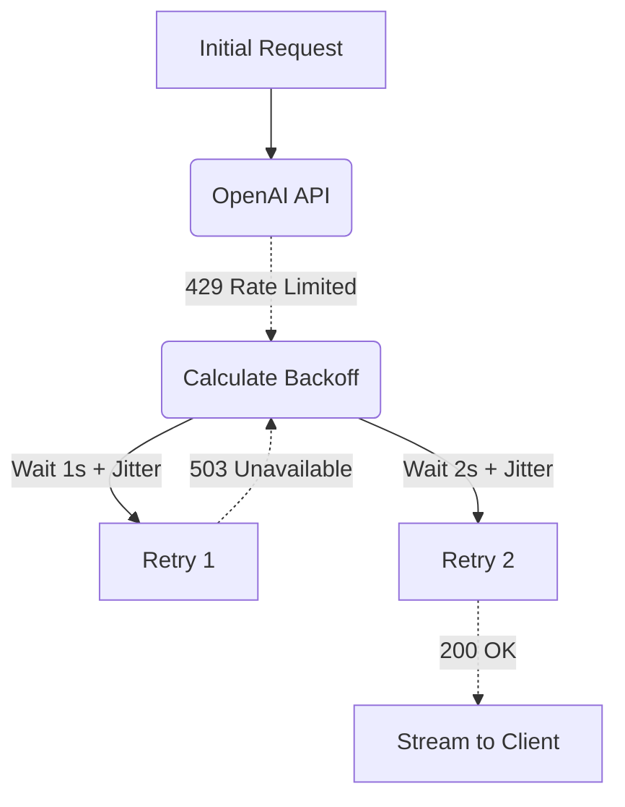

# Antifragile Exponential Retries

[⬅️ Back to Features Catalog](/docs/features-overview)

## What It Does
The **Antifragile Exponential Retries** feature shields client applications from transient network instability and API throttling. When an upstream provider returns a recoverable error (like a `429 Too Many Requests` or a brief `502 Bad Gateway`), the proxy automatically absorbs the failure and retries the request using an exponential backoff algorithm before giving up.

## How It Works
If a client app simply retries immediately after a `429`, it contributes to a "thundering herd" problem, causing the API provider to throttle them further.

1. **Jittered Backoff:** The proxy uses the `tenacity` library to implement `wait_exponential_jitter`. If the first request fails, the proxy waits ~1 second. If the second fails, it waits ~2 seconds, then ~4 seconds, up to a configurable maximum.
2. **Randomized Jitter:** A random millisecond "jitter" is added to every sleep cycle. This ensures that if 1,000 proxy pods get throttled simultaneously, they don't all wake up and retry at the exact same millisecond.
3. **Respecting `Retry-After`:** If the upstream provider includes a strict `Retry-After` HTTP header, the proxy intelligently parses it and suspends the specific request task for that exact duration.

View diagram on GitHub mobile 📱 -->

## Performance Profile
- **Performance:** Workload and environment dependent; measure this path under the published benchmark protocol.
- **Overhead:** Suspends the specific `asyncio` task using `asyncio.sleep()`, yielding control back to the event loop so other concurrent requests can continue processing unhindered.

## Configuration Flags

| Environment Variable | Description | Linked Deployment Guide |
| :--- | :--- | :--- |
| `MAX_RETRIES` | The maximum number of retry attempts before returning the error to the client (default 3). | [View in deployment.md](/docs/deployment) |

## Critical Logic & Edge Cases
* **Non-Recoverable Errors:** The proxy explicitly configures the `tenacity` engine to *never* retry on client errors like `400 Bad Request` or `401 Unauthorized`. Retrying these is futile and wastes resources.
* **Streaming Idempotency:** Text generation is fundamentally idempotent. However, if the proxy is handling a state-mutating tool execution (like executing a SQL insert on behalf of an agent), it relies on the downstream system's idempotency keys.

## FAQ

**Q: Will the client application timeout while the proxy is retrying?**
A: Possibly, depending on how aggressive your client's timeout settings are. If you configure `MAX_RETRIES=5`, the total sleep time could exceed 15 seconds. Client applications interfacing with the proxy should configure their `read_timeout` to at least 30 seconds to allow the proxy time to recover the request.

**Q: Does this conflict with Provider Failover Routing?**
A: No. The proxy executes retries *first*. Only if the `MAX_RETRIES` limit is entirely exhausted will the proxy escalate the failure to the Provider Failover Routing engine to attempt the secondary mirror.

## Plainspeak
This feature teaches the system how to be patient and polite when the internet is struggling.

Sometimes a server gets overwhelmed and drops a connection. Instead of immediately hammering the server with a million retry requests (which just makes the crash worse), this feature forces the proxy to wait a little bit, then try again. If it fails again, it waits a little bit *longer*. This elegant, increasing delay gives the broken server time to recover.

## Related Tests
See the following test file for reference implementations and edge-case testing: [`tests/test_antifragile_dispatcher.py`](https://github.com/YOUR_ORG/LLM-Shield-Proxy/blob/main/tests/test_antifragile_dispatcher.py).
