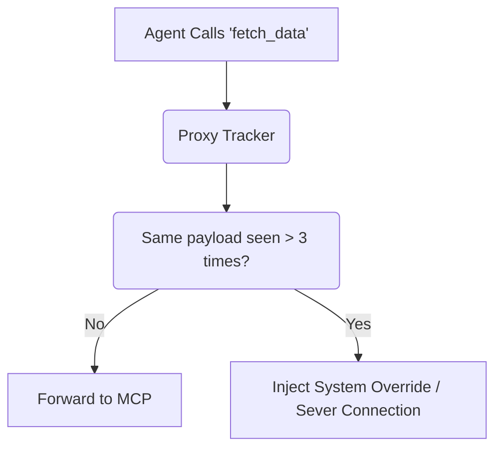

# Composite Agent Loop Circuit Breaker

[⬅️ Back to Features Catalog](/docs/features-overview)

## What It Does
The **Composite Agent Loop Circuit Breaker** tracks configured request and tool-call signals. When a configured threshold is reached, it terminates the affected flow. It is a bounded heuristic, not a complete detector for every looping or high-cost agent behavior.

## How It Works
When autonomous agents are given tools, they can repeat failed actions until another limit intervenes. For example, an agent may resubmit the same SQL query and consume additional tokens and tool capacity.

1. **Stateful Trajectory Tracking:** The proxy utilizes the [Stateless Redis TTL Vault](/docs/features/data-protection-pii-redaction/stateless-redis-ttl-vault) to track a hash of the `tool_calls` array for a specific `session_id`.
2. **Loop Detection:** If the proxy observes the exact same tool payload being executed more than `N` times consecutively within the same short-lived session, it flags a hallucination loop.
3. **Circuit Breaking:** On the catch-all HTTP path, the proxy returns HTTP 429 with `X-Shield-Circuit-Breaker: TRIPPED` after the configured duplicate threshold. It does not inject a replacement system message.

View diagram on GitHub mobile 📱 -->

## Performance Profile
- **Performance:** Workload and environment dependent; measure this path under the published benchmark protocol.
- **Storage:** Reuses the configured session TTL store and does not introduce a relational-table migration. It still adds keys, reads, writes, memory, and network work to that store.

## Configuration Flags

| Environment Variable | Description | Linked Deployment Guide |
| :--- | :--- | :--- |
| `ENABLE_AGENT_BREAKER` | Toggles the loop detection engine. | [View in deployment.md](/docs/deployment) |
| `AGENT_BREAKER_THRESHOLD` | Consecutive duplicate threshold (default 3). | [View in deployment.md](/docs/deployment) |

## Critical Logic & Edge Cases
* **Payload comparison:** The implementation computes bounded serialized-request signals and tool-call hashes. Semantically equivalent payloads with different serialization or content can be treated as different attempts, and distinct short requests can produce heuristic false positives.
* **Intervention:** The implemented intervention is an HTTP 429 response. Client or agent code decides whether to retry, alter the tool call, or stop.

## FAQ

**Q: Will this break LangChain agents that intentionally call a tool multiple times?**
A: The configured identical-payload rule does not count calls whose normalized arguments differ. Repeated identical arguments are a heuristic signal, not definitive proof of a hallucination; legitimate polling or idempotent retries may need an exception or different threshold.

**Q: How does the proxy know what "session" an agent is in?**
A: Client applications must pass a consistent `X-Session-ID` header. The proxy uses this header to isolate loop tracking.

## Plainspeak
This feature provides a threshold-based stop for one class of repeated agent action.

Sometimes an agent repeats the same action without making progress. The circuit breaker compares the signals it is configured to track and intervenes after a threshold; it can miss changing loops and can flag legitimate repetition, so pair it with time, token, and tool budgets.

## Related Tests
See the following test file for reference implementations and edge-case testing: [`tests/test_circuit_breaker.py`](https://github.com/ninadphalak/LLM-Shield-Proxy/blob/main/tests/test_circuit_breaker.py).
