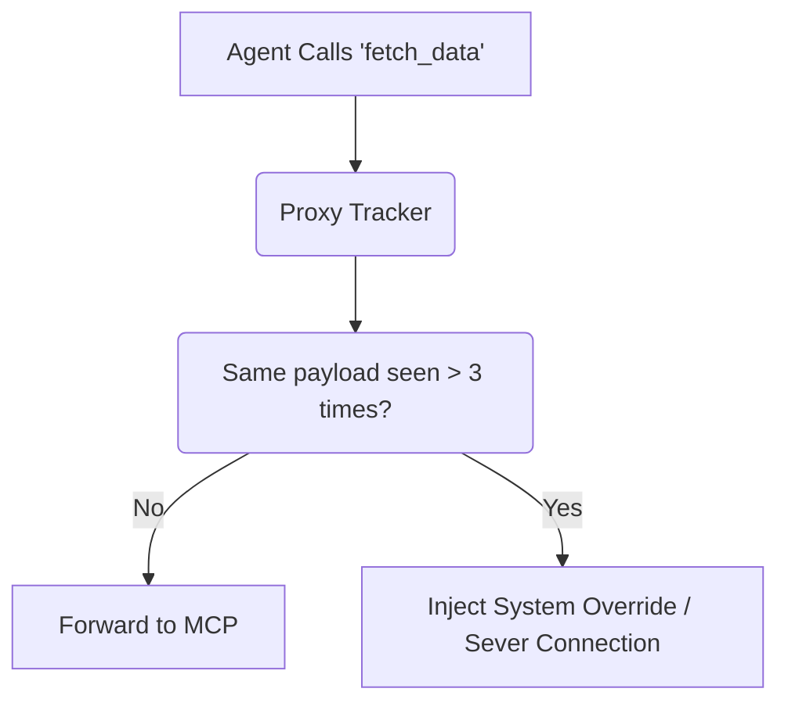

# Composite Agent Loop Circuit Breaker

[⬅️ Back to Features Catalog](/docs/features-overview)

## What It Does
The **Composite Agent Loop Circuit Breaker** is an advanced safeguard designed for autonomous multi-agent systems (like AutoGen, LangGraph, or CrewAI). It dynamically tracks the recursive depth and tool-call patterns of an agent. If an agent gets stuck in an infinite "hallucination loop" (repeatedly calling the same tool and failing), the proxy physically severs the connection to stop the LLM from burning through your billing quotas.

## How It Works
When autonomous agents are given tools, they can get stuck. For example: an agent writes a SQL query, it fails, the agent apologizes, writes the exact same bad SQL query, it fails, and this repeats infinitely at \$0.03 per token.

1. **Stateful Trajectory Tracking:** The proxy utilizes the [Stateless Redis TTL Vault](/docs/features/data-protection-pii-redaction/stateless-redis-ttl-vault) to track a hash of the `tool_calls` array for a specific `session_id`.
2. **Loop Detection:** If the proxy observes the exact same tool payload being executed more than `N` times consecutively within the same short-lived session, it flags a hallucination loop.
3. **Circuit Breaking:** The proxy forcefully breaks the loop by returning an injected system message to the agent: `SYSTEM OVERRIDE: Maximum recursive tool retries exceeded. Proceed without this tool.` or, if configured strictly, drops the HTTP connection entirely with a 429.

View diagram on GitHub mobile 📱 -->

## Performance Profile
- **Execution Speed:** Loop evaluation via Redis takes `&lt;1ms` per request.
- **Overhead:** Leverages the existing session TTL infrastructure, meaning it requires zero additional database tables.

## Configuration Flags

| Environment Variable | Description | Linked Deployment Guide |
| :--- | :--- | :--- |
| `ENABLE_AGENT_BREAKER` | Toggles the loop detection engine. | [View in deployment.md](/docs/deployment) |
| `MAX_AGENT_RECURSION` | Maximum consecutive identical tool payloads allowed (default 3). | [View in deployment.md](/docs/deployment) |

## Critical Logic & Edge Cases
* **Payload Hashing:** To avoid storing large tool payloads in memory, the proxy hashes the AST of the `tool_calls` payload. It ignores timestamp variances but is highly sensitive to semantic changes. If the agent changes even one character in a SQL query, it is considered a *new* attempt and the loop counter resets.
* **Graceful Degradation:** The preferred intervention is injecting a synthetic system message rather than dropping the socket. This allows the LLM to realize the tool is broken and dynamically pivot to a new strategy, preserving the overall task context.

## FAQ

**Q: Will this break LangChain agents that intentionally call a tool multiple times?**
A: If the agent calls a tool multiple times with *different* arguments (e.g., paginating through a database), the circuit breaker will ignore it. It only triggers when the agent executes the *exact same* arguments repeatedly, which is a definitive sign of a hallucinated failure loop.

**Q: How does the proxy know what "session" an agent is in?**
A: Client applications must pass a consistent `X-Session-ID` header. The proxy uses this header to isolate loop tracking.

## Plainspeak
This feature acts as an emergency stop button for autonomous AI agents that get stuck in infinite loops.

Sometimes, an AI agent is given a complex task and it gets confused, endlessly repeating the same useless actions (like searching for the same file over and over) without making progress. If left alone, this runs up a massive bill. This circuit breaker automatically detects when an AI is stuck in a repeating cycle and violently cuts the power, saving money and preventing server exhaustion.

## Related Tests
See the following test file for reference implementations and edge-case testing: [`tests/test_circuit_breaker.py`](https://github.com/YOUR_ORG/LLM-Shield-Proxy/blob/main/tests/test_circuit_breaker.py).
