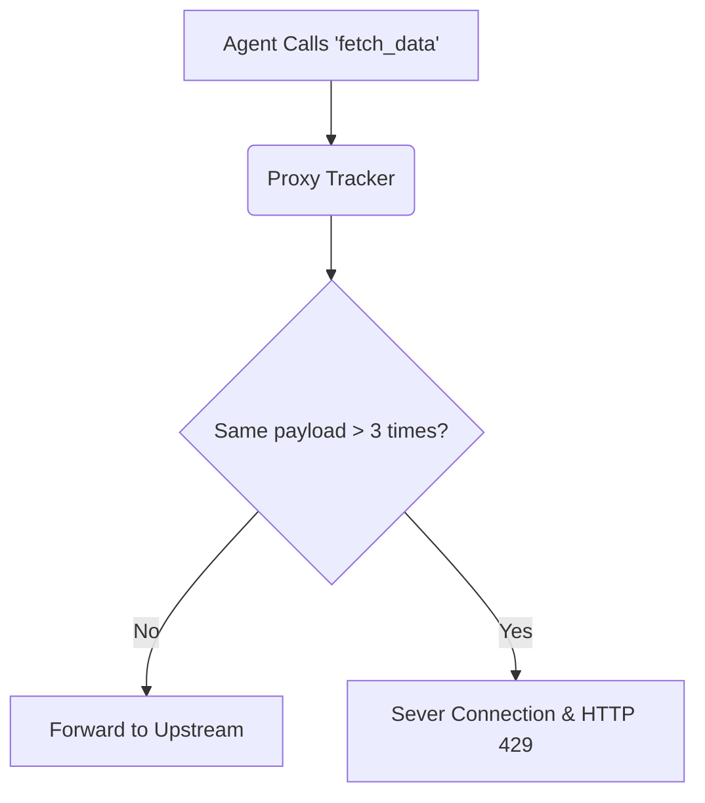

# Agent Loop Circuit Breaker

[⬅️ Back to Features Catalog](/docs/features-overview)

## What It Does
The **Circuit Breaker** tracks autonomous agent tool calls to detect when an agent is stuck in a hallucination loop (e.g., repeatedly submitting the exact same failed SQL query). When a loop is detected, it severs the connection to stop the agent from burning through token budgets and tool capacity.

## How It Works
When given tools, autonomous agents will sometimes repeat failed actions indefinitely until they hit a hard limit.

1. **Stateful Trajectory Tracking:** The proxy uses the [Redis TTL Vault](/docs/features/data-protection-pii-redaction/stateless-redis-ttl-vault) to track a cryptographic hash of the `tool_calls` array for a given `session_id`.
2. **Loop Detection:** If the proxy observes the exact same tool payload being executed consecutively more than `N` times within a short-lived session, it flags the behavior as a hallucination loop.
3. **Circuit Breaking:** The proxy immediately terminates the request and returns an HTTP `429 Too Many Requests` with the header `X-Shield-Circuit-Breaker: TRIPPED`.

## Performance Profile
- **Storage Overhead:** This feature reuses the existing Redis session TTL store. It introduces minor read/write and memory overhead, but avoids the need for heavy relational database migrations.

## Configuration Flags

| Environment Variable | Description | Linked Guide |
| :--- | :--- | :--- |
| `ENABLE_AGENT_BREAKER` | Toggles the loop detection engine. | [View in deployment.md](/docs/deployment) |
| `AGENT_BREAKER_THRESHOLD` | Consecutive duplicate threshold (default 3). | [View in deployment.md](/docs/deployment) |

## Implementation Details & Edge Cases
* **Payload Comparison:** The tracker compares the exact serialized tool-call arguments. Semantically identical payloads with different JSON formatting or slight variations will not trigger the breaker.
* **Intervention Limits:** The proxy simply returns a 429 error; it does not attempt to inject a synthetic system message to "coach" the agent out of the loop. It is up to the client application to handle the 429 appropriately.

## FAQ

**Q: Will this break LangChain agents that intentionally call a tool multiple times?**
A: It depends. If the agent calls the same tool with *different* arguments (e.g., paginating through results), the circuit breaker will not trip. It only triggers on consecutive, identical arguments. If your agent relies on identical idempotent polling, you may need to increase the threshold or disable the breaker.

**Q: How does the proxy know which "session" an agent is in?**
A: Client applications must provide a consistent `X-Session-ID` header. The proxy uses this header to isolate loop tracking per agent trajectory.

## Practical Effect
This feature acts as a financial and operational safeguard, terminating runaway agents before they consume excessive tokens or overload internal APIs with identical, useless requests.

## Related Tests
Tests: [`tests/test_circuit_breaker.py`](https://github.com/ninadphalak/LLM-Shield-Proxy/blob/main/tests/test_circuit_breaker.py).
