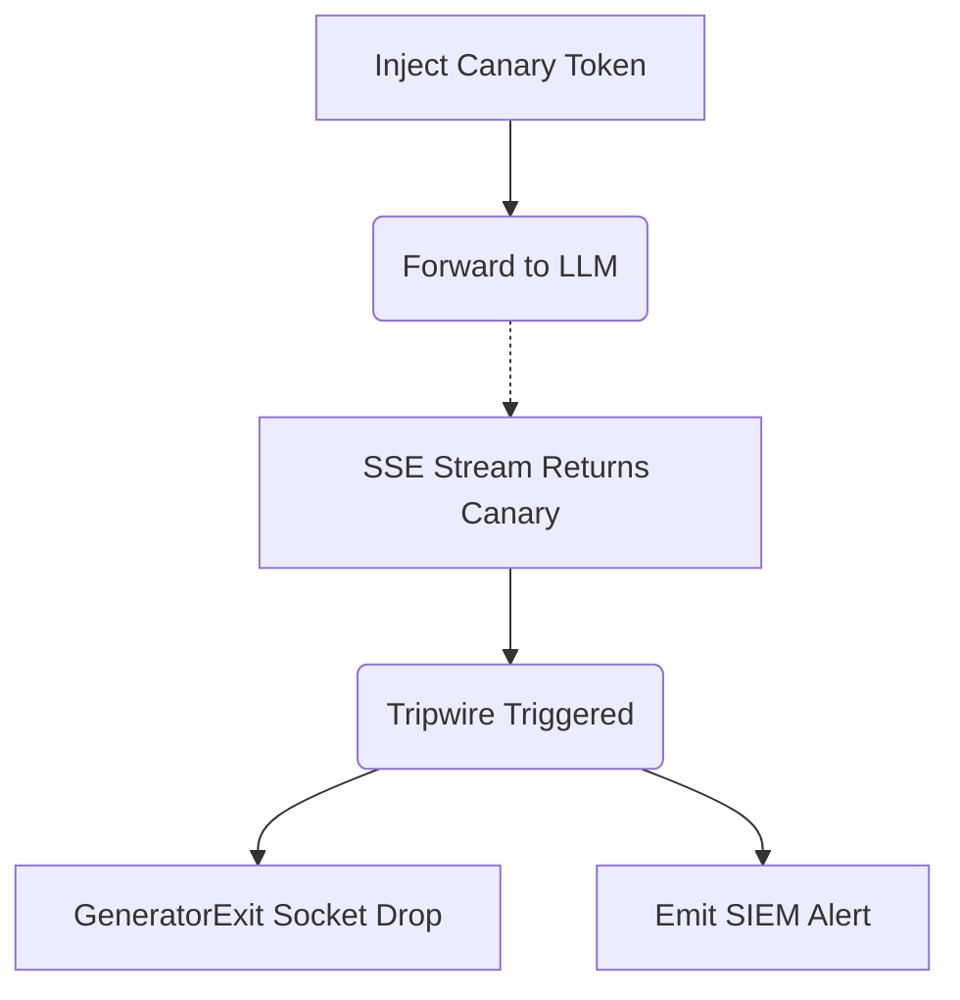

# Prompt Correlation Markers

[⬅️ Back to Features Catalog](/docs/features-overview)

## What It Does
This feature places a keyed synthetic marker in model context and inspects supported response text
for that marker. A match can stop later forwarding and produce an investigation signal; it does
not prove an attack, prevent prompt injection, or recover bytes already emitted.

## How It Works
A literal output scan cannot prevent prompt injection. This feature instead looks for one
configured marker that should not appear in normal output:

1. **Marker insertion:** The proxy can add a keyed synthetic marker such as `CNRY_a9f3b...` to
   supported system-prompt or tool context.
2. **Response scan:** As the response streams back, the sliding-window buffer scans the supported
   text path for that exact marker.
3. **Stream Termination:** If the configured canary token is detected in the inspected response path, the proxy stops forwarding later chunks and closes the affected stream. Bytes already emitted cannot be recalled, and encoding or transformation can evade a literal marker.

View diagram on GitHub mobile 📱 -->

## Performance Profile
- **Performance:** Workload and environment dependent; measure this path under the published benchmark protocol.
- **Overhead:** Adds marker generation, prompt content, scanning, and alert work. Measure latency, token cost, allocations, and false positives with the selected provider.

## Critical Logic & Edge Cases
* **Termination boundary:** A match stops later chunks on the supported generator path. Earlier chunks and buffered intermediaries are outside that control.
* **Audit path:** A match can emit configured audit or telemetry metadata. Delivery, signing, retention, and alert latency depend on the enabled audit transport and downstream system.

## FAQ

**Q: Is the canary token the same for every request?**
A: If no explicit token is provided, the process generates a token at startup. The directive also uses a configured secret and request/session metadata. Rotation and uniqueness boundaries depend on process lifetime and configuration; do not describe it as per-request unless a test demonstrates that behavior.

**Q: Can this stop "jailbreaks" (e.g., DAN)?**
A: No. It detects only the configured marker when that marker survives in the inspected output. It can miss transformed or omitted content and does not prevent other sensitive text from being produced or sent through another path.

## Plainspeak
The feature places a configured synthetic marker in model context and inspects the supported response path for that marker. A match is a tripwire signal; it can be triggered accidentally, evaded by transformation, or detected only after earlier bytes have been emitted.

## Related Tests
See the following test file for reference implementations and edge-case testing: [`tests/test_security_hardening.py`](https://github.com/ninadphalak/LLM-Shield-Proxy/blob/main/tests/test_security_hardening.py).
