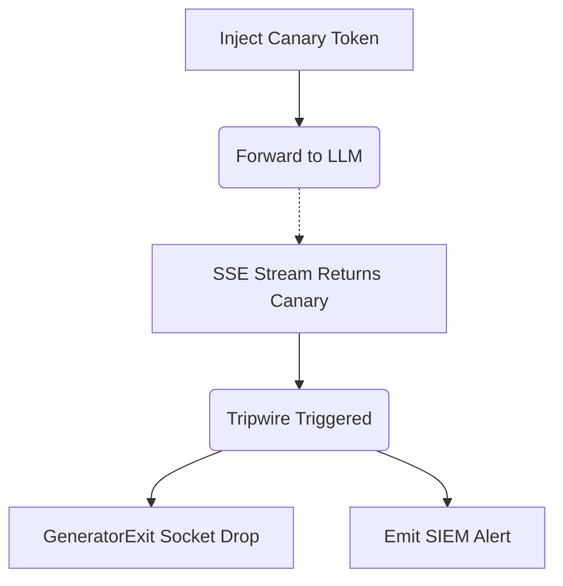

# Prompt Correlation Markers

[⬅️ Back to Features Catalog](/docs/features-overview)

## What It Does
This feature inserts a keyed synthetic marker (a canary token) into the model's context and monitors the response stream for that exact marker. If the marker is detected in the output, it acts as an investigation signal and stops forwarding subsequent chunks. It does not prevent prompt injection or recall bytes that have already been emitted.

## How It Works
A literal output scan cannot prevent prompt injection outright. Instead, this feature looks for a specific configured marker that should not appear in normal model output:

1. **Marker Insertion:** The proxy adds a keyed synthetic marker (e.g., `CNRY_a9f3b...`) into the supported system prompt or tool context.
2. **Response Scan:** As the response streams back, the sliding-window buffer scans the supported text path for that exact marker.
3. **Stream Termination:** If the canary token is detected, the proxy immediately stops forwarding any further chunks and closes the affected stream. Bytes that have already been sent to the client cannot be recalled. 

## Performance Profile
- **Overhead:** This feature introduces overhead for marker generation, prompt modification, response scanning, and alerting. Latency, token costs, and false positives should be measured against your specific provider.

## Implementation Details & Edge Cases
* **Termination Boundary:** A match stops later chunks on the supported generator path. Earlier chunks and buffered intermediaries are outside that control.
* **Evasion:** The scanner only detects the exact literal marker. Encoding or transformation by the model can easily evade detection.
* **Audit Path:** A match can emit configured audit or telemetry metadata. Alert latency and retention depend on your enabled audit transport and downstream SIEM system.

## FAQ

**Q: Is the canary token the same for every request?**
A: If no explicit token is provided, the process generates a token at startup. It uses a configured secret combined with request/session metadata. Token rotation and uniqueness boundaries depend on your configuration and the proxy's process lifetime. 

**Q: Can this stop "jailbreaks" (e.g., DAN)?**
A: No. It only detects the configured marker when that marker survives intact in the inspected output. It can miss transformed content and does not prevent the model from generating other sensitive text.

## Practical Effect
This feature acts as a tripwire. It places a synthetic marker in the context and scans for it in the response. A match triggers an alert and halts the stream, but it can be triggered accidentally, evaded by transformation, or detected only after earlier bytes have already leaked.

## Related Tests
Tests: [`tests/test_security_hardening.py`](https://github.com/ninadphalak/LLM-Shield-Proxy/blob/main/tests/test_security_hardening.py).
