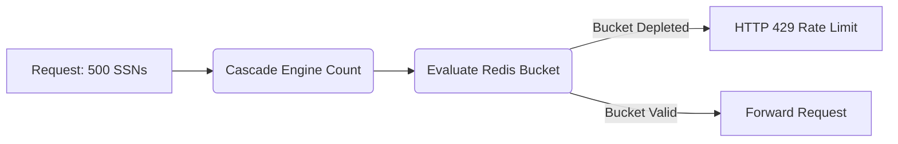

# Entity-Weighted Request Limits

[⬅️ Back to Features Catalog](/docs/features-overview)

## What It Does
The **Entity-Weighted Request Limiter** applies a token-bucket threshold based on the volume of PII entities detected in a request. Rather than strictly limiting the number of HTTP requests, it limits the total counted sensitive entities (like SSNs or emails) allowed through the proxy within a given time window.

## How It Works
Standard rate limiters (e.g., 100 requests per minute) can be bypassed by an attacker packing 10,000 credit card numbers into a single request. 

1. **Entity Accounting:** During the redaction cascade, the proxy tallies the exact number of identified PII entities in the payload.
2. **Weighted Deductions:** The proxy deducts a proportional weight from the token bucket (e.g., deducting 62 points for 62 entities) instead of a static "1" per HTTP request.
3. **Threshold Enforcement:** If the request's entity weight exceeds the remaining bucket capacity, the proxy halts processing and returns `HTTP 429 Too Many Requests`.

## Performance Profile
- **Concurrency Boundary:** When configured with Redis, the token-bucket evaluation uses an atomic Lua script to prevent race conditions. Performance overhead is tied directly to network latency between the proxy and Redis.

## Configuration Flags

| Environment Variable | Description | Linked Guide |
| :--- | :--- | :--- |
| `BLAST_RADIUS_BURST_CAPACITY` | Maximum token-bucket capacity (default 100). | [View in deployment.md](/docs/deployment) |
| `BLAST_RADIUS_REPLENISH_RATE_PER_MIN` | Bucket replenishment rate per minute (default 10). | [View in deployment.md](/docs/deployment) |
| `REDIS_URL` | Required for distributed state synchronization. | [View in deployment.md](/docs/deployment) |

## Implementation Details & Edge Cases
* **Request-Scoped Configuration:** Settings are resolved dynamically per role via `policies.yaml`. Verify the exact limits applied to specific roles rather than relying solely on global defaults.
* **Egress Blind Spot:** This limitation applies to *inbound* requests before they are forwarded upstream. It does not count or limit entities rehydrated on the outbound (response) path.

## FAQ

**Q: What if I don't use Redis?**
A: Without Redis, the proxy falls back to an in-process memory bucket. Because state is not shared, each pod enforces its own isolated limit. You must use Redis if you require a globally synchronized limit across replicas.

**Q: Does it limit data that the detectors miss?**
A: No. The limit relies entirely on the output of the redaction engine. Undetected entities bypass the bucket calculation. 

## Practical Effect
This feature caps the volume of detectable sensitive data a single user can transmit in a given timeframe. It acts as an emergency brake against bulk exfiltration attempts, but it does not guarantee protection against undetected data or small-scale leaks.

## Related Tests
Tests: [`tests/test_blast_radius.py`](https://github.com/ninadphalak/LLM-Shield-Proxy/blob/main/tests/test_blast_radius.py).
