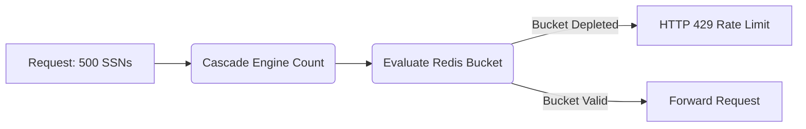

# Entity-Weighted Blast Radius Limits

[⬅️ Back to Features Catalog](/docs/features-overview)

## What It Does
**Entity-Weighted Blast Radius Limits** apply a token-bucket threshold to PII entities detected in supported inbound request paths. This can limit counted disclosures before upstream forwarding; it is not a complete exfiltration detector or a bound on undetected data.

## How It Works
Traditional rate limiters (e.g., 100 requests per minute) are easily bypassed by an attacker submitting a single request containing 10,000 credit card numbers.

1. **Entity Accounting:** During the 3-Tier Redaction Cascade, the proxy counts the exact number of PII entities identified (e.g., 50 SSNs, 12 API keys).
2. **Weighted Deductions:** Rather than deducting "1" from the rate limit bucket for the HTTP request, the proxy deducts a weight relative to the entity count (e.g., deducting 62 points).
3. **Threshold response:** When observed entity weights exhaust the configured bucket, the applicable path returns `HTTP 429` or stops later stream forwarding. This bounds counted events on that path, not the total impact of a breach or entities the detectors miss.

View diagram on GitHub mobile 📱 -->

## Performance Profile
- **Performance:** Workload and environment dependent; measure this path under the published benchmark protocol.
- **Concurrency boundary:** A Redis Lua operation is atomic on the selected Redis server. Multi-key, failover, identity, topology, and local-fallback behavior require deployment tests.

## Configuration Flags

| Environment Variable | Description | Linked Deployment Guide |
| :--- | :--- | :--- |
| `BLAST_RADIUS_BURST_CAPACITY` | Maximum token-bucket capacity (default 100). | [View in deployment.md](/docs/deployment) |
| `BLAST_RADIUS_REPLENISH_RATE_PER_MIN` | Bucket replenishment per minute (default 10). | [View in deployment.md](/docs/deployment) |
| `REDIS_URL` | Required for distributed state synchronization. | [View in deployment.md](/docs/deployment) |

## Critical Logic & Edge Cases
* **Atomic Lua Evaluation:** Redis executes the token-bucket Lua operation atomically on a single server. This prevents races inside that operation, but enforcement still depends on key design, Redis availability, topology, identity integrity, and fail-closed error handling.
* **Request-scoped configuration:** Only settings read through the dynamic settings proxy can vary by policy. Verify the blast-radius settings actually used by the limiter before describing role-specific thresholds.

## FAQ

**Q: What if I don't use Redis?**
A: If the proxy is running in single-node, stateless mode without Redis, it utilizes a local Python `asyncio` implementation of the Token-Bucket algorithm. While effective for a single pod, Redis is highly recommended for production clusters to enforce global limits.

**Q: Does it count entities on the request (ingress) or response (egress)?**
A: The current catch-all integration deducts detected entities after inbound request redaction and before upstream forwarding. It does not count rehydrated response entities in the streaming return path.

## Plainspeak
This feature can stop a supported inbound request when its detected-entity weight exceeds the available bucket.

Unlike a request-count limiter, this path weights a request by the entities the configured detectors found. Detector misses, unsupported payload paths, and outbound response content remain outside that specific bound.

## Related Tests
See the following test file for reference implementations and edge-case testing: [`tests/test_blast_radius.py`](https://github.com/ninadphalak/LLM-Shield-Proxy/blob/main/tests/test_blast_radius.py).
