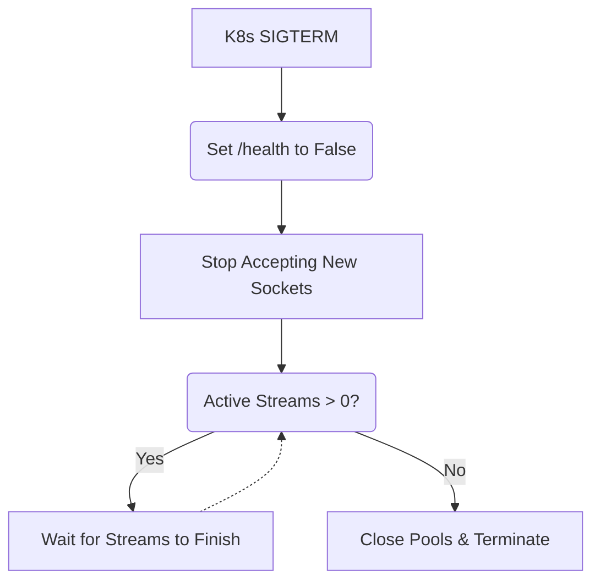

# Graceful Shutdown / Pod Drain

[⬅️ Back to Features Catalog](/docs/features-overview)

## What It Does
**Graceful Shutdown / Pod Drain** gives active SSE streams a configured interval to finish during an orderly process shutdown. Streams can still be interrupted by the timeout, forced termination, node failure, network loss, or an uncoordinated orchestrator configuration.

## How It Works
Kubernetes sends `SIGTERM` when it stops a pod during a scale-down or deployment. The proxy uses
its shutdown interval to stop reporting ready and wait for active requests.

1. **Signal Interception:** The proxy catches the `SIGTERM` signal at the FastAPI lifecycle level.
2. **Readiness toggle:** The application changes its readiness response after receiving the shutdown signal. Kubernetes routing convergence depends on probe timing, endpoint propagation, ingress behavior, and existing connections.
3. **Drain Window:** During application shutdown, the lifespan handler waits until the process-local active-request count reaches zero or `DRAIN_TIMEOUT_SECONDS` expires. Stream code can also stop while the draining flag is set.
4. **Resource close:** After the wait, the lifecycle closes managed HTTP, Vault, watcher, gRPC, and crypto resources. Redis and other library-managed resources must be verified separately.

View diagram on GitHub mobile 📱 -->

## Performance Profile
- **Performance:** Workload and environment dependent; measure this path under the published benchmark protocol.
- **Overhead:** The normal-path check and connection tracking have environment-dependent cost; include them in service-level measurements.

## Configuration Flags

| Environment Variable | Description | Linked Deployment Guide |
| :--- | :--- | :--- |
| `DRAIN_TIMEOUT_SECONDS` | Maximum time to wait for active streams before forcing a shutdown (default 25s). | [View in deployment.md](/docs/deployment) |

## Critical Logic & Edge Cases
* **Kubernetes `terminationGracePeriodSeconds`:** Set the Kubernetes termination grace period
  above `DRAIN_TIMEOUT_SECONDS`, for example 30 seconds and 25 seconds. Otherwise Kubernetes can
  send `SIGKILL` before the drain interval ends.
* **Drain timeout:** If a stream does not finish, `DRAIN_TIMEOUT_SECONDS` bounds the graceful wait before forced termination. Coordinate it with the orchestrator's termination grace period.

## FAQ

**Q: Will users notice when a pod is draining?**
A: The proxy gives existing streams up to the configured drain deadline. They can still end early because of the platform grace period, ingress behavior, upstream failure, client disconnect, or timeout. Verify new-request routing during endpoint propagation.

**Q: Why does the proxy return a `429 Too Many Requests` instead of a `503 Service Unavailable` when draining?**
A: The current middleware returns 429 for new requests observed after the draining flag is set. Whether a gateway retries that response, routes elsewhere, or exposes deployment state depends on its policy; configure and test it explicitly.

**Q: How does this interact with HTTP/2 Connection Pooling?**
A: The shared `httpx.AsyncClient` is closed after the configured drain wait in the application lifecycle. The implementation does not selectively close idle sockets at signal receipt.

## Practical effect
This feature gives active streams time to finish during an orderly restart; streams that exceed the timeout or encounter a forced shutdown can still be interrupted.

On shutdown, the application marks itself unready and gives active streams up to the configured drain timeout to finish. Streams can still be interrupted when the timeout, platform grace period, process failure, or upstream connection ends.

## Related Tests
Tests: [`tests/test_enterprise_resiliency.py`](https://github.com/ninadphalak/LLM-Shield-Proxy/blob/main/tests/test_enterprise_resiliency.py).
