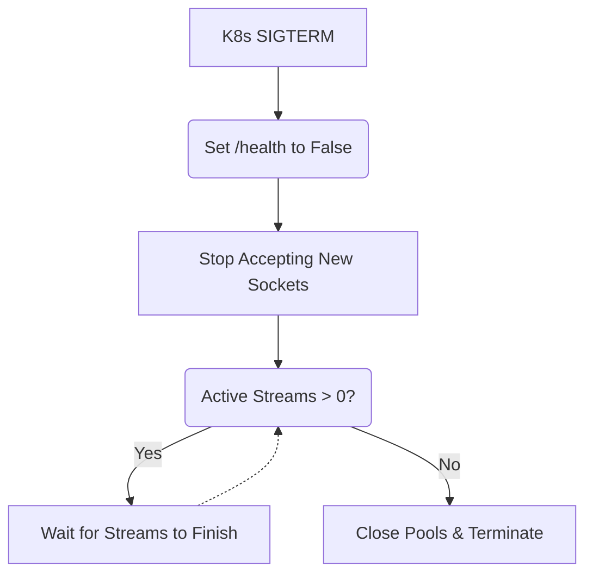

# Graceful Shutdown / Pod Drain

[⬅️ Back to Features Catalog](/docs/features-overview)

## What It Does
**Graceful Shutdown / Pod Drain** guarantees that during Kubernetes rolling deployments, scaling events, or server restarts, active LLM Server-Sent Events (SSE) streams are not abruptly severed. It ensures a flawless user experience (no "Connection Reset" errors in the middle of a chatbot response) during infrastructure maintenance.

## How It Works
When Kubernetes wants to scale down a pod or deploy a new version, it sends a `SIGTERM` signal to the container. Traditional Python proxies often exit immediately, terminating all active TCP sockets.

1. **Signal Interception:** The proxy catches the `SIGTERM` signal at the FastAPI lifecycle level.
2. **Readiness Toggle:** It instantly marks its internal health check as `Unhealthy`. Kubernetes sees this and stops routing *new* HTTP traffic to this specific pod.
3. **Drain Window:** The proxy enters a waiting loop, allowing all currently active `asyncio` streaming tasks to finish naturally.
4. **Clean Exit:** Once the active connection count hits 0, or the `DRAIN_TIMEOUT_SECONDS` limit is reached, it safely closes the HTTP/2 upstream connection pools, closes Redis sockets, and terminates the process.

View diagram on GitHub mobile 📱 -->

## Performance Profile
- **Performance:** Workload and environment dependent; measure this path under the published benchmark protocol.
- **Overhead:** Zero overhead during normal operation.

## Configuration Flags

| Environment Variable | Description | Linked Deployment Guide |
| :--- | :--- | :--- |
| `DRAIN_TIMEOUT_SECONDS` | Maximum time to wait for active streams before forcing a shutdown (default 25s). | [View in deployment.md](/docs/deployment) |

## Critical Logic & Edge Cases
* **Kubernetes `terminationGracePeriodSeconds`:** For this feature to work, your Kubernetes Deployment YAML *must* have a `terminationGracePeriodSeconds` value greater than the proxy's `DRAIN_TIMEOUT_SECONDS`. (e.g., set K8s to 30s, and the proxy to 25s). This gives the proxy the necessary time to drain before K8s sends a ruthless `SIGKILL`.
* **Zombie Stream Protection:** If an upstream LLM is completely frozen and a stream refuses to complete, the `DRAIN_TIMEOUT_SECONDS` acts as a hard backstop. Once hit, the proxy forces a shutdown to prevent a zombie pod from permanently blocking a deployment rollout.

## FAQ

**Q: Will users notice when a pod is draining?**
A: No. Existing users connected to the draining pod will see their streams finish flawlessly. New requests from the frontend will be routed by the Kubernetes Service to a different, healthy pod.

**Q: Why does the proxy return a `429 Too Many Requests` instead of a `503 Service Unavailable` when draining?**
A: Returning a `503` often causes load balancers and upstream gateways to aggressively penalize or kill the node entirely, thinking it has catastrophically failed. Furthermore, from a Red Team security perspective, emitting `503` errors can leak internal network topology and infrastructure state to attackers. Returning a `429` safely signals standard backpressure, obfuscating the deployment event while ensuring the upstream load balancer simply retries the request against a healthy pod.

**Q: How does this interact with HTTP/2 Connection Pooling?**
A: When `SIGTERM` is received, the `httpx.AsyncClient` is instructed to close its idle `keep-alive` sockets immediately, retaining only the active sockets required to service the in-flight streams.

## Plainspeak
This feature ensures no one gets cut off mid-sentence when the proxy server needs to restart or update.

When IT engineers update the server, normally it instantly kills all active connections, resulting in broken half-written AI responses for users. With this feature, when the server is told to shut down, it stops accepting *new* users, but patiently waits for all *current* users to finish their active conversations before finally turning itself off.

## Related Tests
See the following test file for reference implementations and edge-case testing: [`tests/test_enterprise_resiliency.py`](https://github.com/YOUR_ORG/LLM-Shield-Proxy/blob/main/tests/test_enterprise_resiliency.py).
